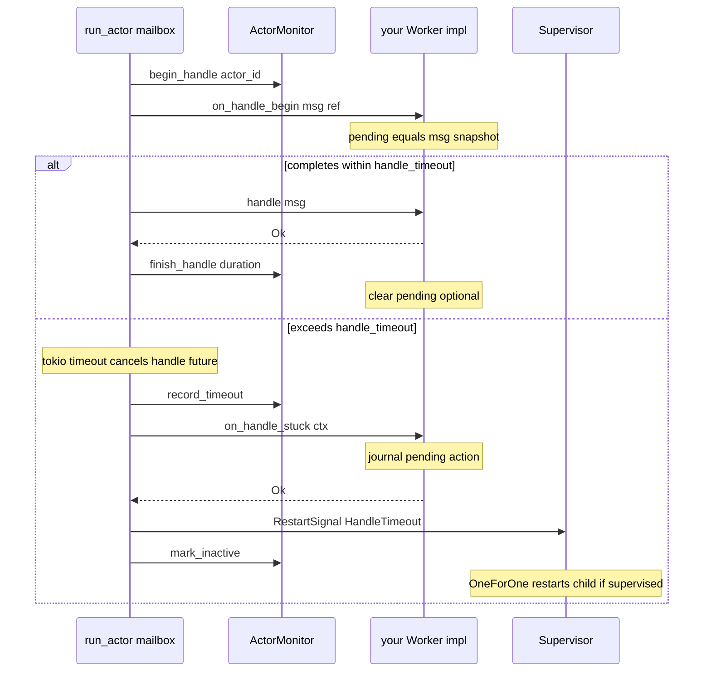
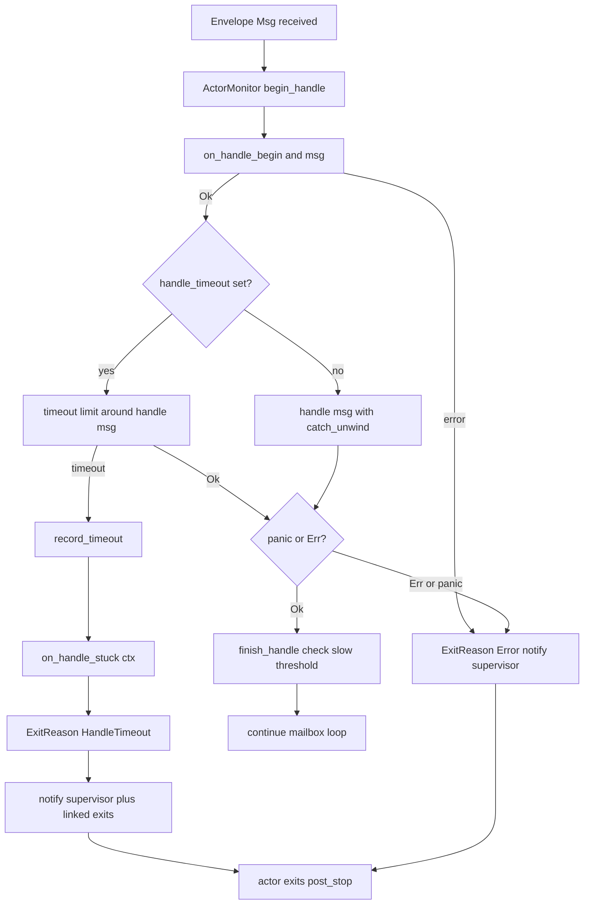

# lane_switchboards v0.0.2

Release notes for **v0.0.2** — runtime tuning, load limits, dedicated Tokio runtimes, hash-ring clustering, and TCP service mesh.

For the full project overview see [README.md](./README.md).

---

## What's new in v0.0.2

### `config.rs` — separate tuning knobs

Channel sizing and concurrency are no longer bundled into one struct. Each subsystem takes only what it needs:

| Config | Fields | Defaults | Used by |
|--------|--------|----------|---------|
| **`ActorConfig`** | `mailbox_capacity`, `max_in_flight`, `handle_timeout`, `slow_handle_threshold` | 64, 1, none, none | `spawn`, `spawn_with_config`, `spawn_on_runtime` |
| **`DistributedConfig`** | `bridge_capacity`, `max_in_flight` | 32, 32 | `Node::bind_on_runtime`, `serve_actor_on_runtime` |
| **`SupervisorConfig`** | `mailbox_capacity` (+ strategy/intensity) | 32 | supervisor restart-signal queue |
| **`RuntimeOptions`** | `worker_threads` | OS default | `DedicatedRuntime::new` |

### Deadlock / slow-handle prevention (v0.0.2)

| Component | Purpose |
|-----------|---------|
| `ActorConfig.handle_timeout` | Per-`handle()` wall-clock limit |
| `ActorConfig.slow_handle_threshold` | Slow-but-successful handle warnings |
| `on_handle_begin(&msg)` | Snapshot pending work before handle |
| `on_handle_stuck(ctx)` | Persist stuck action on timeout |
| `ExitReason::HandleTimeout` | Actor exit reason + supervisor notification |
| `ActorMonitor` / `ActorStats` | Global stats: timeouts, panics, in-flight, handle ms |

Integration test: `handle_timeout_triggers_stuck_recovery_and_stats` in `tests/integration.rs`.

#### Handle lifecycle — `on_handle_begin` and `on_handle_stuck`

Every `Envelope::Msg` passes through `handle_message` in `src/actor.rs`. The two hooks bracket `handle()` so you can **snapshot work before processing** and **persist it if the handler stalls**.

| Hook | When | Typical use |
|------|------|-------------|
| **`on_handle_begin(&msg)`** | Always, before `handle()` | Copy `msg` into `self.pending`, write to journal, increment generation |
| **`handle(msg)`** | After begin, inside timeout + `catch_unwind` | Normal business logic |
| **`on_handle_stuck(ctx)`** | Only when `handle_timeout` elapses | Flush `self.pending` to durable storage; log `ctx.elapsed` / `ctx.limit` |

`HandleStuckContext` fields: `actor_id`, `elapsed`, `limit`.

**Sequence — happy path vs timeout**



**Decision flow inside `handle_message`**



**Example — journal before handle, flush on stuck**

```rust
#[async_trait]
impl Actor<OrderMsg> for OrderWorker {
    async fn on_handle_begin(&mut self, msg: &OrderMsg) -> Result<(), ActorProcessingErr> {
        self.pending = Some(msg.clone()); // snapshot BEFORE handle
        Ok(())
    }

    async fn handle(&mut self, msg: OrderMsg) -> Result<(), ActorProcessingErr> {
        process_order(msg).await?;          // may stall here
        self.pending = None;
        Ok(())
    }

    async fn on_handle_stuck(&mut self, ctx: HandleStuckContext) -> Result<(), ActorProcessingErr> {
        if let Some(order) = self.pending.take() {
            self.journal.insert(order.id, order); // persist stuck action
        }
        tracing::warn!(%ctx.actor_id, ?ctx.elapsed, "order processing stuck");
        Ok(())
    }
}

let config = ActorConfig {
    handle_timeout: Some(Duration::from_secs(5)),
    slow_handle_threshold: Some(Duration::from_secs(2)),
    ..Default::default()
};
```

**Important:** `on_handle_begin` runs while `msg` is still available by reference — store what you need there. When timeout fires, the in-flight `handle()` future is **dropped**; recovery reads from state you saved in `on_handle_begin`, not from the dropped future. Pair with a **supervisor** so `HandleTimeout` triggers a child restart (see `ChildSlot` / `spawn_child_spec`).

**Monitor after timeout**

```rust
let stats = ActorMonitor::global().get(actor_id)?;
// stats.handle_timeouts, stats.last_handle_ms, stats.max_handle_ms, ...
```

Stats remain queryable after the actor exits (`mark_inactive`).

### Semaphore load limiting (EventBus-style)

Per-node and per-actor backpressure via `tokio::sync::Semaphore`:

- **TCP nodes** — `DistributedConfig.max_in_flight` caps concurrent frame dispatches per node. A permit is held until the bridge channel accepts the message, so a full bridge blocks new frames.
- **Actors** — `ActorConfig.max_in_flight`:
  - `1` (default) — classic sequential mailbox (OTP semantics).
  - `> 1` — up to N concurrent `handle()` calls; control messages (link, stop, upgrade, …) stay on the main loop.

### Dedicated Tokio runtime

Run actors and distributed nodes on an isolated runtime (mirrors `new_on_current_runtime` / `new_on_runtime` from event-bus patterns):

```rust
use lane_switchboards::{
    ActorConfig, DedicatedRuntime, DistributedConfig, RuntimeOptions,
    serve_actor_on_runtime, spawn_on_runtime,
};

let rt = DedicatedRuntime::new(RuntimeOptions {
    worker_threads: Some(4),
})?;
let handle = rt.handle();

rt.block_on(async {
    serve_actor_on_runtime(
        &handle,
        "worker-a",
        "127.0.0.1:9101",
        "worker",
        MyWorker,
        &DistributedConfig {
            bridge_capacity: 64,
            max_in_flight: 128,
        },
        &ActorConfig {
            mailbox_capacity: 256,
            max_in_flight: 8,
        },
    )
    .await
})?;
```

| API | Runtime |
|-----|---------|
| `spawn` / `spawn_on_current_runtime` | `Handle::current()` |
| `spawn_on_runtime(handle, …)` | explicit |
| `serve_actor` / `serve_actor_on_current_runtime` | current |
| `serve_actor_on_runtime(handle, …)` | explicit |
| `Node::bind_on_runtime(handle, …, config)` | explicit |
| `DedicatedRuntime` + `build_multi_thread_runtime` | build / own a runtime |

### Supervision helpers (v0.0.1 → v0.0.2)

- **`ChildRegistry<M>`** — named child refs updated on every restart; generation counters.
- **`ChildSlot<M>`** + **`ChildSlot::child_spec`** — single supervised child with a stable handle.
- **`spawn_child_spec(order, name, registry, build)`** — named children under one supervisor.
- **`Supervisor::start_settled(duration)`** — wait for initial spawns to settle.
- **`Supervisor::with_actor_config(actor_config, sup_config, children)`** — child mailbox sizing independent of supervisor mailbox.
- **`supervise_actor_with_config`** — single-child helper with explicit `ActorConfig`.

### Hash ring + cluster multi-send

- **`HashRing` / `RingNode`** — consistent-hash discovery (`src/hash_ring.rs`).
- **`Cluster::send_by_key`**, **`send_all`**, **`send_to`**, **`send_replicas`**, **`leave`**, **`member_for_key`**.

### TCP service mesh

- **`ServiceMesh`**, **`MeshRegistryServer`**, **`MeshRegistryClient`**, **`MeshRouter`**
- **`serve_microservice`**, **`join_mesh`**, **`MicroserviceHandle`**
- Docs: [service_mesh.md](./examples/service_mesh.md), [serve_microservice.md](./examples/serve_microservice.md)

---

## Module map (`src/`)

| Module | v0.0.2 capability |
|--------|-------------------|
| `config.rs` | `ActorConfig`, `DistributedConfig`, `DedicatedRuntime`, `RuntimeOptions`, `spawn_on` |
| `actor.rs` | `spawn_on_runtime`, handle timeout hooks, concurrent `handle()` when `max_in_flight > 1` |
| `monitor.rs` | `ActorMonitor`, `ActorStats` — handle duration, timeouts, panics |
| `supervisor.rs` | `ChildRegistry`, `ChildSlot`, `spawn_child_spec`, `mailbox_capacity` on `SupervisorConfig` |
| `distributed.rs` | Per-node semaphore, `bind_on_runtime`, `serve_actor_on_runtime` |
| `hash_ring.rs` | Consistent hash ring |
| `mesh.rs` | TCP control plane + data-plane routing |

---

## Example run results (2026-05-31)

All examples built and run locally (`cargo test` — **14 passed**).

| Example | Command | Result | Notes |
|---------|---------|--------|-------|
| envelope_demo | `cargo run --example envelope_demo` | ✅ pass | Link, monitor, upgrade, stop/kill |
| supervisor_strategies | `cargo run --example supervisor_strategies` | ✅ pass | OneForOne / OneForAll / RestForOne + intensity |
| hot_upgrade | `cargo run --example hot_upgrade` | ✅ pass | V1 → V2 in-process upgrade |
| distributed_demo | `cargo run --example distributed_demo` | ✅ pass | Remote TCP ping |
| horizontal_scaling | `cargo run --example horizontal_scaling` | ✅ pass | 4-node hash ring |
| horizontal_scaling_rest_for_one | `cargo run --example horizontal_scaling_rest_for_one` | ✅ pass | RestForOne per site + cluster |
| service_mesh | `cargo run --example service_mesh` | ✅ pass | orders / inventory / billing mesh |
| calculator | `cargo run --example calculator` | ✅ pass | Supervised; divide-by-zero panics, supervisor restarts |
| resilient_calculator | `cargo run --example resilient_calculator` | ✅ pass | Supervisor restarts after panic |
| resilient_calculator_timer | `cargo run --example resilient_calculator_timer` | ✅ pass | Timer + supervised calculator |
| recoverable_timer_calc | `cargo run --example recoverable_timer_calc` | ✅ pass | Journal replay after restart |
| rest_for_one_calculator_timer | `cargo run --example rest_for_one_calculator_timer` | ✅ pass | RestForOne chain + intensity breach |
| gateway | `cargo run --example gateway` | ✅ server | `GET /health` → 200; long-running Actix server on `:8080` |

### Tests

```bash
cargo test
# 6 lib unit tests + 8 integration tests — all pass
```

---

## Migration from v0.0.1

| Before | After |
|--------|-------|
| Hardcoded `mpsc::channel(32)` / `(64)` | `ActorConfig`, `DistributedConfig`, `SupervisorConfig.mailbox_capacity` |
| Single bundled runtime config | `ActorConfig` + `DistributedConfig` + supervisor mailbox separately |
| `tokio::spawn(run_actor(…))` only | `spawn_on_runtime(handle, …)` or `DedicatedRuntime` |
| `Cluster::send_round_robin` only | + `send_by_key`, `send_all`, `send_to`, `send_replicas`, `HashRing` |
| Manual child ref tracking after restart | `ChildRegistry`, `ChildSlot`, `spawn_child_spec` |

---

## Quick reference — config defaults

```rust
ActorConfig {
    mailbox_capacity: 64,
    max_in_flight: 1,        // sequential mailbox
    handle_timeout: None,    // Some(Duration::from_secs(5)) to enable
    slow_handle_threshold: None,
}

DistributedConfig {
    bridge_capacity: 32,
    max_in_flight: 32,       // per TCP node
}

SupervisorConfig {
    strategy: OneForOne,
    max_restarts: 5,
    within_secs: 10,
    intensity_action: ShutdownSupervisor,
    mailbox_capacity: 32,
}
```

---

## Related docs

- [README.md](./README.md) — project overview and comparison table
- [horizontal_scaling.md](./examples/horizontal_scaling.md)
- [horizontal_scaling_rest_for_one.md](./examples/horizontal_scaling_rest_for_one.md)
- [service_mesh.md](./examples/service_mesh.md)
- [serve_microservice.md](./examples/serve_microservice.md)
- [supervisor_strategies.md](./examples/supervisor_strategies.md)
