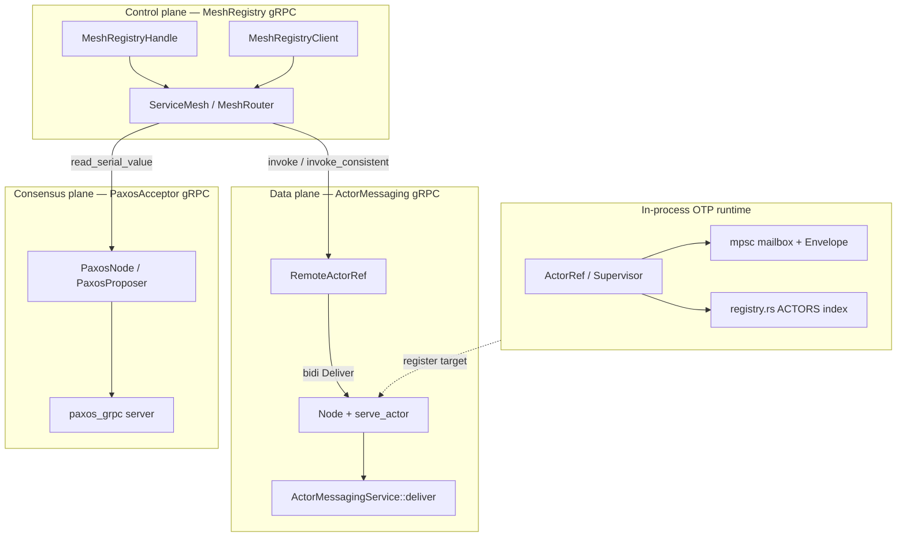
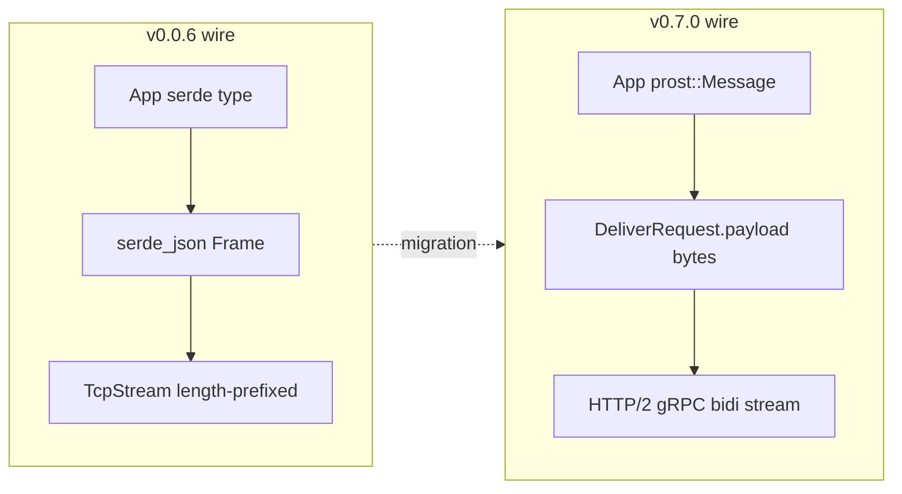
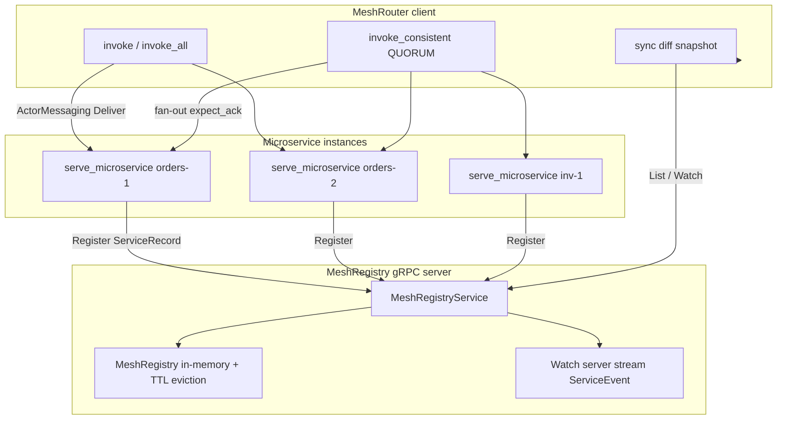
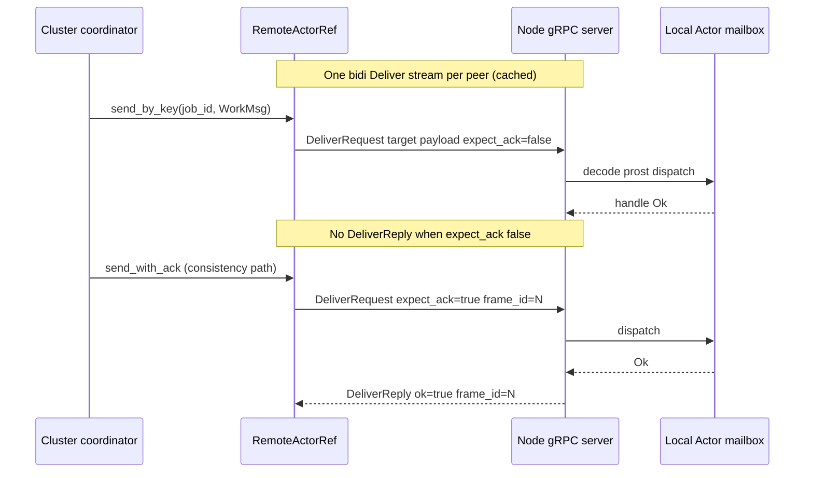
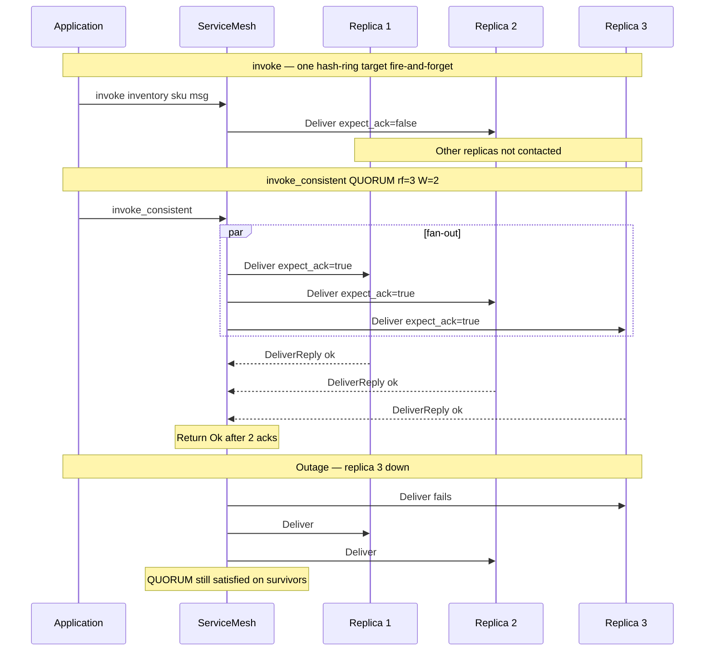
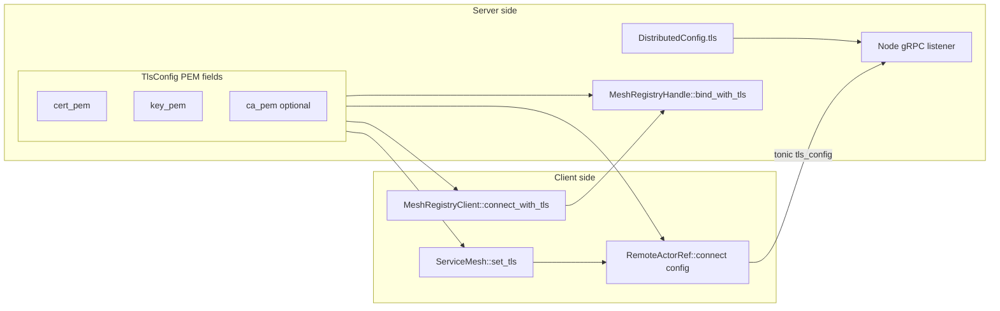

# lane_switchboards v0.7.0

Release notes for **v0.7.0** — the wire layer moves from **length-prefixed JSON over raw TCP** to **Protocol Buffers over gRPC** (tonic/prost). Public OTP APIs (`Actor`, `Supervisor`, `ServiceMesh`, `Cluster`) are unchanged; only transport and serialization changed. v0.0.6 consistency, Paxos reads, and optional `tls` / `metrics` features carry forward on the new wire.

For the full project overview see [README.md](./README.md).  
Previous release: [READMEv0.0.6.md](./READMEv0.0.6.md) · [READMEv0.0.5.md](./READMEv0.0.5.md) · [Wire reference](./docs/wire_protocol.md) · [gRPC migration checklist](./docs/GRPC_MIGRATION_TODO.md)

---

## What's new in v0.7.0

### 1) Three gRPC planes (replaces JSON/TCP framing)

| Plane | Proto package | Service | Module |
|-------|---------------|---------|--------|
| **Control** | `lane_switchboard.control` | `MeshRegistry` | `mesh_registry_grpc.rs` |
| **Data** | `lane_switchboard.data` | `ActorMessaging` (bidi `Deliver`) | `distributed_grpc.rs` |
| **Consensus** | `lane_switchboard.paxos` | `PaxosAcceptor` | `paxos_grpc.rs` |

- `proto/*.proto` + `build.rs` → `crate::proto`
- `RemoteMessage` = `prost::Message + Default + Send + Sync + Clone + Debug`
- Removed `serde_json` from wire paths; removed `MeshControlMsg` / JSON `Frame` types

### 2) Data plane — persistent bidi `Deliver` streams

| Component | Role |
|-----------|------|
| `Node` / `serve_actor` | gRPC server; `ActorMessagingService` dispatches by `target` |
| `RemoteActorRef` | tonic client; cached bidi stream per peer |
| `DeliverRequest` | `target`, `payload` (protobuf bytes), `frame_id`, `expect_ack` |
| `DeliverReply` | Quorum / `send_with_ack` correlation (`ok`, `error`) |
| `Node::connected_channels()` | Active bidi streams on this node |

Fire-and-forget `send()` sets `expect_ack = false`. Consistency paths set `expect_ack = true` and map replies to `ConsistencyError`.

### 3) Control plane — mesh registry over gRPC

| Before (v0.0.6) | After (v0.7.0) |
|-----------------|----------------|
| `MeshRegistryServer` TCP + JSON | `MeshRegistryHandle::bind` (tonic) |
| `MeshRegistryClient` framed control msgs | `MeshRegistryClient::connect` |
| — | `register`, `deregister`, `list`, `ping`, `watch` (server stream) |

Tracing spans: `grpc.register`, `grpc.deregister`, `grpc.list`, `grpc.ping`, `grpc.watch`.

### 4) TLS unified via `TlsConfig` (`feature = "tls"`)

| Layer | API |
|-------|-----|
| Data plane | `DistributedConfig.tls` on `Node::bind_on_current_runtime`, `RemoteActorRef::connect` |
| Mesh registry | `MeshRegistryHandle::bind_with_tls`, `MeshRegistryClient::connect_with_tls` |
| Microservice | `serve_microservice_tls`, `ServiceMesh::set_tls` |

**Removed:** `Node::bind_tls_on_runtime`, `RemoteActorRef::with_tls`, `Cluster::set_tls_connector`, `MeshRouter::with_registry_tls` (use `TlsConfig` + config fields above).

### 5) Paxos acceptor on dedicated gRPC server

- `serve_paxos_acceptor` / `PaxosProposerClient` over `PaxosAcceptor` RPCs
- Spans: `grpc.paxos.prepare`, `grpc.paxos.propose`, `grpc.paxos.commit`
- In-process `PaxosMsg` no longer uses serde on the wire

### 6) Benchmarks and docs

| Artifact | Description |
|----------|-------------|
| [`benches/wire.rs`](benches/wire.rs) | Criterion: `remote_actor_ref_send`, `mesh_registry_list_32`, `invoke_consistent_quorum_rf3` |
| [`docs/wire_protocol.md`](docs/wire_protocol.md) | Control/data/consensus plane reference |
| [`examples/grpc_cluster.rs`](examples/grpc_cluster.rs) | Hash-ring + round-robin over gRPC |
| Examples | All distributed/mesh wire types use `prost::Message` |

### 7) Crate version

```toml
lane_switchboards = "0.7"
```

Re-export: `pub use prost` (and `Oneof`) for example message derives.

---

## System architecture (v0.7.0)

High-level view: **OTP actors** locally; **three gRPC planes** for discovery, delivery, and linearizable reads.



---

## Wire stack: v0.0.6 → v0.7.0



---

## Service mesh: control + data planes



Each `ServiceRecord` carries `address` (data-plane listen addr) and `target` (unique `instance_id` for `DeliverRequest.target`).

---

## Distributed cluster: one peer connection



`Cluster` keeps a roster of `RemoteActorRef` values; `HashRing` picks the peer for `send_by_key`.

---

## Tunable consistency on gRPC acks (unchanged semantics)

Write/read levels from v0.0.6 still apply; acks are **`DeliverReply`** on the same bidi stream (not JSON `AckFrame`).



Theory and level tables: [`docs/consistency.md`](docs/consistency.md). Production Envoy sidecar pattern: [`examples/consistency.md`](examples/consistency.md).

---

## TLS configuration flow (`feature = "tls"`)



```bash
cargo run --example tls_distributed --features tls
cargo run --example consistency --features tls
```

---

## Observability

| Span | Where |
|------|--------|
| `grpc.deliver` | `ActorMessagingService` |
| `grpc.register` / `deregister` / `list` / `ping` / `watch` | `MeshRegistryService` |
| `grpc.paxos.prepare` / `propose` / `commit` | `PaxosGrpcService` |
| `consistency.invoke_consistent` / `read_consistent` | `mesh.rs` (`feature = metrics` optional callback) |

`Node::connected_channels()` — count of open inbound bidi `Deliver` streams.

---

## Benchmarks (localhost, release)

Run: `cargo bench --bench wire`

Measured on **macOS (Apple Silicon), release profile, peers on 127.0.0.1** — use as relative comparisons, not SLAs.

| Benchmark | Median | Measures |
|-----------|--------|----------|
| `remote_actor_ref_send` | **~1.8 µs** | Warm bidi stream, fire-and-forget send |
| `mesh_registry_list_32` | **~187 µs** | `List` with 32 registered instances |
| `invoke_consistent_quorum_rf3` | **~139 µs** | QUORUM write, rf=3, three local replicas |

---

## Migration notes from v0.0.6

### Wire types

```rust
// Before — serde JSON (no longer valid on wire)
#[derive(Serialize, Deserialize)]
enum PingMsg { Ping(String) }

// After — prost
use lane_switchboards::prost::Message;

#[derive(Clone, PartialEq, Message)]
struct PingMsg {
    #[prost(string, tag = "1")]
    text: String,
}
```

Nested enums: use `prost` `oneof` (`#[derive(Oneof)]` on inner enum) or flat opcode fields — see [`examples/service_mesh.rs`](examples/service_mesh.rs).

### Registry and nodes

```rust
// Before
let registry = MeshRegistryServer::bind("127.0.0.1:9050").await?;

// After
let registry = MeshRegistryHandle::bind("127.0.0.1:0").await?;
let mut client = MeshRegistryClient::connect(&registry.address).await?;
```

### TLS

```rust
use lane_switchboards::{DistributedConfig, TlsConfig};

let mut config = DistributedConfig::default();
config.tls = Some(server_tls);
let node = Node::bind_on_current_runtime("node-b", "127.0.0.1:0", &config).await?;

let mut client_config = DistributedConfig::default();
client_config.tls = Some(client_tls);
let remote = RemoteActorRef::connect(&addr, "worker", &client_config);
```

### Breaking removals

| Removed (v0.0.6) | Replacement (v0.7.0) |
|------------------|------------------------|
| `MeshControlMsg`, JSON `Frame` / `AckFrame` | `DeliverRequest` / `DeliverReply` |
| `RemoteActorRef::with_tls` | `RemoteActorRef::connect(..., &DistributedConfig)` |
| `Cluster::set_tls_connector` | `Cluster::set_distributed_config` with `tls` |
| `serde_json` dependency | `prost` + `tonic` |

`DistributedConfig` is no longer `Copy` (holds optional `TlsConfig`).

### Examples

```bash
cargo run --example distributed_demo
cargo run --example grpc_cluster
cargo run --example service_mesh
cargo run --example tls_distributed --features tls
cargo run --example consistency --features tls
cargo build --examples
```

---

## Tests and checks

| Command | Result |
|---------|--------|
| `cargo test --lib` | 37 passed |
| `cargo test --lib --features tls` | 39 passed (+ `mesh_registry_tls_round_trip`, `tls_round_trip`) |
| `cargo clippy --lib -- -D warnings` | clean |
| `cargo build --examples` | all examples compile |

---

## Quick reference — gRPC mesh invoke

```rust
use lane_switchboards::mesh::{
    join_mesh, serve_microservice, MeshRegistryHandle, MeshRegistryClient, MeshRouter,
};
use lane_switchboards::prost::Message;

#[derive(Clone, PartialEq, Message)]
struct OrderMsg {
    #[prost(uint64, tag = "1")]
    order_id: u64,
}

let registry = MeshRegistryHandle::bind("127.0.0.1:0").await?;
let handle = serve_microservice("orders", "orders-1", "127.0.0.1:0", OrdersActor).await?;

let mut mesh = lane_switchboards::mesh::ServiceMesh::new();
let mut client = MeshRegistryClient::connect(&registry.address).await?;
join_mesh(&mut mesh, Some(&mut client), &handle).await?;

let mut router = MeshRouter::with_registry(&registry.address);
router.sync().await?;
router.invoke("orders", &order_id, OrderMsg { order_id }).await?;
```

---

## File map (v0.7.0 touch points)

| File | Role |
|------|------|
| `proto/*.proto` | Control, data, Paxos service definitions |
| `build.rs` / `src/proto.rs` | tonic-build + `ServiceRecord` conversions |
| `src/distributed_grpc.rs` | `ActorMessagingService`, bidi `Deliver` |
| `src/mesh_registry_grpc.rs` | `MeshRegistryService`, handle + client |
| `src/paxos_grpc.rs` | `PaxosAcceptor` gRPC + `PaxosProposerClient` |
| `src/grpc_tls.rs` | `TlsConfig` → tonic server/client TLS |
| `src/distributed.rs` | `Node`, `RemoteActorRef`, `Cluster`, `connected_channels` |
| `src/mesh.rs` | Routing + consistency (gRPC fan-out) |
| `src/config.rs` | `TlsConfig`, `DistributedConfig.tls` |
| `benches/wire.rs` | Criterion wire benchmarks |
| `docs/wire_protocol.md` | Wire protocol reference |
| `docs/GRPC_MIGRATION_TODO.md` | Completed migration checklist |
| `examples/*` | Protobuf wire types; `grpc_cluster` added |
