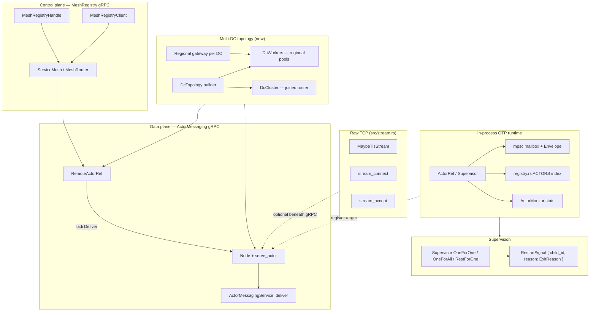
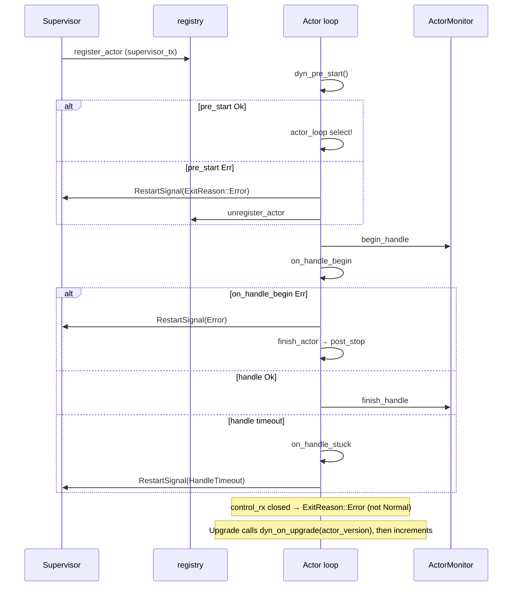
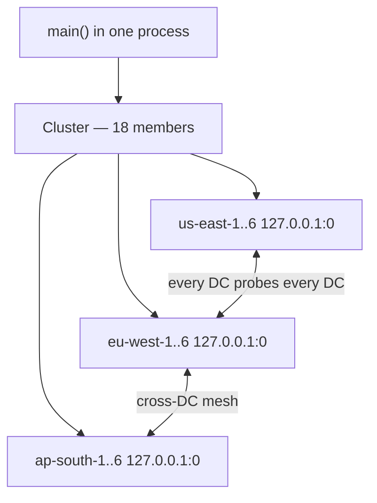
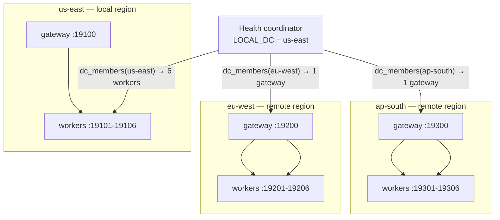
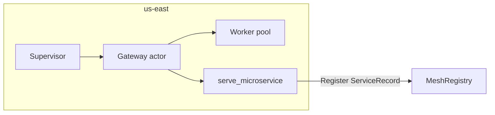
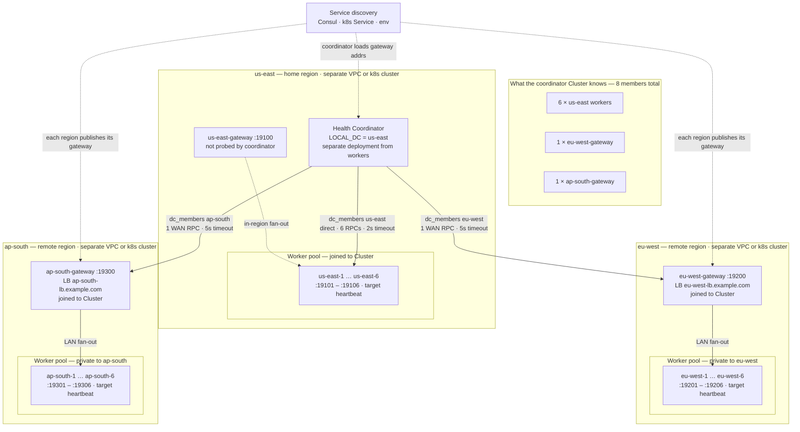
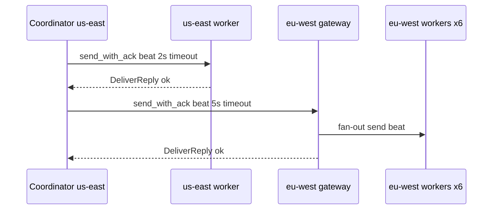
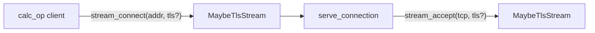

# lane_switchboards v0.0.8

Release notes for **v0.0.8** — actor runtime hardening, typed supervisor signals, multi-DC topology builder, raw TCP stream example, and production-style regional heartbeat monitoring.

For the full project overview see [README.md](./README.md).  
Previous release: [READMEv0.0.7.md](./READMEv0.0.7.md) · [Multi-DC heartbeat guide](./examples/multi_dc_heartbeat.md) · [Wire reference](./docs/wire_protocol.md)

---

## What's new in v0.0.8

### 1) Actor runtime fixes and hardening (`src/actor.rs`)

| Fix | Before | After |
|-----|--------|-------|
| **Demonitor shadowing** | `retain(\|(id, _)\| …)` shadowed outer `id` — demonitor was a no-op | Closure uses `mid`; observer is actually removed |
| **`pre_start` failure** | Actor vanished silently; supervisor slot stale | `notify_supervisor` with `ExitReason::Error` before unregister |
| **`ActorRef::upgrade`** | Missing `Send + Sync` on public API | Signature matches `into_dyn_actor` — errors at call site |
| **`control_rx` closed** | Exit reason defaulted to `Normal` | `ExitReason::Error("control channel closed unexpectedly")` |
| **Hot upgrade version** | `dyn_on_upgrade(0)` always | `actor_version` counter passed and incremented each swap |
| **`on_handle_begin` failure** | Undocumented fatal path | Documented: failure terminates actor (journal internally if non-fatal) |
| **Handle timeout ms cast** | Obscure `.min(u64::MAX as u128) as u64` | `u64::try_from(...).unwrap_or(u64::MAX)` |

### 2) Typed supervisor restart signals (`RestartSignal`)

```rust
// Before (v0.7.0)
pub struct RestartSignal {
    pub child_id: ActorId,
    pub reason: String,  // format!("{:?}", reason) — lossy
}

// After (v0.0.8)
pub struct RestartSignal {
    pub child_id: ActorId,
    pub reason: ExitReason,  // match on HandleTimeout, Killed, Error, …
}
```

Supervisor strategies can now branch on exit **type**, not debug strings. Re-exported from the crate root: `RestartSignal`, `ExitReason`.

### 3) Multi-DC topology module (`src/topology.rs`)

Declarative builder for standing up datacenter layouts without hand-rolling loops.

| Type | Role |
|------|------|
| `DcTopology` | Chainable DC layout: `.datacenter("us-east", 6)` or `.datacenter_with_ports("us-east", 6, 19100)` |
| `DcWorkers<M>` | Spawn regional worker pools **without** joining a global cluster |
| `DcCluster<M>` | Spawn all nodes, tag with `.with_dc`, join one `Cluster<M>` |
| `DatacenterSpec` | `(name, count, optional port_base)` per region |
| `NodeInfo` | `{ name, dc, addr }` bookkeeping + `node_name(addr)` reverse lookup |

Port convention: reserve `port_base` for a **regional gateway**; workers bind `port_base + 1 .. port_base + count`.

### 4) New examples

| Example | Command | Purpose |
|---------|---------|---------|
| **`stream_calc`** | `cargo run --example stream_calc` | Raw TCP via `stream_connect` / `stream_accept` / `MaybeTlsStream` |
| **`multi_dc_heartbeat`** | `cargo run --example multi_dc_heartbeat` | API tour — all 18 nodes in one process |
| **`multi_dc_heartbeat_topology`** | `cargo run --example multi_dc_heartbeat_topology` | **Production layout** — gateways, `LOCAL_DC`, fixed port blocks |

### 5) README — Lunatic comparison and supported features matrix

The main [README.md](./README.md) now includes a **Lunatic** column in the runtime comparison table and an explicit **Supported features** checklist (process supervision, TCP, distributed nodes, hot reload, etc.).

### 6) Public API cleanup

- `spawn_on_current_runtime` is **`pub(crate)`** — use `spawn` or `spawn_with_config` from application code.
- `topology` module exported: `DcTopology`, `DcCluster`, `DcWorkers`, `DatacenterSpec`, `NodeInfo`.

---

## System architecture (v0.0.8)

Full stack: OTP actors locally, gRPC for distributed/mesh, optional TLS, topology for multi-DC roster building.



---

## Actor lifecycle and supervisor signal flow (v0.0.8)



---

## Multi-DC: testing layout vs production layout

This is the central distinction introduced in v0.0.8. The **testing** example teaches APIs; the **production** example models how you actually operate regions.

### Testing layout (single process, API tour)

[`multi_dc_heartbeat`](examples/multi_dc_heartbeat.rs) — all regions colocated:



| Property | Testing value |
|----------|---------------|
| Processes | **1** — all 18 nodes |
| Bind addresses | Ephemeral `127.0.0.1:0` |
| Coordinator roster | **All 18 workers** |
| Cross-DC traffic | Every DC sends to every other DC's **6 workers** |
| `local_dc` arg | `"local"` placeholder |
| Use when | Learning `dc_members`, `dc_replicas_for_key`, `send_all` |

```bash
cargo run --example multi_dc_heartbeat
```

### Production layout (regional gateways + coordinator home DC)

[`multi_dc_heartbeat_topology`](examples/multi_dc_heartbeat_topology.rs):



| Property | Production value |
|----------|------------------|
| Processes | **1 per region** (simulated here with port blocks) |
| Bind addresses | Fixed per region (`191xx`, `192xx`, `193xx`) |
| Coordinator roster | **8 members** — 6 local workers + 2 remote gateways |
| Cross-DC traffic | **1 gRPC hop per remote DC** (gateway fans out locally) |
| `local_dc` arg | **`"us-east"`** — coordinator's actual home DC |
| Partition handling | Coordinator **stops probing** unreachable region |
| Use when | Designing real multi-region health checks |

```bash
cargo run --example multi_dc_heartbeat_topology
```

---

## Production setup — step by step

### A) Single-region service (mesh + supervision)

Typical microservice in one datacenter:



1. Wrap stateful workers in a **supervisor** (`OneForOne` or `RestForOne`).
2. Expose the service with `serve_microservice` (or `serve_microservice_tls --features tls`).
3. Register in `MeshRegistry`; clients use `MeshRouter::invoke`.
4. Set `ActorConfig::handle_timeout` for stuck-handle recovery.
5. Use `ChildRegistry` / `ChildSlot` so callers keep stable refs after restart.

```bash
# Local dev
cargo run --example calculator_mesh_simplified

# Production
cargo run --example calculator_mesh --release
cargo run --example ecommerce_flash_sale --release
```

### B) Multi-datacenter workers + regional gateway

Each region runs independently:



**How to read the diagram**

| Symbol / edge | Meaning |
|---------------|---------|
| **Coordinator** | Runs in the home DC (`us-east`); builds the `Cluster` roster and runs health probes on a timer. |
| **Solid arrows from coordinator** | gRPC `send_with_ack` on the persistent bidi stream — local workers directly, remote regions via gateway only. |
| **Gateway → workers** | Happens inside the remote region over LAN; the coordinator never dials individual remote worker IPs. |
| **Dotted arrows from service discovery** | Production source of gateway hostnames; workers stay off the global roster. |
| **8-member roster** | 6 local worker refs + 1 ref per remote gateway — not all 18 nodes. |

| Component | Per region | Bind |
|-----------|------------|------|
| Worker pool (N nodes) | `DcWorkers::spawn` or `serve_actor` × N | `{region-host}:9101..910N` |
| Regional gateway | `serve_actor("{dc}-gateway", …)` | `{region-host}:9100` |
| Coordinator | Separate deployment in home DC | N/A |

**Coordinator roster rules:**

- **Local region** — join every worker with `.with_dc("us-east")`.
- **Remote regions** — join **gateway only** with `.with_dc("eu-west")`; do not add individual worker addresses to the global roster.

Runnable skeleton with production DNS and supervisors: [`multi_dc_heartbeat_prod`](examples/multi_dc_heartbeat_prod.rs) (`DRY_RUN=1` default).

```rust
use lane_switchboards::topology::{DcTopology, DcWorkers};
use lane_switchboards::distributed::{Cluster, ClusterMember, serve_actor};

const LOCAL_DC: &str = "us-east";

// --- In eu-west region (separate process / k8s cluster) ---
let workers = DcWorkers::spawn(
    DcTopology::new().datacenter_with_ports("eu-west", 6, 19_200),
    "heartbeat",
    |_, name| HeartbeatWorker::new(name),
).await?;

let gateway = serve_actor(
    "eu-west-gateway",
    "0.0.0.0:19200",
    "gateway",
    RegionalGateway::new(workers),
).await?;

// Publish gateway address to service discovery (Consul, k8s Service, etc.)
```

```rust
// --- In us-east coordinator (separate process) ---
//
// The coordinator builds a Cluster roster: a local index of RemoteActorRef
// handles it can dial over gRPC. This is NOT service discovery itself — you
// still load addresses from Consul/k8s/env — but once joined, Cluster gives
// you DC-aware routing helpers (dc_members, local_replicas_for_key, etc.).

let mut cluster = Cluster::new();

// LOCAL REGION — register every worker in the coordinator's home DC.
//
// local_workers was spawned earlier in this same process (e.g. via DcWorkers
// on ports 19101-19106). Each ClusterMember carries:
//   - name      → logical id ("us-east-3") for logging and ref_by_name
//   - node_addr → gRPC dial target ("10.0.1.15:19103" or LB hostname)
//   - target    → deliver route on that node ("heartbeat" actor mailbox)
//   - dc tag    → "us-east" so cluster.dc_members("us-east") finds these
//
// The coordinator talks to local workers DIRECTLY — no gateway hop — because
// it runs in the same region and low latency matters for health checks.
for node in local_workers.nodes() {
    cluster.join(
        ClusterMember::new(&node.name, &node.addr, "heartbeat")
            .with_dc(LOCAL_DC.to_string()),
    );
}

// REMOTE REGIONS — register ONE gateway per foreign DC, not every worker.
//
// eu-west runs its own 6 workers behind eu-west-gateway @ :19200 (see block
// above). The coordinator only stores the gateway's public/LB address from
// service discovery. When it probes eu-west, it sends ONE gRPC Deliver to the
// gateway; the gateway fans out to all 6 local workers inside eu-west.
//
// Why not join all 18 workers globally?
//   - WAN cost: 1 cross-region RPC vs 6
//   - Security: remote worker IPs stay private to their region
//   - Failure domain: gateway health = region health
cluster.join(
    ClusterMember::new("eu-west-gateway", "eu-west-lb.example.com:19200", "gateway")
        .with_dc("eu-west"),
);
// Repeat for ap-south, etc. — one ClusterMember per remote gateway.

// INTRA-DC PROBE — ping every local worker with acknowledgement.
//
// dc_members(LOCAL_DC) returns RemoteActorRef for all members tagged
// "us-east" (the 6 workers we joined above). send_with_ack sets
// DeliverRequest.expect_ack = true and waits for DeliverReply on the
// persistent bidi stream — so you know the message reached the remote
// actor mailbox, not just the TCP/gRPC layer.
//
// 2s timeout: local LAN; fail fast if a worker is wedged.
for w in cluster.dc_members(LOCAL_DC) {
    w.send_with_ack(beat_msg.clone(), Duration::from_secs(2)).await?;
}

// CROSS-DC PROBE — ping remote region via its gateway only.
//
// dc_members("eu-west") returns 1 ref (the gateway), NOT 6 worker refs.
// The gateway's handle() receives beat_msg and forwards to each worker
// inside eu-west over localhost/LAN — invisible to the coordinator.
//
// 5s timeout: higher than local — accounts for WAN RTT + gateway fan-out.
// On failure: mark eu-west unreachable and stop routing (see topology example).
for gw in cluster.dc_members("eu-west") {
    gw.send_with_ack(beat_msg.clone(), Duration::from_secs(5)).await?;
}
```

#### What this block is doing (step by step)

1. **`Cluster::new()`** — Creates an empty roster. Nothing is reachable until you `join` members. The cluster also owns a consistent-hash ring used by `send_by_key` / `dc_replicas_for_key`; heartbeat code here uses `dc_members` instead.

2. **Joining local workers** — Each `local_workers` node (spawned in-process or on the same VPC) becomes a `ClusterMember` with `.with_dc("us-east")`. After join, `cluster.dc_members("us-east")` returns six `RemoteActorRef<HbMsg>` pointing at the `"heartbeat"` target on each node. Even though the coordinator is in the same process as the workers in dev, production uses the same API: gRPC `ActorMessaging::Deliver` to each worker address.

3. **Joining remote gateway only** — For `eu-west`, you join a single member: the gateway's load-balancer hostname and target `"gateway"`. The six eu-west workers are **not** in this coordinator's cluster. They live only in eu-west's regional process behind `RegionalGateway`.

4. **`dc_members(LOCAL_DC)`** — Filters the roster by datacenter tag. Returns all members where `dc == "us-east"` (or untagged members when using the `"local"` sentinel — here you pass the real home DC name).

5. **`send_with_ack`** — Sends a protobuf `HbMsg` on the cached bidi gRPC stream. The remote node must accept the message into the actor mailbox and reply with `DeliverReply { ok: true }` before the call returns. Use this for health checks; fire-and-forget `send()` only guarantees the bytes left the client.

6. **Cross-region via gateway** — One ack'd RPC to `eu-west-lb.example.com:19200`. The gateway actor receives the beat and calls `worker.send(...)` for each of its six in-region workers. From the coordinator's perspective the region is one endpoint; from eu-west's perspective six workers still report individually (e.g. for per-node stats in `multi_dc_heartbeat_topology`).



**Environment variables (recommended):**

| Variable | Example | Purpose |
|----------|---------|---------|
| `LOCAL_DC` | `us-east` | Coordinator home DC for `datacenters()` / `local_replicas_for_key` |
| `GATEWAY_BIND` | `0.0.0.0:19200` | Regional gateway listen addr |
| `WORKER_PORT_BASE` | `19200` | Workers at `base+1..base+N` |
| `REMOTE_GATEWAYS` | `eu-west=host:19200,ap-south=host:19300` | Coordinator discovery |

### C) TLS between regions (`feature = "tls"`)

```rust
use lane_switchboards::{DistributedConfig, TlsConfig};

let mut config = DistributedConfig::default();
config.tls = Some(TlsConfig {
    cert_pem: std::fs::read("server.crt")?,
    key_pem: std::fs::read("server.key")?,
    ca_pem: Some(std::fs::read("ca.crt")?),
});

// Server (regional gateway / serve_actor)
serve_actor_on_current_runtime("gw", "0.0.0.0:19200", "gateway", gw, &config, &ActorConfig::default()).await?;

// Client (coordinator probing remote gateway)
let remote = RemoteActorRef::connect("eu-west-lb.example.com:19200", "gateway", &config);
remote.send_with_ack(msg, Duration::from_secs(5)).await?;
```

```bash
cargo run --example tls_distributed --features tls
cargo run --example consistency --features tls
```

### D) Raw TCP services (`src/stream.rs`)

For non-gRPC protocols or sidecar bridges:



- **Plain TCP:** pass `None` for connector/acceptor.
- **TLS:** `feature = "tls"`, pass `TlsConnector` / `TlsAcceptor`.

```bash
cargo run --example stream_calc
cargo run --example stream_calc  # plain
# TLS: swap None → Some(&acceptor) in serve_connection / calc_op
```

### E) Supervisor restart decisions (v0.0.8)

Match on typed exit reasons:

```rust
use lane_switchboards::{ExitReason, RestartSignal};

async fn on_restart(signal: RestartSignal) {
    match signal.reason {
        ExitReason::HandleTimeout { elapsed_ms, limit_ms } => {
            tracing::warn!(elapsed_ms, limit_ms, "child timed out — restarting");
        }
        ExitReason::Killed => {
            tracing::info!("intentional kill — skip or restart per policy");
        }
        ExitReason::Normal | ExitReason::Shutdown => {
            // typically do not restart
        }
        ExitReason::Error(msg) => {
            tracing::error!(%msg, "child error");
        }
        ExitReason::Linked(peer, inner) => { /* … */ }
    }
}
```

---

## Testing setup — step by step

Use these patterns on a laptop or in CI. **Do not** copy testing shortcuts into production.

### 1) Unit and integration tests

```bash
cargo test                    # 40 unit + 8 integration + 7 supervisor
cargo test --features tls     # + TLS round-trip tests
```

Topology module tests (`src/topology.rs`):

- `dc_topology_counts_and_node_names` — spawn 2 DC × 2 nodes, verify `dc_members` counts.
- `datacenter_with_ports_binds_expected_addresses` — fixed port binding.
- `broadcast_to_dc_reaches_all_members` — fan-out within one DC.

### 2) Single-process API tour (multi-DC)

```bash
cargo run --example multi_dc_heartbeat
```

Validates: `ClusterMember::with_dc`, `dc_members`, `datacenters`, `dc_replicas_for_key`, `send_all`, partition counting.

Uses `DcCluster::spawn` with ephemeral ports — **all 18 nodes in one roster**.

### 3) Production-layout simulation (still localhost)

```bash
cargo run --example multi_dc_heartbeat_topology
```

Same machine, but:

- Distinct port blocks per region.
- Coordinator `LOCAL_DC=us-east`.
- 8-member roster (gateways for remote DCs).
- Cross-DC via gateway fan-out.

Use this to verify coordinator logic before deploying per-region processes.

### 4) Production deployment skeleton (fictional DNS, compiles without infra)

```bash
cargo run --example multi_dc_heartbeat_prod
DEPLOY_ROLE=regional-gateway LOCAL_DC=eu-west cargo run --example multi_dc_heartbeat_prod
DEPLOY_ROLE=worker LOCAL_DC=us-east WORKER_NAME=us-east-hb-3 cargo run --example multi_dc_heartbeat_prod
```

Production hostnames (`*.prod.example.com`), supervisors, and `send_with_ack` probes — **`DRY_RUN=1` by default** (no network). Set `DRY_RUN=0` on real hardware.

### 5) Mesh and distributed smoke tests

```bash
cargo run --example distributed_demo
cargo run --example grpc_cluster
cargo run --example service_mesh
cargo run --example horizontal_scaling
cargo run --example horizontal_scaling_rest_for_one
```

### 6) Supervision and fault injection

```bash
cargo run --example supervisor_strategies
cargo run --example resilient_calculator
cargo run --example rest_for_one_calculator_timer
cargo run --example handle_timeout_calculator_timer
```

### 7) Benchmarks (localhost baseline only)

```bash
cargo bench --bench wire
cargo bench --bench ecommerce
```

Numbers are **relative comparisons on 127.0.0.1**, not production SLAs.

---

## Production vs testing — quick reference

| Concern | Testing | Production |
|---------|---------|------------|
| **Regions** | All in one `cargo run` | One process/deployment per region |
| **Ports** | `127.0.0.1:0` ephemeral | Fixed hosts + load balancer DNS |
| **Multi-DC roster** | All workers in `Cluster` (18) | Local workers + remote gateways (8) |
| **Cross-DC RPCs** | Direct to each worker | One gateway per remote DC |
| **`local_dc`** | `"local"` (placeholder) | Real DC name from env (`us-east`) |
| **TLS** | Omitted | `--features tls` + `TlsConfig` PEM |
| **Supervision** | Often omitted in demos | Always — `Supervisor` + intensity limits |
| **Health probes** | Fire-and-forget `send()` | `send_with_ack` + timeout |
| **Partition** | Simulated in example | Coordinator stops routing; alert on stale workers |
| **Discovery** | In-memory `Cluster::join` | Service discovery / mesh registry |
| **Hot upgrade** | `hot_upgrade` example | `ActorRef::upgrade` + versioned `on_upgrade` |
| **Restart signals** | Log only | Match on `ExitReason` variant |

---

## Migration notes from v0.7.0

### Breaking: `RestartSignal::reason` is now `ExitReason`

```rust
// Before
if signal.reason.contains("HandleTimeout") { … }

// After
use lane_switchboards::ExitReason;
match signal.reason {
    ExitReason::HandleTimeout { elapsed_ms, limit_ms } => { … }
    other => { … }
}
```

### Breaking: `spawn_on_current_runtime` no longer public

```rust
// Before
use lane_switchboards::spawn_on_current_runtime;

// After — use one of:
use lane_switchboards::{spawn, spawn_with_config, spawn_on_runtime};
```

### New: multi-DC topology

```rust
use lane_switchboards::topology::{DcCluster, DcTopology, DcWorkers};

// All regions, one cluster (testing)
let cluster = DcCluster::spawn(
    DcTopology::new()
        .datacenter("us-east", 6)
        .datacenter("eu-west", 6),
    "heartbeat",
    |dc, name| Worker::new(dc, name),
).await?;

// Regional workers only (production — one region per process)
let workers = DcWorkers::spawn(
    DcTopology::new().datacenter_with_ports("eu-west", 6, 19_200),
    "heartbeat",
    |_, name| Worker::new(name),
).await?;
```

### Actor behaviour changes (transparent to most callers)

- `pre_start` failure now notifies supervisor.
- `control_rx` drop is an error exit, not normal shutdown.
- `on_upgrade(old_version)` receives incrementing version counter.

---

## Examples index (v0.0.8)

| Example | Command |
|---------|---------|
| Raw TCP calculator | `cargo run --example stream_calc` |
| Multi-DC API tour | `cargo run --example multi_dc_heartbeat` |
| Multi-DC production layout | `cargo run --example multi_dc_heartbeat_topology` |
| Multi-DC production skeleton (fictional DNS) | `cargo run --example multi_dc_heartbeat_prod` |
| Hot code upgrade | `cargo run --example hot_upgrade` |
| gRPC distributed | `cargo run --example distributed_demo` |
| gRPC cluster | `cargo run --example grpc_cluster` |
| Service mesh | `cargo run --example service_mesh` |
| TLS distributed | `cargo run --example tls_distributed --features tls` |
| E-commerce flash sale | `cargo run --example ecommerce_flash_sale` |
| Calculator mesh | `cargo run --example calculator_mesh_simplified` |

---

## Tests and checks

| Command | Result (v0.0.8) |
|---------|-----------------|
| `cargo test` | 40 unit + 8 integration + 7 supervisor + 9 doc-tests |
| `cargo test --features tls` | + TLS round-trip tests |
| `cargo build --examples` | all examples compile |
| `cargo run --example multi_dc_heartbeat_topology` | production-layout heartbeat demo |

---

## File map (v0.0.8 touch points)

| File | Role |
|------|------|
| `src/actor.rs` | Demonitor fix, pre_start notify, upgrade bounds/version, typed exit paths |
| `src/supervisor.rs` | `RestartSignal.reason: ExitReason` |
| `src/topology.rs` | `DcTopology`, `DcWorkers`, `DcCluster`, port-base binding |
| `src/stream.rs` | `MaybeTlsStream`, `stream_connect`, `stream_accept` |
| `src/lib.rs` | Re-exports: `RestartSignal`, `topology::*` |
| `examples/stream_calc.rs` | Raw TCP calculator demo |
| `examples/multi_dc_heartbeat.rs` | Single-process API tour |
| `examples/multi_dc_heartbeat_topology.rs` | Regional gateway production layout |
| `examples/multi_dc_heartbeat_prod.rs` | Production DNS + supervisors + dry-run deploy roles |
| `examples/multi_dc_heartbeat.md` | Testing vs production guide |
| `README.md` | Lunatic comparison, supported features matrix |
