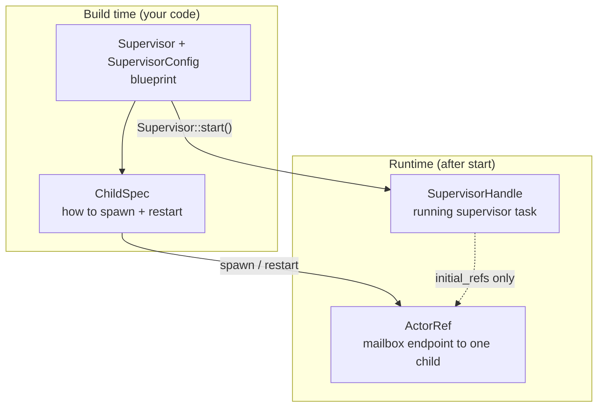
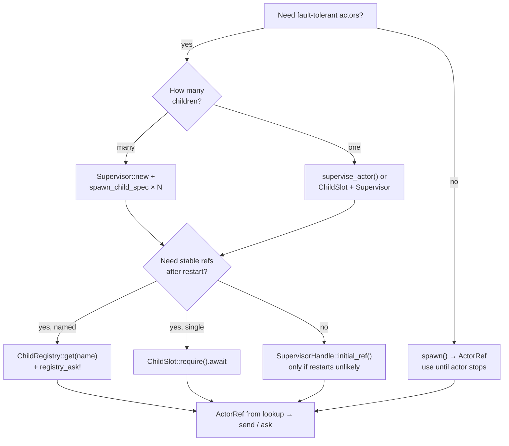
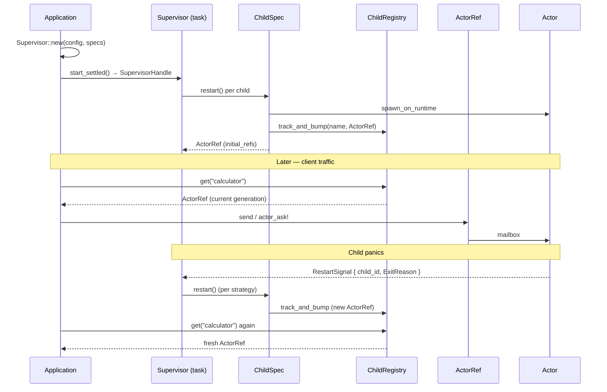

# lane_switchboards v0.0.9

Release notes for **v0.0.9** — lock-free `ChildRegistry` lookups and a practical guide to the four core supervision types: **`ActorRef`**, **`ChildSpec`**, **`Supervisor`**, and **`SupervisorHandle`**.

For the full project overview see [README.md](./README.md).  
Previous release: [READMEv0.0.8.md](./READMEv0.0.8.md) · [Supervisor strategies example](./examples/supervisor_strategies.md)

---

## What's new in v0.0.9

### `ChildRegistry` — `ArcSwap` + synchronous `get`

| Before (v0.0.8) | After (v0.0.9) |
|-----------------|----------------|
| `ChildRegistry` backed by `Arc<Mutex<…>>` | Snapshot in `Arc<ArcSwap<…>>` — reads are lock-free |
| `registry.get(name).await` | `registry.get(name)` — synchronous, no await |
| Separate `get_sync` | Removed — `get` is always sync |

Writes (`track`, `track_and_bump`) still use copy-on-write `rcu`; concurrent lookups never block on a mutex.

Dependency: `arc-swap`.

---

## The four types — what each one is

Think of OTP supervision as **four layers** with different lifetimes:



| Type | What it is | Lifetime | You hold it when… |
|------|------------|----------|-------------------|
| **`ActorRef<M>`** | Lightweight handle to **one** actor’s mailbox (`send`, `stop`, `link`, …) | Until the actor stops; **new `ActorId` after every respawn** | Sending messages, linking, monitoring, stopping a specific actor |
| **`ChildSpec<M>`** | **Factory** for one supervised child — knows `order`, current `id`, and how to `restart()` | Owned by the supervisor task after `start()` | Building the child list **before** `Supervisor::start()` |
| **`Supervisor<M>`** | **Blueprint** — config + `Vec<Box<dyn ChildSpec<M>>>` | Short — consumed by `start()` / `start_settled()` | Declaring strategy, intensity limits, and which children belong in the tree |
| **`SupervisorHandle<M>`** | **Running** supervisor — background task, shutdown channel, snapshot of **initial** child refs | Until `stop().await` | Graceful shutdown; optional peek at refs from the **first** spawn pass |

---

## `ActorRef<M>` — talk to one actor

```rust
// src/actor.rs
pub struct ActorRef<M> {
    pub id: ActorId,
    // mpsc sender into the actor mailbox
}
```

**Role:** The only type you use to **send work** to an actor (`send`, `actor_ask!`, `stop`, `kill`, `link`, `upgrade`).

**Important:** After a supervised restart, the child gets a **new** `ActorId`. Any `ActorRef` you saved from before the crash is stale. That is why multi-child apps use `ChildRegistry` or `ChildSlot` instead of caching `ActorRef` from `SupervisorHandle::initial_refs()` alone.

| Use `ActorRef` when… | Do **not** rely on a bare `ActorRef` when… |
|----------------------|---------------------------------------------|
| You just spawned via `spawn()` and know the actor is stable | The actor is supervised and may restart (use registry/slot) |
| You looked up a **fresh** ref from `ChildRegistry::get` | You only have `initial_ref()` from hours ago |
| Remote messaging via `RemoteActorRef` (distributed layer) | You need restart policy — that is `Supervisor`’s job |

---

## `ChildSpec<M>` — how the supervisor spawns and restarts

```rust
// src/supervisor.rs
pub trait ChildSpec<M> {
    fn id(&self) -> ActorId;
    fn order(&self) -> usize;
    fn restart(&self, supervisor_tx, actor_config) -> Future<Output = Result<ActorRef<M>, _>>;
    fn set_id(&mut self, id: ActorId);
}
```

**Role:** Describes **one slot** in the supervision tree. The supervisor calls `restart()` on the initial start and after every child failure (per strategy).

**You rarely implement `ChildSpec` by hand.** Use helpers:

| Helper | Produces | Typical use |
|--------|----------|-------------|
| `child_spec(order, factory)` | Anonymous child | Custom spawn logic, tests |
| `spawn_child_spec(order, name, registry, build)` | Named child + `ChildRegistry` update | RestForOne chains, strategy demos |
| `ChildSlot::child_spec(order, slot, build)` | Single child + stable slot | One worker, resilient calculator |
| `registry_child_spec!(order, name, registry, actor)` | Macro wrapper around `spawn_child_spec` | Examples with less boilerplate |

**`order`** matters for `RestForOne`: lower order starts first; when child `order = k` fails, children with `order >= k` restart.

---

## `Supervisor<M>` — declare the tree, then start it

```rust
pub struct Supervisor<M> {
    config: SupervisorConfig,      // strategy, max_restarts, within_secs, …
    children: Vec<Box<dyn ChildSpec<M>>>,
}
```

**Role:** **Configuration object** — not a running task. You build it, pass child specs, then **consume** it:

```rust
let handle = Supervisor::new(config, vec![
    spawn_child_spec(0, "calc", registry.clone(), || Calculator { … }),
    spawn_child_spec(1, "timer", registry.clone(), || Timer { … }),
])
.start_settled(Duration::from_millis(50))
.await?;
```

| Use `Supervisor::new` when… | Use `supervise_actor` instead when… |
|-----------------------------|--------------------------------------|
| Multiple children or non-default strategy | Exactly **one** child, OneForOne, minimal boilerplate |
| RestForOne / OneForAll / custom intensity | You want `(ActorRef, SupervisorHandle)` in one call |

**Constraint:** All children under one `Supervisor<M>` share the same message type `M` (often a shared enum).

---

## `SupervisorHandle<M>` — control the running supervisor

```rust
pub struct SupervisorHandle<M> {
    initial_refs: Vec<ActorRef<M>>,  // refs from the *first* spawn only
    // shutdown_tx, join handle, …
}
```

**Role:** Proof that the supervisor task is alive. Primary operations:

| Method | Purpose |
|--------|---------|
| `initial_ref()` / `initial_refs()` | Refs from **startup** — convenience only; can go stale after restart |
| `stop(self).await` | Stop children in **reverse start order**, then join supervisor task |

| Use `SupervisorHandle` when… | Prefer `ChildRegistry` / `ChildSlot` when… |
|------------------------------|---------------------------------------------|
| Shutting down the whole subtree | Sending messages to children after restarts |
| `supervise_actor` returned handle + you need `stop()` | Looking up the live calculator/timer by name |
| Holding `_supervisor` in a struct so the task stays alive | Generation counters or stable named lookup |

**Pattern in gateway actors:** store `Option<SupervisorHandle<M>>` (or `_supervisor`) in `pre_start` so dropping the gateway does not kill the tree unintentionally — see `calculator_mesh` examples.

---

## When to use what — decision guide



### Quick reference table

| Goal | Reach for |
|------|-----------|
| Send one message to an actor | `ActorRef::send` or `actor_ask!` |
| Spawn unsupervised worker | `spawn()` → `ActorRef` |
| One supervised worker, stable handle | `supervise_actor` or `ChildSlot` |
| Several supervised workers, dependency order | `Supervisor` + `spawn_child_spec` + `RestForOne` |
| Find child after restart by name | `ChildRegistry::get` (sync, lock-free in v0.0.9) |
| Ask named child in one line | `registry_ask!(registry, name, "missing", \|r\| Msg::…)` |
| Stop entire supervision subtree | `SupervisorHandle::stop().await` |
| Define custom restart/spawn logic | `child_spec(order, \|sup_tx, cfg\| async { … })` implementing `ChildSpec` |

---

## Lifecycle — one request through a supervised tree



---

## Code sketches

### Minimal — one supervised actor

```rust
let (worker, sup) = supervise_actor(MyWorker::default(), SupervisorConfig::default()).await?;
worker.send(WorkMsg::Tick).await?;
// worker is ActorRef; sup is SupervisorHandle for shutdown
sup.stop().await;
```

### Production — RestForOne + registry (recommended for multi-child)

```rust
let registry = Arc::new(ChildRegistry::<AppMsg, ChildName>::new());

let _sup = Supervisor::new(
    SupervisorConfig { strategy: RestartStrategy::RestForOne, ..Default::default() },
    vec![
        registry_child_spec!(0, ChildName::Calculator, registry.clone(), Calculator { … }),
        registry_child_spec!(1, ChildName::Timer, registry.clone(), Timer { registry: registry.clone(), … }),
    ],
)
.start_settled(Duration::from_millis(50))
.await?;

// After any restart — sync, lock-free:
let calc = registry.get(&ChildName::Calculator).expect("running");
let sum = actor_ask!(calc, |reply| AppMsg::Add(1.0, 2.0, reply))?;
```

### Low-level — custom `ChildSpec`

```rust
let spec = child_spec(0, |sup_tx, actor_config| {
    Box::pin(async move {
        spawn_on_runtime(&Handle::current(), MyActor::new(), Some(sup_tx), &actor_config)
            .await
            .map(|(r, _)| r)
    })
});

let handle = Supervisor::new(SupervisorConfig::default(), vec![spec]).start().await?;
```

---

## Related examples

| Example | Shows |
|---------|--------|
| [`supervisor_strategies`](./examples/supervisor_strategies.md) | `Supervisor` + `ChildSpec` + `ChildRegistry` + all three strategies |
| [`rest_for_one_calculator_timer_optimized`](./examples/rest_for_one_calculator_timer_optimized.md) | `registry_child_spec!`, `registry_ask!`, `SupervisorHandle` |
| [`calculator_mesh_simplified`](./examples/calculator_mesh_simplified.md) | Gateway holds `SupervisorHandle` + `ChildRegistry` behind mesh RPC |
| [`single_child_supervisor`](./examples/single_child_supervisor.md) | `ChildSlot` + handle_timeout + stuck journal (from latency example) |
| [`resilient_calculator`](./examples/resilient_calculator.md) | `ChildSlot` instead of registry for a single child |

---

## File map (v0.0.9 touch points)

| File | Change |
|------|--------|
| `src/supervisor.rs` | `ChildRegistry` → `ArcSwap`; `get()` sync; `get_sync` removed |
| `src/macros.rs` | `registry_ask!` uses sync `get` |
| `Cargo.toml` | `arc-swap = "1.7"` |
| Examples / tests | `registry.get(…)` without `.await` |
