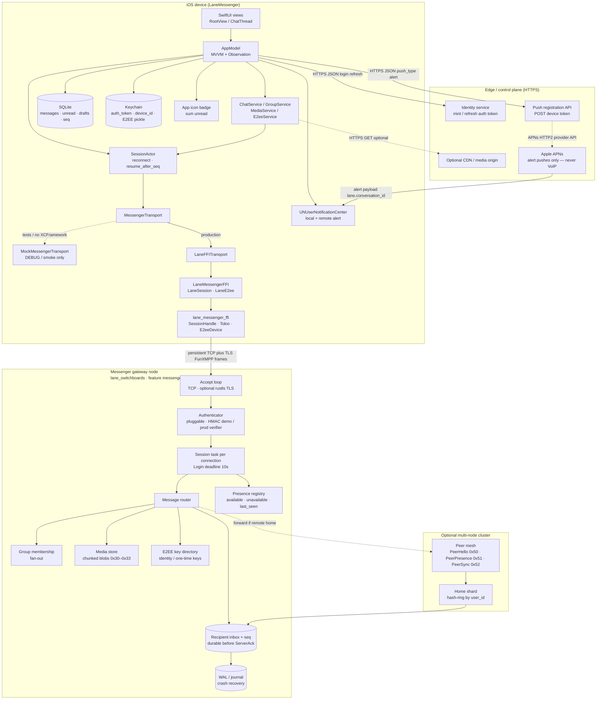
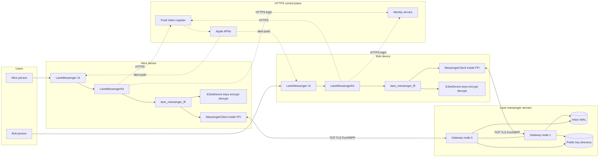
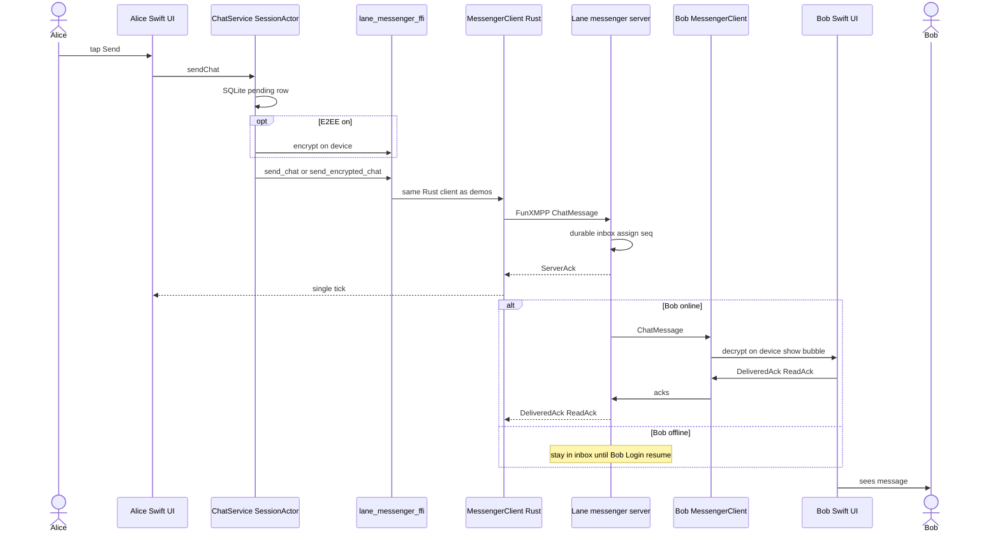
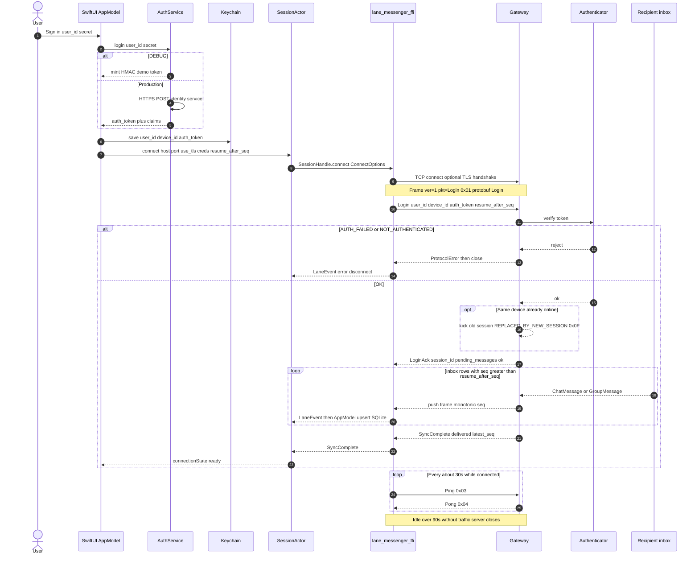
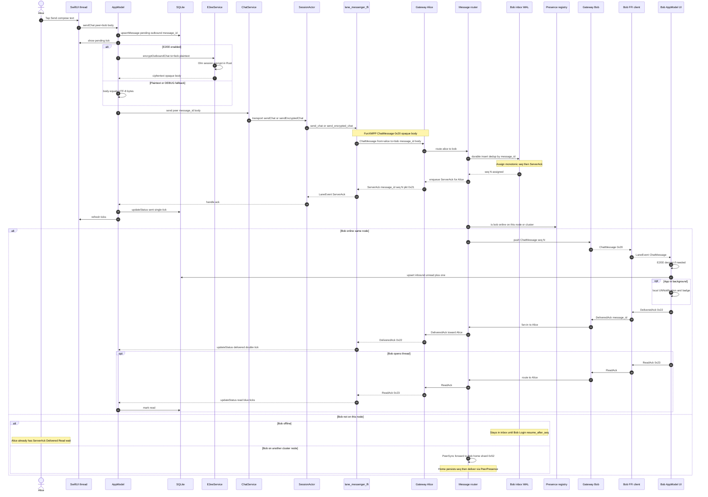
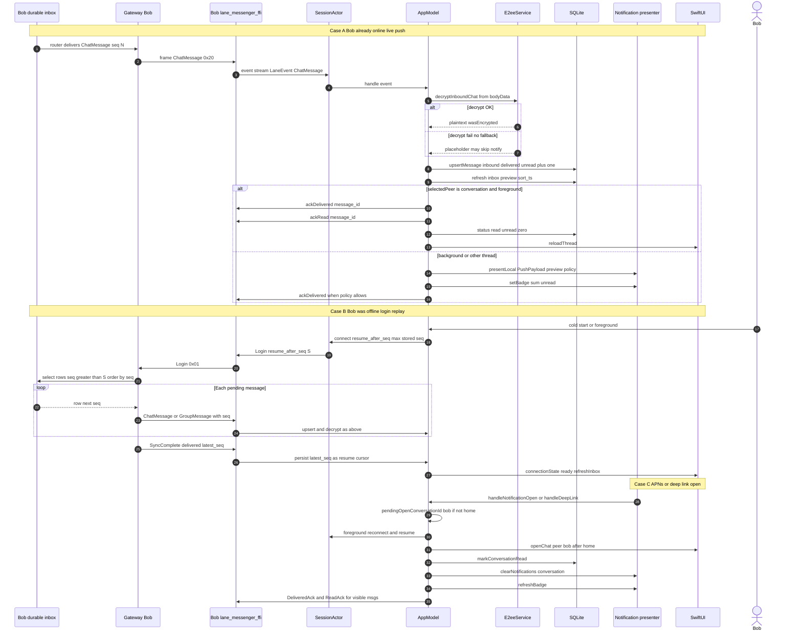
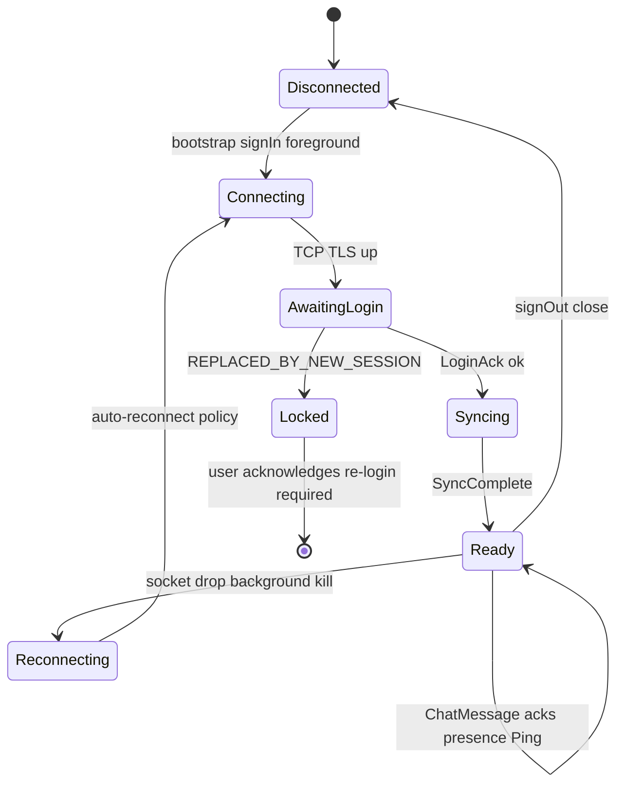
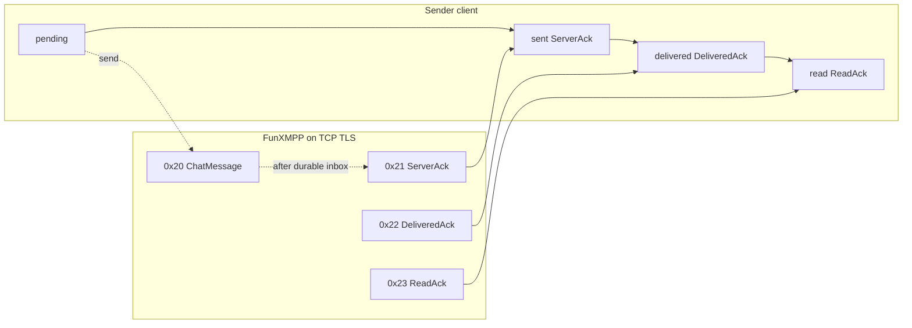

# Lane messenger ecosystem — architecture & beginner guide

This is the **end-to-end** map of the production stack: iOS UI → Swift kit →
FFI bindings → Rust client → FunXMPP over TCP/TLS → messenger gateway.

**Diagrams in this doc**

| Section | Contents |
|---------|----------|
| [§1.1](#11-entities-servers-protocols-mermaid) | Entities, servers, protocols (flowchart) |
| [§1E](#1e-users-clients-and-servers-communication) | Users ↔ clients ↔ gateways (overview) |
| [§1A](#1a-session-connect--login-detailed) | Connect / Login / SyncComplete |
| [§1B](#1b-message-send-flow-maximum-detail) | Full send + ack ladder + offline/cluster |
| [§1C](#1c-message-receive-flow-maximum-detail) | Live receive, offline replay, APNs open |
| [§1D](#1d-ack-ladder--wire-packets-cheat-sheet) | Packet ID cheat sheet |
| [§8 FAQ](#8-faq) | E2EE location, send path, FFI size, native vs Rust |

If you are new here, read this page first, then dive into the linked docs.

| Audience | Start here |
|----------|------------|
| Backend / protocol | [`docs/messenger/`](messenger/README.md) |
| Mobile FFI | [`docs/client-ffi/`](client-ffi/00_overview.md) |
| Swift cheatsheet | [`bindings/swift/LaneMessengerFFI/SWIFT_CHEATSHEET.md`](../bindings/swift/LaneMessengerFFI/SWIFT_CHEATSHEET.md) |
| iOS product | [`docs/client-ios/`](client-ios/00_overview.md) |
| Phase checklists | [`todo.md`](../todo.md), [`todo_ios.md`](../todo_ios.md), [`todo_client_ffi.md`](../todo_client_ffi.md) |
| WA vs Lane gaps | [`gap.md`](../gap.md) — fidelity score + implementation backlog |

---

## 1. Big picture (production)

### 1.1 Entities, servers, protocols (Mermaid)

Who talks to whom, and **which protocol** each link uses.



**Protocol legend**

| Link | Protocol | Payload |
|------|----------|---------|
| App ↔ Identity / push register | **HTTPS** + JSON | tokens, APNs device token |
| App ↔ APNs (via Apple) | APNs **alert** | `aps` + `lane.*` custom keys |
| FFI ↔ Gateway | **TCP** (+ **TLS** in prod) | FunXMPP: `u8 ver \| u8 pkt_type \| u32 len \| protobuf` |
| Gateway ↔ Gateway (cluster) | Same FunXMPP peer packets | `0x50`–`0x52` only (never exposed to apps) |
| Kit ↔ SQLite / Keychain | Local IPC / OS APIs | rows / secrets — not on the wire |

### 1.2 Stack (ASCII quick view)

```text
┌──────────────────────────────────────────────────────────────────┐
│  LaneMessenger (SwiftUI)                                         │
│  apps/ios/App/                                                   │
│    · screens, deep links, APNs AppDelegate                       │
└────────────────────────────┬─────────────────────────────────────┘
                             │
┌────────────────────────────▼─────────────────────────────────────┐
│  LaneMessengerKit                                                │
│  apps/ios/Sources/LaneMessengerKit/                              │
│    · AppModel, SessionActor, Chat/Group/Media/E2ee services      │
│    · SQLite (messages, unread, resume seq)                       │
│    · Keychain (token, device_id, E2EE pickle)                    │
│    · Push presentation + badge (alert APNs only)                 │
└────────────────────────────┬─────────────────────────────────────┘
                             │ MessengerTransport
              ┌──────────────┴──────────────┐
              │                             │
   MockMessengerTransport          LaneFFITransport
   (smoke / no XCFramework)        (#if canImport(LaneMessengerFFI))
              │                             │
              │                  bindings/swift/LaneMessengerFFI
              │                    LaneSession · LaneE2ee
              │                             │
              │                  lane_messenger_ffi (Rust)
              │                    SessionHandle · E2eeDevice
              │                    Tokio runtime · poll events
              └──────────────┬──────────────┘
                             │  TCP (+ TLS) · FunXMPP frames
                             │  u8 ver | u8 type | u32 len | protobuf
                             ▼
┌──────────────────────────────────────────────────────────────────┐
│  Messenger gateway  (lane_switchboards, feature `messenger`)     │
│  src/messenger/server.rs                                         │
│    accept → auth → session → router → presence / groups / media  │
│    inbox + WAL for offline · optional cluster peer mesh          │
└──────────────────────────────────────────────────────────────────┘
```

### What production uses vs what it does **not**

| Use | Do **not** use for core chat |
|-----|------------------------------|
| Persistent **TCP + TLS** + FunXMPP via FFI | gRPC `SendMessage` over HTTP/2 |
| HTTPS for login / APNs register / CDN | WebSocket as primary iOS transport |
| SQLite + Keychain on device | Hand-rolled Swift frame codec |
| Standard **alert** APNs | VoIP / Push-to-Talk for chat |

---

## 1E. Users, clients, and servers (communication)

How **people**, **apps**, and **Lane servers** talk. Alice and Bob are users;
each runs a client that embeds the Rust messenger engine; the gateway is the
Lane messenger server (optionally several clustered nodes).



**Text send (Alice → Bob) — who calls whom**



| Role | Component | Job |
|------|-----------|-----|
| User | Alice / Bob | Taps UI only |
| Client app | SwiftUI + Kit | UX, SQLite, Keychain, push presentation |
| Client engine | `lane_messenger_ffi` → **`MessengerClient`** | Codec, session, send/recv, E2EE |
| Server | Lane **messenger gateway** | Auth, route, inbox, presence, public keys |
| Not on server | Private keys / plaintext encrypt | Always on device when E2EE is on |

Without XCFramework, Kit uses `MockMessengerTransport` and **never** reaches a
real gateway (UI/smoke only).

---

## 1A. Session connect & login (detailed)

Before any chat, the client must open a FunXMPP session. Login is always the
**first** frame (deadline **10s**).



**Packet IDs in this phase:** `Login 0x01`, `LoginAck 0x02`, `Ping 0x03`,
`Pong 0x04`, `ProtocolError 0x0F`, `SyncComplete 0x24`, plus any replayed
`ChatMessage 0x20` / `GroupMessage 0x40`.

---

## 1B. Message **send** flow (maximum detail)

Alice (online) sends a 1:1 text to Bob. E2EE optional; ack ladder always applies.



**Send-path guarantees**

| Step | Guarantee |
|------|-----------|
| Before `ServerAck` | Message is **durable** in recipient inbox (WAL) |
| Dedup | Retries with same `message_id` → exactly-once effect per inbox |
| Ordering | Recipient sees monotonic `seq`; replay is gap-free ascending |
| Body | Opaque bytes — plaintext or Olm/Megolm ciphertext; gateway does not need to read E2EE content |
| Ticks | `ServerAck 0x21` → `DeliveredAck 0x22` → `ReadAck 0x23` |

**Group send (delta):** `GroupMessage 0x40` instead of `ChatMessage`; router
fans out to members; receipts may arrive as `GroupAckSummary 0x42`.

**Media send (delta):** `MediaStart 0x30` → many `MediaChunk 0x31` (≤64 KiB) →
`MediaAck 0x32`; then chat/group message carries `media_id` + optional caption.

---

## 1C. Message **receive** flow (maximum detail)

Two cases: Bob is **online** when Alice sends, and Bob was **offline** (catch-up
on login). Also covers background notification + deep link.



**Receive-path state on device**



**Inbound UI / notify decision**

| Condition | Behavior |
|-----------|----------|
| Foreground + thread open | Upsert, show bubble, send Delivered+Read, no banner |
| Foreground + other screen | Upsert, unread++, inbox badge; optional in-app banner |
| Background + socket alive | Upsert, **local** notification, badge++ |
| Background + socket dead | Miss live push; rely on **APNs alert** then resume on open |
| E2EE + `hideBodyWhenE2EE` | Notification body = “New message” (no plaintext on lock screen) |

---

## 1D. Ack ladder & wire packets (cheat sheet)



| ID | Packet | Direction | Role in send/receive |
|----|--------|-----------|----------------------|
| 0x01 | Login | C→S | Auth + `resume_after_seq` |
| 0x02 | LoginAck | S→C | `session_id`, `pending_messages` |
| 0x03 / 0x04 | Ping / Pong | C↔S | Liveness (~30s / idle 90s) |
| 0x0F | ProtocolError | S→C | Fatal then close |
| 0x10 | Presence | both | Online / offline / last seen |
| 0x11 | SubscribePresence | C→S | Roster filter |
| 0x20 | ChatMessage | both | 1:1 body (opaque) |
| 0x21 | ServerAck | S→C | Persisted (single tick) |
| 0x22 | DeliveredAck | both | Device got it (double tick) |
| 0x23 | ReadAck | both | Opened thread (blue) |
| 0x24 | SyncComplete | S→C | Offline replay done |
| 0x30–0x33 | Media* | both | Chunked blob transfer |
| 0x40 | GroupMessage | both | Group chat |
| 0x41 | GroupEvent | both | Create / add / remove / leave |
| 0x42 | GroupAckSummary | S→C | Aggregated group receipts |
| 0x50–0x52 | Peer* | node↔node | Cluster only — **not** in app FFI |

Frame layout: `u8 ver | u8 pkt_type | u32 length | protobuf` (big-endian).
Schemas: `proto/messenger.proto`.

---

## 2. The three packages beginners mix up

### 2.1 `messenger` (server + reference client)

**What it is:** the FunXMPP messaging plane inside the root crate
`lane_switchboards` (Cargo feature `messenger`).

**Owns:**

- Binary wire codec (`src/messenger/codec.rs`)
- Gateway sessions, routing, acks, presence, groups, media (`server.rs`)
- Offline inbox / journal
- Olm/Megolm E2EE (`e2ee.rs`)
- Reference client used by tests and `messenger_demo` (`client.rs`)
- Optional multi-node cluster (`cluster.rs`)

**Mental model:** WhatsApp-like **backend + a Rust test client**. Mobile apps do
not talk to this crate directly; they talk through the FFI.

**Docs:** [`docs/messenger/README.md`](messenger/README.md)

### 2.2 `lane_messenger_ffi` (mobile bridge)

**What it is:** a separate Cargo crate that wraps the same Rust
`MessengerClient` + `E2eeDevice` behind **opaque handles** for Swift / Android /
Flutter / C.

**Owns:**

- Tokio runtime (hosts must not block the UI thread on connect/send)
- `SessionHandle::connect` / `poll_event` / send / ack / media / groups
- C ABI (`include/lane_messenger_ffi.h`, `c_api.rs`)
- Optional UniFFI + JNI

**Does not own:** UI, Keychain, SQLite, push banners.

**Mental model:** “the chat engine as a native library.”

**Docs:** [`lane_messenger_ffi/README.md`](../lane_messenger_ffi/README.md),
[`docs/client-ffi/`](client-ffi/00_overview.md)

### 2.3 `bindings` (language wrappers)

**What it is:** thin language packages that call the FFI. **No protocol logic.**

| Binding | Path |
|---------|------|
| Swift (hand-written C wrappers) | `bindings/swift/LaneMessengerFFI/` (`LaneSession.swift`, `LaneE2ee.swift`) |
| Swift / Kotlin UniFFI generated | `…/generated/` via `./scripts/generate_uniffi_bindings.sh` |
| Android JNI module | `bindings/android/lane-messenger-ffi/` |

**Mental model:** “Swift/Kotlin types that point at the Rust library.”

---

## 3. Layer-by-layer detail

### 3.1 iOS app (`apps/ios/App/`)

- `@main` SwiftUI entry (`LaneMessengerApp.swift`)
- Info.plist: gateway host/port, `remote-notification`, `lane://` URL scheme
- Entitlements: `aps-environment` (alert APNs only)
- Chooses transport:

```swift
#if canImport(LaneMessengerFFI)
  AppModel(transport: LaneFFITransport())
#else
  AppModel(transport: MockMessengerTransport())
#endif
```

### 3.2 LaneMessengerKit

| Area | Responsibility |
|------|----------------|
| `App/AppModel.swift` | Route, inbox, scene phase, push open, badge |
| `FFI/SessionActor.swift` | Connect / reconnect / resume_after_seq |
| `FFI/MessengerTransport.swift` | Protocol + mock |
| `FFI/LaneFFITransport.swift` | Real FFI |
| `Auth/` | DEBUG HMAC mint vs Release HTTPS identity |
| `Local/` | SQLite messages, drafts, unread, groups |
| `Domain/` | Chat, groups, media, E2EE orchestration |
| `Push/` | Payload parse, preview policy, token register |
| `UI/` | SwiftUI shells |

### 3.3 Wire protocol (FunXMPP)

```text
┌────┬──────────┬──────────┬─────────────────────┐
│ ver│ pkt_type │ length   │ protobuf payload    │
│ u8 │ u8       │ u32 BE   │                     │
└────┴──────────┴──────────┴─────────────────────┘
```

- Schema: `proto/messenger.proto`
- Lifecycle: connect → **Login** (first, ≤10s) → LoginAck → offline replay →
  SyncComplete → steady state (Ping/Pong ~30s; idle >90s closes)
- Docs: [`01_wire_protocol.md`](messenger/01_wire_protocol.md)

### 3.4 Gateway internals

```text
TCP(+TLS) accept
  → Authenticator (HMAC demo or pluggable)
  → Session registry (user → devices; same device → REPLACED_BY_NEW_SESSION)
  → Router
       · 1:1: persist inbox → ServerAck → deliver if online
       · groups: membership + fan-out
       · media: chunked blobs
       · presence: available / unavailable / last_seen
  → Optional cluster: home shard + peer forward (0x50–0x57, not exposed to apps)
```

### 3.5 Typical send path

Short form (full sequence diagrams: [§1B](#1b-message-send-flow-maximum-detail),
[§1C](#1c-message-receive-flow-maximum-detail)):

```text
User taps Send
  → SQLite row (pending)
  → E2EE encrypt in Rust (if enabled)
  → FFI send_chat / send_encrypted_chat
  → FunXMPP ChatMessage
  → ServerAck (✓) → DeliveredAck (✓✓) → ReadAck (blue)
  → update ticks in SQLite + UI
```

### 3.6 Background / push

FunXMPP TCP drops in background. Design:

1. Foreground: reconnect + `resume_after_seq` (I2)
2. Local notification while socket briefly alive
3. Future APNs alert payload → same `PushPayload` → deep link `lane://chat/<id>`
4. Badge = sum of local unread
5. **Never** VoIP push for chat

Docs: [`docs/client-ios/09_push.md`](client-ios/09_push.md)

---

## 4. DEBUG vs production

| Concern | DEBUG / local | Production |
|---------|---------------|------------|
| Auth | `DebugAuthService` — empty secret mints `hex(HMAC-SHA256("demo-secret", "user:device"))` | `HttpAuthService` → identity HTTPS; **no HMAC secret in the app** |
| Transport | Mock (smoke) or FFI with `use_tls: false` | `LaneFFITransport` + TLS |
| Gateway secret | `"demo-secret"` in `messenger_demo` | Server-side only |
| `MESSENGER_USE_TLS` | `NO` | `YES` |
| Push registrar | `StubPushTokenRegistrar` | `HttpPushTokenRegistrar` |

---

## 5. Step-by-step: run the ecosystem (beginner)

Do these in order. Each step proves one layer.

### Prerequisites

- Rust (stable) + Cargo
- For iOS native: macOS, Xcode, rustup iOS targets
- For kit-only smoke: Swift toolchain (Command Line Tools is enough)

```bash
# Optional iOS targets for XCFramework
rustup target add aarch64-apple-ios aarch64-apple-ios-sim x86_64-apple-ios
```

---

### Step A — Run the gateway demo (Rust only)

Proves: codec, auth, chat, acks, offline sync, groups, media on one machine.

```bash
cd /path/to/lane_switchboards
cargo run --example messenger_demo --features messenger
```

You should see a listen address and alice/bob golden-path logs.

Run the integration suite:

```bash
cargo test --test messenger
```

---

### Step B — Run iOS kit smoke (no native FFI required)

Proves: Swift session actor, store, groups, media, E2EE mocks, push helpers.

```bash
cd apps/ios
swift run lane-messenger-kit-smoke
```

Expect: `OK — all smoke checks passed`.

This uses `MockMessengerTransport` — **no gateway needed**.

---

### Step C — Build the FFI library (host)

Proves: the mobile crate compiles.

```bash
cargo build -p lane_messenger_ffi --release
cargo test -p lane_messenger_ffi
```

Header: `lane_messenger_ffi/include/lane_messenger_ffi.h`

---

### Step D — Build the iOS XCFramework

Proves: device + simulator slices for linking into the app.

```bash
./scripts/build_xcframework.sh
# → dist/LaneMessengerFFI.xcframework
```

Optional UniFFI codegen:

```bash
./scripts/generate_uniffi_bindings.sh
```

Details: [`docs/client-ffi/BUILD.md`](client-ffi/BUILD.md)

---

### Step E — Open the iOS app against a local gateway

1. Start a gateway you can point at (demo binds a random port — for a fixed
   port, run your own `MessengerServer::bind("127.0.0.1:9000", …)` or adjust
   Info.plist after noting the demo address).

2. Generate / open the Xcode project:

```bash
cd apps/ios
xcodegen generate          # requires XcodeGen
open LaneMessenger.xcodeproj
```

3. Link `dist/LaneMessengerFFI.xcframework` (and the Swift package
   `bindings/swift/LaneMessengerFFI` as needed).

4. Set Info.plist / scheme:

| Key | Example |
|-----|---------|
| `MESSENGER_HOST` | `127.0.0.1` |
| `MESSENGER_PORT` | `9000` |
| `MESSENGER_USE_TLS` | `NO` for local DEBUG |

5. Run on Simulator. **DEBUG login:**

- User ID: `alice` (or `bob`)
- Secret: leave **empty** to mint the demo HMAC token
- Or paste a pre-minted hex token

Without the XCFramework linked, the app still opens on **mock** transport for
UI work — you will not hit a real gateway.

---

### Step F — Two-device mental test (local)

1. Terminal: gateway listening.
2. Device/sim A: login `alice`, open chat with `bob`, send a message.
3. Device/sim B (or second process / Rust client): login `bob`, confirm
   delivery ticks and offline catch-up after disconnect.

Use `resume_after_seq` persistence in SQLite so reconnect does not duplicate.

---

### Step G — Production checklist (before TestFlight)

- [ ] Identity HTTPS issues tokens; app uses `HttpAuthService` only
- [ ] TLS on (`MESSENGER_USE_TLS=YES`); ATS-compliant
- [ ] No `demo-secret` / HMAC mint in Release
- [ ] XCFramework Release build linked
- [ ] APNs alert entitlement; token → HTTPS register; no VoIP
- [ ] E2EE pickle in Keychain; preview policy hides body when encrypted
- [ ] Multi-device kick UX for `REPLACED_BY_NEW_SESSION`
- [ ] See [`docs/messenger/11_security_review.md`](messenger/11_security_review.md)

---

## 6. How to *use* the pieces in code

### Rust reference client (tests / tools)

```rust
use lane_switchboards::messenger::MessengerClient;

let (mut client, _) = MessengerClient::connect(
    "127.0.0.1:9000", "alice", "phone-1", &token, /* resume_after_seq */ 0,
).await?;
client.send_chat("bob", "m-1", b"hello").await?;
```

### FFI (Rust API inside the crate)

```rust
use lane_messenger_ffi::{ConnectOptions, SessionHandle, LaneEvent};

let session = SessionHandle::connect(ConnectOptions {
    host: "127.0.0.1".into(),
    port: 9000,
    use_tls: false,
    user_id: "alice".into(),
    device_id: "phone-1".into(),
    auth_token: token,
    ..Default::default()
})?;

while let Some(ev) = session.poll_event(100) {
    if matches!(ev, LaneEvent::SyncComplete(_)) { break; }
}
session.send_chat("bob", "m-1", b"hi")?;
```

### Swift kit (app code)

Prefer `AppModel` / `ChatService` — do not call C APIs from views.

```swift
await model.signIn(userId: "alice", secret: "")
await model.openChat(peer: "bob")
// compose + send via ChatService / AppModel send helpers
```

Transport is injected once at `AppModel` init (`LaneFFITransport` or mock).

---

## 7. Repository map (bookmark this)

```text
lane_switchboards/
├── src/messenger/           # Gateway + reference client + codec + E2EE
├── proto/messenger.proto    # Packet schemas
├── examples/messenger_demo.rs
├── tests/messenger.rs
├── lane_messenger_ffi/      # Mobile FFI crate
├── bindings/swift/          # Swift wrappers + UniFFI output
├── bindings/android/        # JNI / AAR inputs
├── apps/ios/                # LaneMessenger + LaneMessengerKit
├── scripts/
│   ├── build_xcframework.sh
│   ├── generate_uniffi_bindings.sh
│   └── build_android_ndk.sh
├── docs/
│   ├── ECOSYSTEM_GUIDE.md   # ← you are here
│   ├── messenger/
│   ├── client-ffi/
│   └── client-ios/
└── deploy/                  # systemd / K8s examples
```

---

## 8. FAQ

**Q: Where do key creation and encryption happen — mobile app or Lane backend?**

**On the mobile client (Rust via FFI), not on the Lane gateway.**

| Step | Where |
|------|--------|
| Create IK / SPK / OTKs / Olm / Megolm sessions | **Device** — `E2eeDevice` in `lane_messenger_ffi` |
| Persist private material | **Device** Keychain pickle |
| Publish / fetch **public** key bundles | Device ↔ gateway **key directory** |
| Encrypt before send / decrypt after receive | **Device** |
| Store and route ciphertext, assign `seq`, acks | **Lane messenger server** |

The gateway is a relay + public key directory. With E2EE on it must not see
private keys or message plaintext. See [`messenger/10_e2ee.md`](messenger/10_e2ee.md)
and [§1E](#1e-users-clients-and-servers-communication).

**Q: After sending a text message, does the call go to MessengerClient and then the Lane messenger server?**

**Yes.** On iOS the Swift UI never imports `MessengerClient` directly; the chain is:

```text
User tap Send
  → AppModel / ChatService
  → SessionActor → LaneFFITransport → LaneSession binding
  → lane_messenger_ffi SessionHandle
       └─ wraps MessengerClient (same Rust client as demos/tests)
  → TCP (+ TLS) FunXMPP ChatMessage
  → Lane messenger gateway
       └─ durable inbox → ServerAck → deliver to peer or wait offline
```

Rust demos/tests call `MessengerClient::send_chat` → same gateway path.
Mock transport skips the server entirely. Full picture: [§1E](#1e-users-clients-and-servers-communication),
[§1B](#1b-message-send-flow-maximum-detail).

**Q: Why isn’t chat just REST or gRPC?**  
Realtime delivery, presence, and ack ladders need a long-lived binary session.
HTTP is reserved for identity, config, APNs registration, and CDN.

**Q: How big is the FFI / XCFramework, and what latency does the binding add?**

Measured on this repo (host `cargo build -p lane_messenger_ffi --release`,
2026-07-11, macOS arm64):

| Artifact | Approx size | Ships in app? |
|----------|-------------|---------------|
| `liblane_messenger_ffi.dylib` (release) | **~3.7 MiB** | Host/dev only |
| `liblane_messenger_ffi.a` (static archive) | **~50–70 MiB** | No — object archive, not final link size |
| iOS XCFramework on disk (device + sim slices) | **~6–15 MiB** typical | Thinned per arch at install |
| Contribution inside a thinned App Store IPA (one arch, stripped/LTO) | **~2–5 MiB** ballpark | Yes (order of magnitude; rebuild to measure) |
| Android `.so` per ABI (arm64) | **~2–6 MiB** ballpark | Yes, per ABI you ship |

Dominant bulk: Tokio + TLS (rustls) + prost + **vodozemac** (Olm/Megolm), not
the thin Swift/Kotlin wrappers (`bindings/swift` is only ~100 KiB of sources).

**Binding latency (order of magnitude, not a substitute for a microbench):**

| Hop | Typical cost | Dominates UX? |
|-----|--------------|---------------|
| C ABI call (scalar / small buffer) | **~10 ns – few µs** | No |
| UniFFI / JNI + UTF-8 / byte copy | **~1–50 µs** | No |
| Swift → poll one event / fire send | **µs–low hundreds µs** | No |
| Localhost FunXMPP `send` → `ServerAck` | **~0.2–2 ms** (release, same machine) | Sometimes |
| Cross-node offline ack (bench) | **p50 ~2–4 ms, p99 ~8–15 ms** | Yes vs FFI |
| Real WAN RTT + TLS | **tens–hundreds of ms** | Yes |

Rule of thumb: **FFI overhead is ≪ 1% of end-to-end chat latency.** Network,
disk (SQLite), and crypto dominate; the binding does not.

**Q: Is there a benefit to writing everything in native languages (Swift / Kotlin)?**

| Benefit of all-native | Reality for Lane |
|-----------------------|------------------|
| Avoid FFI marshalling | Saves µs; irrelevant next to RTT |
| Slightly smaller binary (no Rust std/Tokio in app) | Possible **~1–4 MiB** savings if you drop shared crypto/runtime — easy to lose again with Swift crypto + protobuf stacks |
| Idiomatic Swift concurrency / Instruments | Real DX win for **UI** only |
| Match WhatsApp’s per-platform clients | True for WA; Lane deliberately follows **Signal/`libsignal`**: one audited wire+E2EE core |

| Cost of all-native | Why it hurts |
|--------------------|--------------|
| Reimplement FunXMPP codec + session SM per OS | Drift, security bugs, double test matrix |
| Reimplement Olm/Megolm (or wrap differently per OS) | Highest-risk surface; vodozemac already audited path |
| Android ≠ iOS behavior forever | Exactly the class of bugs messengers are famous for |
| No Flutter/desktop reuse | FFI core amortizes once |

**Recommendation:** keep **UI, Keychain, SQLite, push** native (already done in
`LaneMessengerKit`); keep **wire + E2EE + reconnect** in Rust via FFI. Going
fully native is a product/org choice (WA-style), not a latency win. See
[`gap.md`](../gap.md) §2.3.

**Q: Can I implement FunXMPP in Swift with Network.framework?**  
Not for production. The codec, E2EE, and framing stay in Rust via FFI so all
platforms share one implementation.

**Q: Mock vs FFI — which should I use day to day?**  
UI and kit logic: mock + smoke. Integration and devices: XCFramework + gateway.

**Q: Where do secrets live?**  
Auth token + device id + E2EE pickle → Keychain. Gateway HMAC secret →
**server only**, never in App Store builds.

**Q: What about Android / Flutter?**  
Same FFI crate. **Java production API:** [`client-ffi/10_java.md`](client-ffi/10_java.md)
(`com.lane.messenger.LaneSession` / `LaneE2eeDevice`). Also
`docs/client-ffi/07_platforms.md` and `examples/android_ffi_demo/`,
`examples/flutter_ffi_demo/`.

---

## 9. Next reading order

1. This guide (done)
2. [`messenger/00_overview.md`](messenger/00_overview.md) — delivery guarantees
3. [`client-ffi/02_session_and_events.md`](client-ffi/02_session_and_events.md) — connect / poll
4. [`client-ios/02_session.md`](client-ios/02_session.md) — SessionActor
5. [`messenger/10_e2ee.md`](messenger/10_e2ee.md) + [`client-ios/08_e2ee.md`](client-ios/08_e2ee.md)
6. [`todo_ios.md`](../todo_ios.md) — remaining I10 polish
7. [`gap.md`](../gap.md) / [`funxmpp_todo.md`](../funxmpp_todo.md) — WA fidelity backlogs