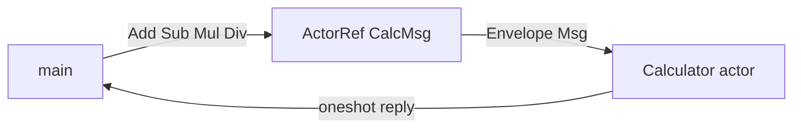

# Calculator — basic actor example

A minimal **calculator actor** that performs four arithmetic operations through the Lane Switchboards actor runtime. Each operation is an application message (`Envelope::Msg`) sent to a single long-lived actor.

```bash
cargo run --example calculator
```

Source: [`calculator.rs`](./calculator.rs)

---

## Operations

| Operation | Message variant | Formula | Error case |
|-----------|-----------------|---------|------------|
| **Add** | `CalcMsg::Add(a, b, reply)` | `a + b` | — |
| **Sub** | `CalcMsg::Sub(a, b, reply)` | `a - b` | — |
| **Mul** | `CalcMsg::Mul(a, b, reply)` | `a * b` | — |
| **Div** | `CalcMsg::Div(a, b, reply)` | `a / b` | `b == 0.0` → `"division by zero"` |

All operations take two `f64` operands and return `Result<f64, String>` on a `oneshot` reply channel.

---

## Architecture



1. `main` spawns a `Calculator` actor and holds an `ActorRef<CalcMsg>`.
2. Helper functions (`add`, `sub`, `mul`, `div`) build a message with a fresh `oneshot` sender.
3. The actor computes the result, stores it in `last_result`, and sends the reply.
4. The caller awaits the `oneshot` receiver.

This is the standard **request–reply over actor mailbox** pattern used throughout the runtime.

---

## Message type

```rust
enum CalcMsg {
    Add(f64, f64, oneshot::Sender<Result<f64, String>>),
    Sub(f64, f64, oneshot::Sender<Result<f64, String>>),
    Mul(f64, f64, oneshot::Sender<Result<f64, String>>),
    Div(f64, f64, oneshot::Sender<Result<f64, String>>),
}
```

The reply channel carries either a numeric result or an error string (e.g. division by zero). The actor itself always returns `Ok(())` from `handle` — business errors stay in the reply, not in actor exit reasons.

---

## Actor state

```rust
struct Calculator {
    last_result: Option<f64>,
}
```

After each successful operation, `last_result` is updated. The demo does not expose a getter, but you could add a `CalcMsg::LastResult(oneshot::Sender<Option<f64>>)` variant to read it.

---

## Request helper

All four operations share one helper to avoid duplicating channel setup:

```rust
async fn request(
    calc: &ActorRef<CalcMsg>,
    build: impl FnOnce(oneshot::Sender<Result<f64, String>>) -> CalcMsg,
) -> anyhow::Result<Result<f64, String>> {
    let (tx, rx) = oneshot::channel();
    calc.send(build(tx)).await?;
    rx.await?
}
```

Usage:

```rust
let sum = add(&calc, 10.0, 4.0).await?;   // Ok(14.0)
let diff = sub(&calc, 10.0, 4.0).await?;  // Ok(6.0)
let prod = mul(&calc, 10.0, 4.0).await?;  // Ok(40.0)
let quot = div(&calc, 10.0, 4.0).await?;  // Ok(2.5)
```

---

## Expected output

```
add: 10 and 4 = 14
sub: 10 and 4 = 6
mul: 10 and 4 = 40
div: 10 and 4 = 2.5
div: 10 and 0 -> error: division by zero
```

---

## Extending the calculator

| Idea | How |
|------|-----|
| Chain operations | Add `CalcMsg::Apply(op, b, reply)` that uses `last_result` as `a` |
| Integer-only math | Change operands to `i64` or wrap with rounding |
| Supervision | Use `ChildSlot` or pass a supervisor channel to `spawn` — see [resilient_calculator.md](./resilient_calculator.md) |
| Remote calculator | Register the actor on a `Node` and send from `RemoteActorRef` (see `distributed_demo`) |
| More ops | Add `Mod`, `Pow` variants to `CalcMsg` |

---

## Related examples

- [calculator.md](./calculator.md) — unsupervised calculator (same operations)
- [resilient_calculator.md](./resilient_calculator.md) — supervised version that survives panics
- [resilient_calculator_timer.rs](./resilient_calculator_timer.rs) — timer without journal replay
- [recoverable_timer_calc.md](./recoverable_timer_calc.md) — journal-backed state recovery + timer
- [hot_upgrade.rs](./hot_upgrade.rs) — same request–reply pattern with `CounterMsg::Get`
- [architecture.md](../architecture.md) — actor runtime design
