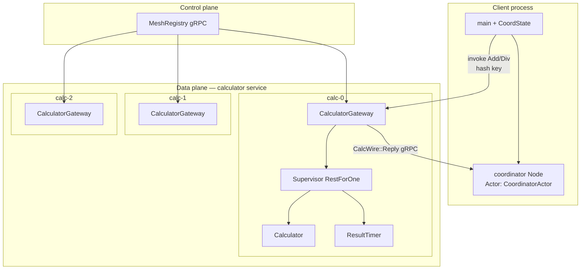
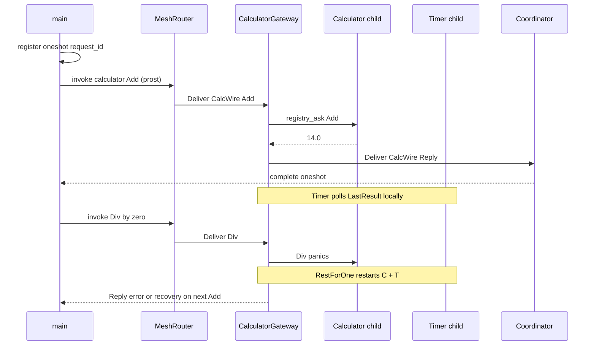

# Calculator service mesh — supervision + protobuf + discovery

[`calculator_mesh.rs`](./calculator_mesh.rs) ports the [**optimized RestForOne calculator**](./rest_for_one_calculator_timer_optimized.rs) onto the **v0.7 gRPC service mesh**. Each calculator replica is a microservice with a **supervised** local tree; the client uses **prost** on the wire and the mesh for routing.

```bash
cargo run --example calculator_mesh
```

Compare locally (no mesh): `cargo run --example rest_for_one_calculator_timer_optimized`

---

## What problem this models

| Real system | This example |
|-------------|--------------|
| Horizontally scaled **calculator API** pods | 3× `serve_microservice("calculator", …)` |
| **Service discovery** | `MeshRegistry` + `MeshRouter::sync` |
| **Pod-internal supervision** (sidecar + workers) | RestForOne: `Calculator` (order 0) + `ResultTimer` (order 1) |
| **Client RPC** over TLS/gRPC | `CalcWire` protobuf + bidi `Deliver` streams |
| **Reply path** | Coordinator node collects `CalcWire::Reply` |

---

## Architecture



---

## Request / reply sequence



---

## How the library helps

### Fault-tolerant

| Mechanism | What it does here |
|-----------|-------------------|
| **RestForOne** | Calculator panic (÷0) restarts **both** calculator and timer on that replica — same semantics as the [optimized example](./rest_for_one_calculator_timer_optimized.rs) |
| **Supervisor intensity** | `max_restarts` / `within_secs` cap restart storms |
| **Stable child refs** | `ChildRegistry` + `registry_ask!` still resolve after restart |
| **Mesh routing** | Other replicas keep serving; sticky key can hit a recovered node |

You do not write restart loops or reconnect logic — the supervisor and gRPC client **invalidate streams on error** (see `RemoteActorRef` in `distributed.rs`).

### Fast

| Layer | Why it is fast |
|-------|----------------|
| **Protobuf** | Compact payloads vs JSON framing (v0.6) |
| **gRPC bidi stream** | One persistent `Deliver` stream per peer (~**1.8 µs** send on warm stream — [README benchmarks](../README.md#benchmarks)) |
| **Hash-ring invoke** | O(log n) replica pick, no central proxy |

End-to-end mesh calculator RPC in this demo is dominated by **reply hop + supervision**; still localhost-microsecond class on a laptop.

### Easy to use

| Boilerplate removed | Library API |
|---------------------|-------------|
| Child specs | `registry_child_spec!(order, ChildName::Calculator, registry, Calculator { … })` |
| Ask pattern | `registry_ask!(registry, ChildName::Calculator, "…", \|reply\| AppMsg::Add(a, b, reply))` |
| Register instances | `serve_microservice` + `join_mesh` |
| Discover + route | `MeshRouter::with_registry` + `sync` + `invoke` |
| Wire types | `#[derive(Message)]` on `CalcWire` (+ `Oneof` for variants) |

No manual length-prefixed JSON, no per-request TCP connect, no custom registry protocol.

---

## Wire format (`CalcWire`)

| Variant | Direction | Purpose |
|---------|-----------|---------|
| `Add` / `Div` | Client → gateway | Compute with `request_id` |
| `LastResult` | Client → gateway | Read supervised calculator state |
| `Reply` | Gateway → coordinator | Result or error string |
| `Health` | Fan-out | `invoke_all` liveness |

Internal timer/calculator messages (`AppMsg`) stay **in-process only** — not serialized.

---

## Benchmarks

| Command | Measures |
|---------|----------|
| `cargo bench --bench wire` | gRPC `send`, registry `list`, quorum invoke |
| `cargo bench --bench ecommerce` | Multi-service checkout pipeline |

This example does not add a separate bench target; mesh calculator latency is dominated by the same **data-plane deliver** path as `wire::remote_actor_ref_send` plus one reply deliver.

---

## Related examples

| Example | Focus |
|---------|--------|
| [`rest_for_one_calculator_timer_optimized.rs`](./rest_for_one_calculator_timer_optimized.rs) | Macros + RestForOne (local only) |
| [`service_mesh.rs`](./service_mesh.rs) | Mesh without supervision |
| [`ecommerce_flash_sale.rs`](./ecommerce_flash_sale.rs) | Mesh + autoscale + QUORUM |
| [`grpc_cluster.rs`](./grpc_cluster.rs) | Cluster without registry |
