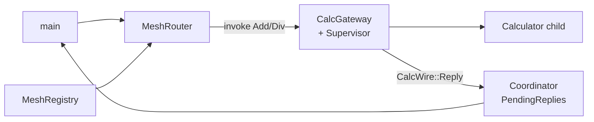
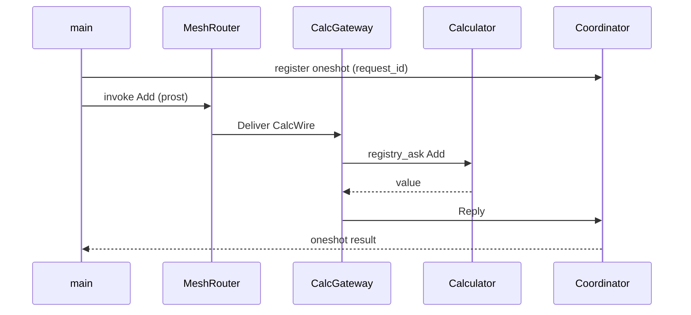

# Calculator mesh (simplified)

[`calculator_mesh_simplified.rs`](./calculator_mesh_simplified.rs) is the smallest **request/response calculator over the gRPC service mesh**. It keeps the ideas from [`calculator_mesh.rs`](./calculator_mesh.rs) but drops everything that is not required to see the pattern.

```bash
cargo run --example calculator_mesh_simplified
```

| | Simplified | Full [`calculator_mesh`](./calculator_mesh.md) |
|---|------------|--------------------------------------------------|
| Replicas | 1 | 3 |
| Supervision | OneForOne, calculator only | RestForOne: calculator + timer |
| Wire variants | Add, Div, Reply | + LastResult, Health |
| Demos | add → div panic → add | + timers, fan-out health |

Local-only (no mesh): [`rest_for_one_calculator_timer_optimized.rs`](./rest_for_one_calculator_timer_optimized.rs)

---

## Architecture



---

## Request flow



---

## What the library does for you

**Fault-tolerant** — `CalcGateway` starts a **OneForOne** supervisor around the calculator. A div-by-zero **panic** restarts only that child; `registry_ask!` still resolves via `ChildRegistry` after restart.

**Fast** — Payloads are **prost** messages on a warm **gRPC bidi** stream (`MeshRouter::invoke` → `Deliver`). No JSON framing or per-call TCP connect.

**Easy** — Roughly ~300 lines vs ~560 in the full example:

| You write | Library provides |
|-----------|------------------|
| `registry_child_spec!` + `registry_ask!` | Supervised ask/reply to named children |
| `serve_microservice` + `join_mesh` | Register instance in `MeshRegistry` |
| `MeshRouter::sync` + `invoke` | Discovery + hash-ring routing |
| `RemoteActorRef::send` | Reply path to coordinator actor |
| `#[derive(Message)]` on `CalcWire` | Protobuf encode/decode on the wire |

---

## Wire format

| Variant | Direction | Purpose |
|---------|-----------|---------|
| `Add` / `Div` | Client → gateway | Compute (`request_id` correlates reply) |
| `Reply` | Gateway → coordinator | `ok` + `value` or `error` |

`CalcMsg` (Add/Div with oneshot) stays **in-process** inside the gateway — never serialized.

---

## Related

| Example | When to use |
|---------|-------------|
| **calculator_mesh_simplified** | First mesh + supervision read |
| [`calculator_mesh`](./calculator_mesh.md) | Multi-replica, RestForOne + timer |
| [`service_mesh`](./service_mesh.md) | Mesh without actors/supervision |
