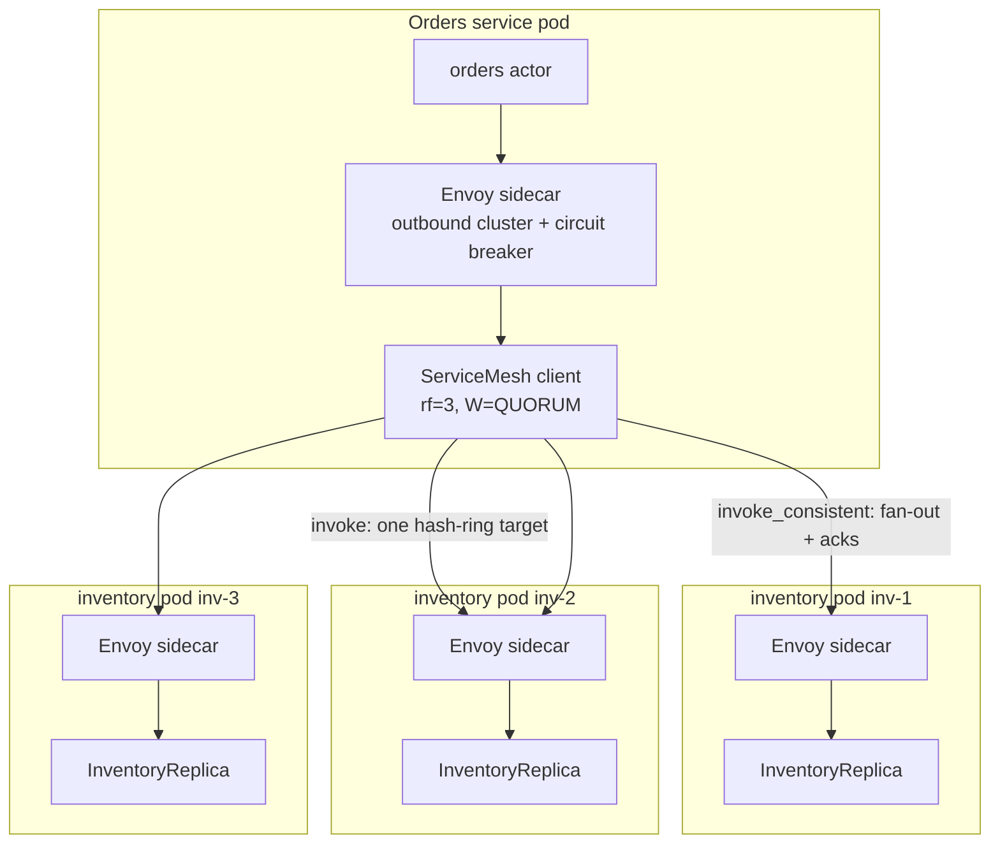
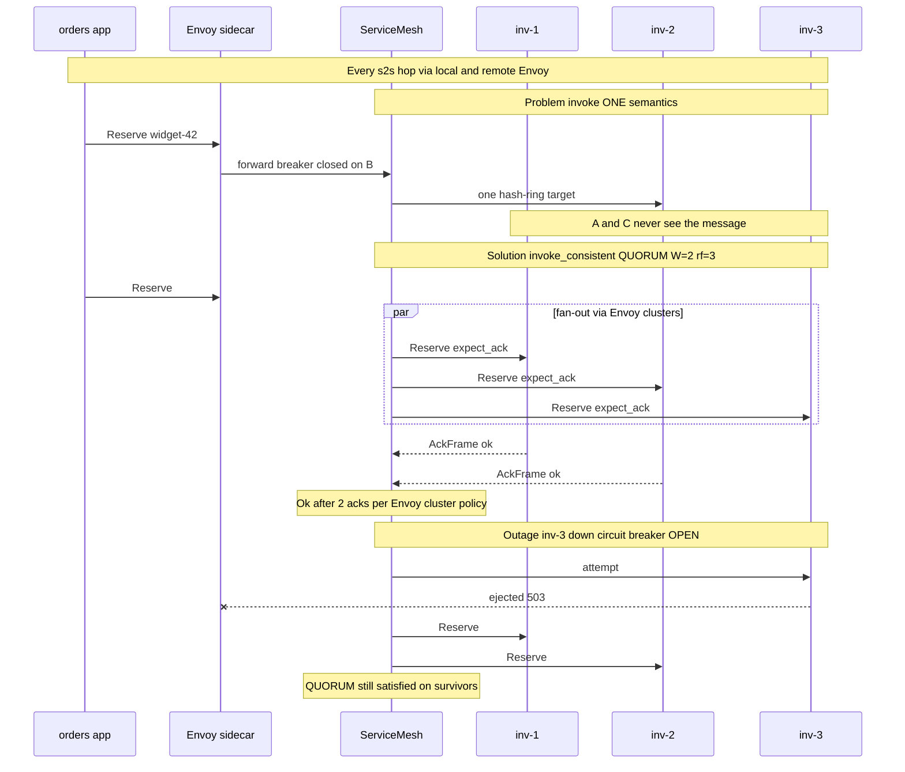

# Consistency demo — flash sale on a replicated inventory service

[`consistency.rs`](./consistency.rs) walks through a **real distributed problem** (reservations during a flash sale) and shows how **tunable write consistency** fixes it. The data plane uses **TLS** like [`tls_distributed.rs`](./tls_distributed.rs); routing and quorum waits use [`ServiceMesh::invoke_consistent`](../src/mesh.rs).

In production, **every service-to-service call goes through an Envoy sidecar** with a **configured circuit breaker** on the outbound inventory cluster. This repo example runs the lane_switchboards mesh in-process; the sidecar layer is documented here and called out in the program output.

```bash
cargo run --example consistency
```

Theory and API tables: [`docs/consistency.md`](../docs/consistency.md).

---

## Production: Envoy sidecar on every hop

Each inventory pod runs **two containers** (or one pod, two processes): your Rust actor and a **local Envoy proxy**. No application opens a TCP socket to a peer app IP directly — it always dials **localhost → sidecar**, and Envoy forwards to the remote sidecar, which delivers to the peer app.

| Layer | Responsibility |
|-------|----------------|
| **Envoy sidecar (outbound)** | mTLS, load balancing, timeouts, retries policy, **circuit breaker** |
| **lane_switchboards mesh** | Replica set selection, `invoke_consistent` fan-out, quorum ack wait |
| **Inventory actor** | Business logic + replicated ledger state |

### Circuit breaker (typical Envoy cluster config)

Envoy’s `circuit_breakers` on the `inventory` **cluster** limit blast radius when a replica melts down during a flash sale:

| Threshold | Example value | Effect |
|-----------|---------------|--------|
| `max_connections` | 1024 | Caps sockets per upstream host |
| `max_pending_requests` | 1024 | Queues before fast-fail |
| `max_requests` | 1024 | In-flight cap per host |
| `max_retries` | 3 | Bound retry storms (pair with app/mesh policy) |
| `track_remaining` | true | Hosts with many open circuits get less traffic |

When consecutive failures or pending-queue pressure trip the breaker, Envoy **ejects** that host (e.g. `inv-3`). Clients see elevated 503/UF until health checks clear the host. That is **orthogonal** to Cassandra-style W levels: Envoy sheds **unhealthy targets**; `invoke_consistent` decides **how many successful acks** you need before committing the operation.

Illustrative cluster snippet (deployed beside your service, not executed by this example):

```yaml
# envoy outbound cluster — inventory replicas
circuit_breakers:
  thresholds:
    - priority: DEFAULT
      max_connections: 1024
      max_pending_requests: 1024
      max_requests: 1024
      max_retries: 3
      track_remaining: true
```

Register mesh targets against the **sidecar inbound port** (often `127.0.0.1:15001` in Istio/Linkerd-style layouts), not the raw actor port, so TLS and breaker policy stay consistent on every s2s path.

### What this example simulates vs omits

| Production | This `cargo run --example consistency` |
|------------|----------------------------------------|
| App → Envoy → Envoy → app on every call | Direct `ServiceMesh` → `serve_microservice_tls` (TLS only) |
| Circuit breaker ejects bad hosts | `drop(inv-3)` stands in for a tripped breaker + dead pod |
| Central control plane / xDS | In-process `register()` only |

---

## Story

An e-commerce site runs **three inventory replicas** (`inv-1`, `inv-2`, `inv-3`) behind a mesh service name `inventory`. A hot SKU `widget-42` sells out in seconds.

| What goes wrong | Why | Fix in this demo |
|-----------------|-----|------------------|
| Customer “reserved” but another API says out of stock | `invoke()` sends to **one** hash-ring replica; others never got the write | Use `invoke_consistent` with `WriteConsistency::Quorum` |
| Partial outage during sale | One replica dies; Envoy **opens the circuit** on that host; single-replica `invoke()` may still hit a survivor but data is split | QUORUM needs 2/3 **acks** — still succeeds with 2 live nodes |
| Finance requires every copy before commit | Need all replicas | `WriteConsistency::All` — **fails** when `inv-3` is down or ejected |

The mesh confirms **receipt** on each replica (mailbox accept + TLS ack). **Your actor** must apply the same business logic on each copy if you want identical `ledger` maps — the example prints per-replica totals to make that visible.

---

## Architecture



**This example** collapses the path to `ServiceMesh → TLS actor` so you can run one binary locally; treat Envoy + circuit breaker as the mandatory wrapper in real deployments.

---

## Sequence — problem vs solution



---

## What the example runs

| Step | API | `write_cl` | Expected |
|------|-----|------------|----------|
| 1 | `mesh.invoke` | (fire-and-forget) | **One** replica prints `reserved` |
| 2 | `mesh.invoke_consistent` | `Quorum` | **Three** replicas print (W=2 acks required) |
| 3 | drop `inv-3`, `invoke_consistent` | `Quorum` | **Two** replicas print; still `Ok(())` (Envoy CB open on `inv-3`) |
| 4 | `invoke_consistent` | `All` | `NotEnoughReplicas` or `NotEnoughAcks` |

---

## TLS setup (same pattern as tls_distributed)

Ephemeral PEM under `$TMP/lane_switchboards_consistency_demo/`:

- `serve_microservice_tls` + `TlsAcceptor` on each replica
- `mesh.set_tls_connector(Some(connector))` so fan-out uses `RemoteActorRef::with_tls`

In production, **Envoy terminates mTLS** between sidecars; lane_switchboards may see plain TCP on the loopback hop (`app → 127.0.0.1:15001`) or TLS end-to-end depending on your mesh config. Align `ConsistencyConfig::ack_timeout` with Envoy **route timeout** and breaker thresholds so quorum waits fail predictably instead of hanging behind a full pending queue.

```bash
KEEP_DEMO_PEM=1 cargo run --example consistency
```

keeps cert/key for inspection.

---

## Configuration snippet

```rust
let config = ConsistencyConfig {
    rf: 3,
    write_cl: WriteConsistency::Quorum,  // W = 2
    ack_timeout: Duration::from_secs(2),
    ..Default::default()
};
let mut mesh = ServiceMesh::with_consistency(config);
mesh.set_tls_connector(Some(connector));
```

Per-service override: `mesh.set_service_consistency("inventory", config)`.

---

## W + R > N (rf = 3)

| Write W | Read R | Strong read-your-writes? |
|---------|--------|---------------------------|
| QUORUM (2) | QUORUM (2) | Yes (W+R > 3) |
| ONE (1) | QUORUM (2) | No |
| QUORUM (2) | ONE (1) | No |

This demo only exercises **writes**; use `read_consistent` / `read_serial_value` for read paths (see [`docs/consistency.md`](../docs/consistency.md)).

---

## Related

- Encrypted single node: [`tls_distributed.md`](./tls_distributed.md)
- Multi-service mesh (no consistency scenes): [`service_mesh.md`](./service_mesh.md)
- Reference: [`docs/consistency.md`](../docs/consistency.md)
- Envoy [circuit breaking](https://www.envoyproxy.io/docs/envoy/latest/intro/arch_overview/upstream/circuit_breaking) (upstream host ejection)
