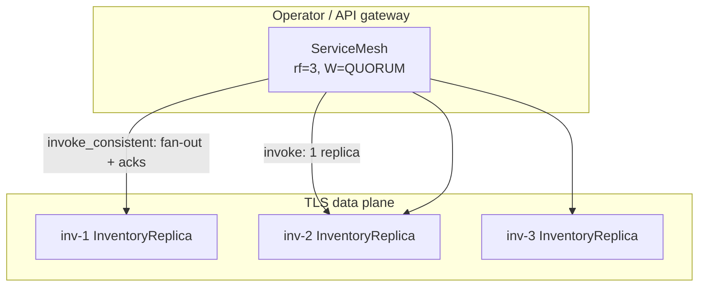
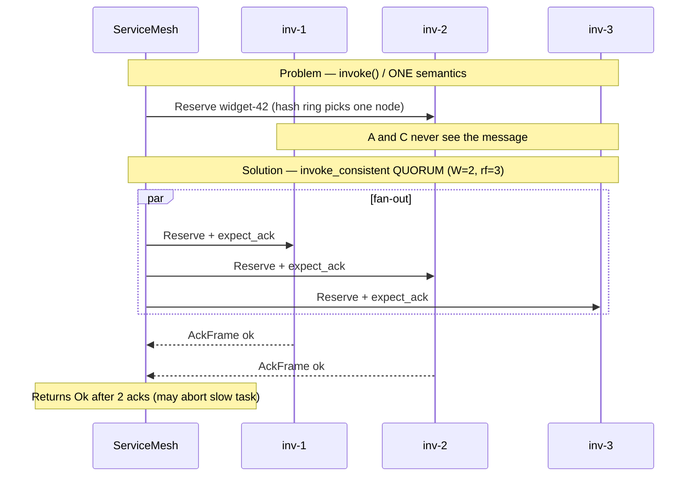

# Consistency demo — flash sale on a replicated inventory service

[`consistency.rs`](./consistency.rs) walks through a **real distributed problem** (reservations during a flash sale) and shows how **tunable write consistency** fixes it. The data plane uses **TLS** like [`tls_distributed.rs`](./tls_distributed.rs); routing and quorum waits use [`ServiceMesh::invoke_consistent`](../src/mesh.rs).

```bash
cargo run --example consistency
```

Theory and API tables: [`docs/consistency.md`](../docs/consistency.md).

---

## Story

An e-commerce site runs **three inventory replicas** (`inv-1`, `inv-2`, `inv-3`) behind a mesh service name `inventory`. A hot SKU `widget-42` sells out in seconds.

| What goes wrong | Why | Fix in this demo |
|-----------------|-----|------------------|
| Customer “reserved” but another API says out of stock | `invoke()` sends to **one** hash-ring replica; others never got the write | Use `invoke_consistent` with `WriteConsistency::Quorum` |
| Partial outage during sale | One replica dies; single-replica routing may still “work” but data is split | QUORUM needs 2/3 **acks** — still succeeds with 2 live nodes |
| Finance requires every copy before commit | Need all replicas | `WriteConsistency::All` — **fails** when `inv-3` is down |

The mesh confirms **receipt** on each replica (mailbox accept + TLS ack). **Your actor** must apply the same business logic on each copy if you want identical `ledger` maps — the example prints per-replica totals to make that visible.

---

## Architecture



---

## Sequence — problem vs solution



---

## What the example runs

| Step | API | `write_cl` | Expected |
|------|-----|------------|----------|
| 1 | `mesh.invoke` | (fire-and-forget) | **One** replica prints `reserved` |
| 2 | `mesh.invoke_consistent` | `Quorum` | **Three** replicas print (W=2 acks required) |
| 3 | drop `inv-3`, `invoke_consistent` | `Quorum` | **Two** replicas print; still `Ok(())` |
| 4 | `invoke_consistent` | `All` | `NotEnoughReplicas` or `NotEnoughAcks` |

---

## TLS setup (same pattern as tls_distributed)

Ephemeral PEM under `$TMP/lane_switchboards_consistency_demo/`:

- `serve_microservice_tls` + `TlsAcceptor` on each replica
- `mesh.set_tls_connector(Some(connector))` so fan-out uses `RemoteActorRef::with_tls`

```bash
KEEP_DEMO_PEM=1 cargo run --example consistency
```

keeps cert/key for inspection.

---

## Configuration snippet

```rust
let config = ConsistencyConfig {
    rf: 3,
    write_cl: WriteConsistency::Quorum,  // W = 2
    ack_timeout: Duration::from_secs(2),
    ..Default::default()
};
let mut mesh = ServiceMesh::with_consistency(config);
mesh.set_tls_connector(Some(connector));
```

Per-service override: `mesh.set_service_consistency("inventory", config)`.

---

## W + R > N (rf = 3)

| Write W | Read R | Strong read-your-writes? |
|---------|--------|---------------------------|
| QUORUM (2) | QUORUM (2) | Yes (W+R > 3) |
| ONE (1) | QUORUM (2) | No |
| QUORUM (2) | ONE (1) | No |

This demo only exercises **writes**; use `read_consistent` / `read_serial_value` for read paths (see [`docs/consistency.md`](../docs/consistency.md)).

---

## Related

- Encrypted single node: [`tls_distributed.md`](./tls_distributed.md)
- Multi-service mesh (no consistency scenes): [`service_mesh.md`](./service_mesh.md)
- Reference: [`docs/consistency.md`](../docs/consistency.md)
