# Distributed Key-Value Store — Example Walkthrough

Run the example:

```bash
cargo run --example distributed_key_value
```

This demo exercises all nine capability areas of the embedded distributed KV
layer built into `lane_switchboards`. Each demo function is self-contained and
explains one concept.

---

## Architecture Overview

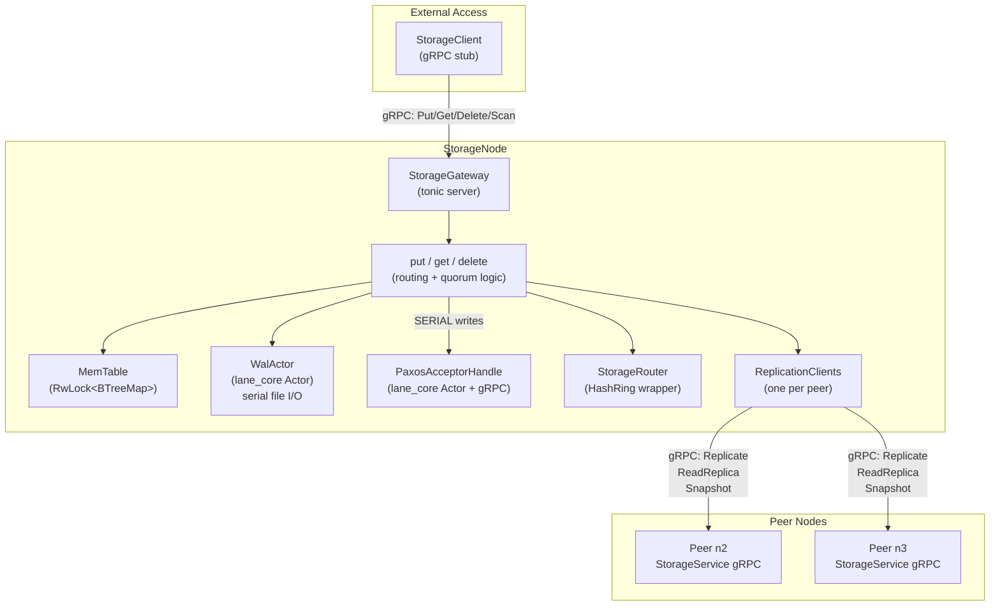

---

## Demo 1 — Single-node RAM-only

The simplest configuration: one node, replication factor 1, no WAL.

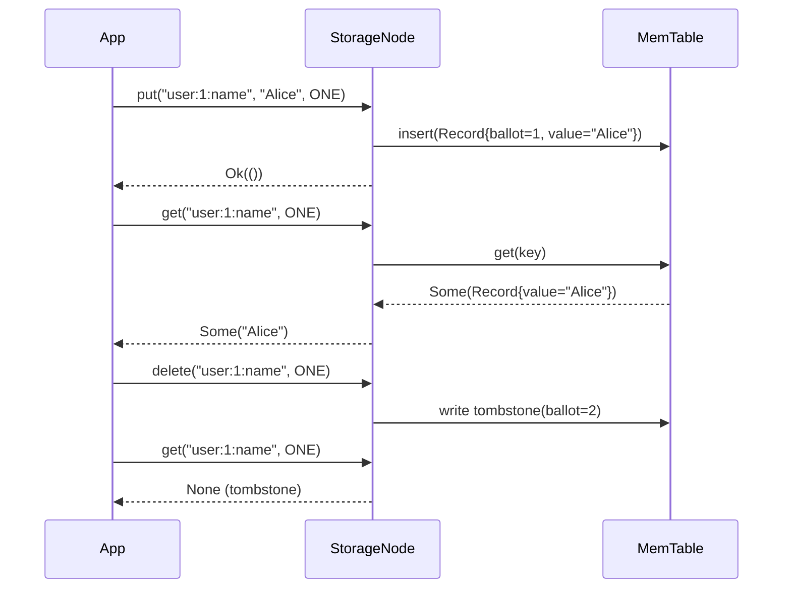

---

## Demo 2 — QUORUM write fan-out

With rf=3, a QUORUM write fans out to **all** replicas but only waits for 2 acks.
The remaining replica still receives the write via a detached `tokio::spawn` task.

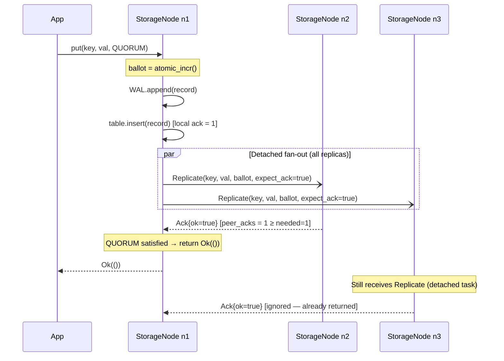

> **Key insight:** Every replica eventually receives the write even if we stopped
> waiting after quorum. This is the Cassandra "send to all, wait for quorum" model.

---

## Demo 3 — Tunable consistency levels

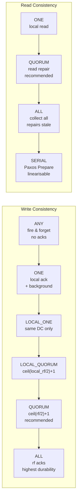

**Strong consistency formula: W + R > N**

| Write     | Read   | W  | R  | W+R | Strong? |
|-----------|--------|----|----|-----|---------|
| ALL (3)   | ONE (1)| 3  | 1  | 4   | ✓       |
| QUORUM(2) |QUORUM(2)| 2 | 2  | 4   | ✓ ← balanced choice |
| ONE (1)   | ALL (3)| 1  | 3  | 4   | ✓       |
| ONE (1)   | ONE (1)| 1  | 1  | 2   | ✗ eventual only |
| SERIAL    | SERIAL | —  | —  | —   | ✓ linearisable |

---

## Demo 4 — Read repair

Read repair heals stale replicas transparently on every `get`.

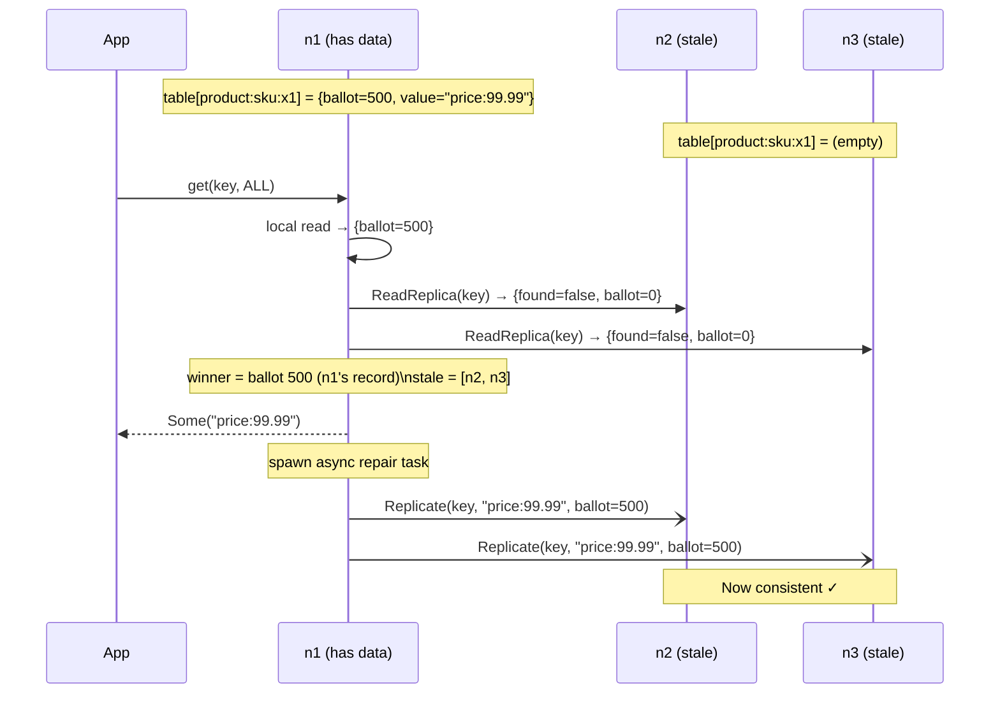

---

## Demo 5 — WAL persistence and crash recovery

The WAL is backed by a lane-core `Actor` — the actor's mailbox serialises all
file writes, and `post_stop` ensures a final flush on graceful shutdown.

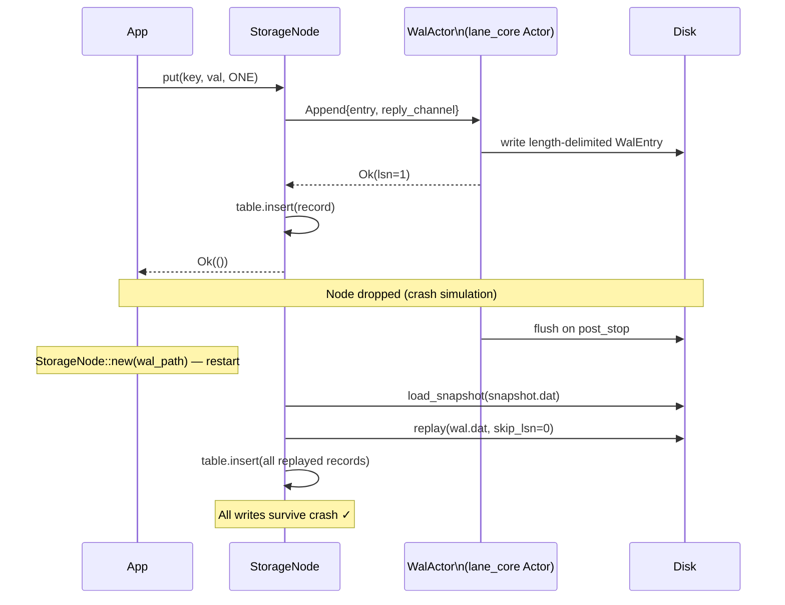

**Checkpoint + WAL truncation:**

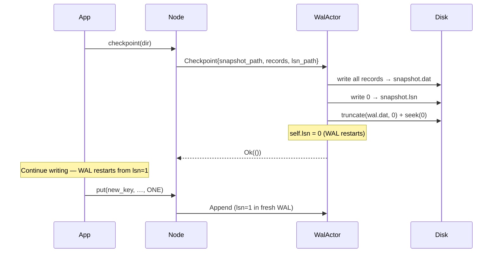

---

## Demo 6 — SERIAL (Paxos) linearisable writes

Single-decree Paxos provides per-key linearisability.  Every Paxos write goes
through three phases:

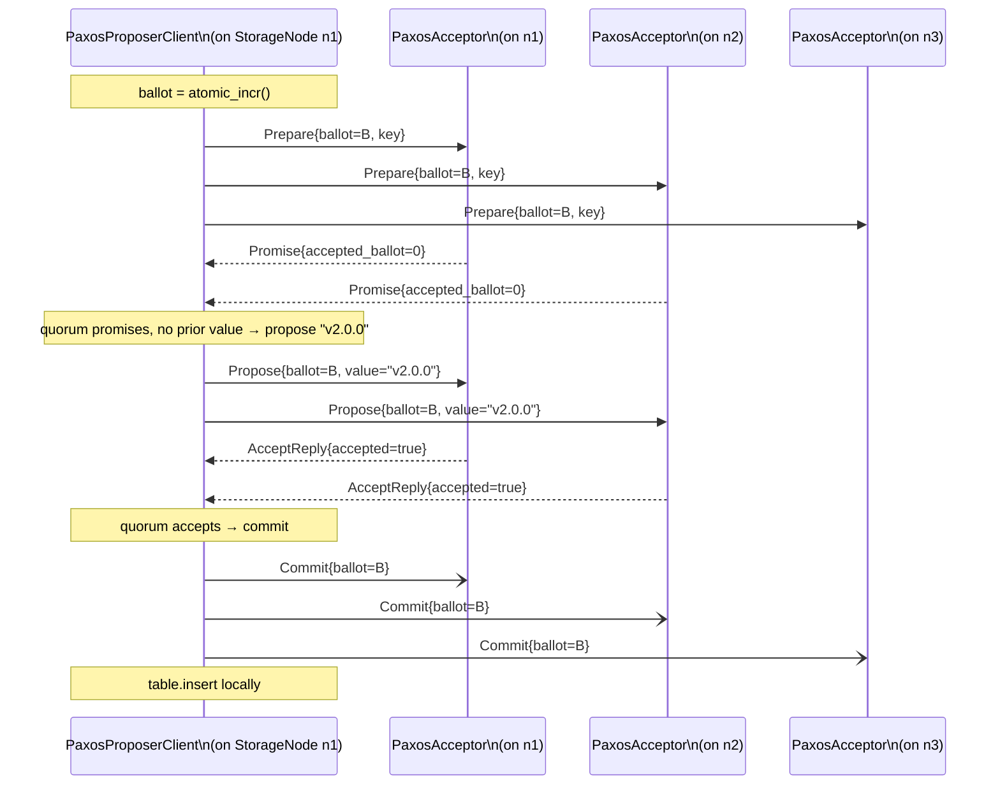

**Completion obligation** — if a proposer's Prepare sees a previously accepted
value, it *must* re-propose that value (not its own) to avoid losing committed data:

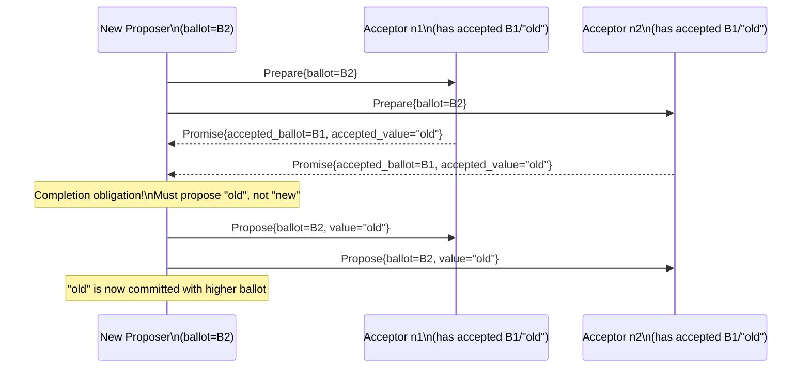

---

## Demo 7 — External StorageClient

`StorageClient` connects to a `StorageNode`'s `StorageGateway` gRPC server.

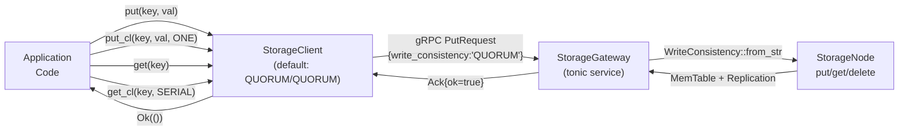

---

## Demo 8 — Node join via `sync_from_peer`

New nodes bootstrap from an existing peer's full snapshot before accepting writes.

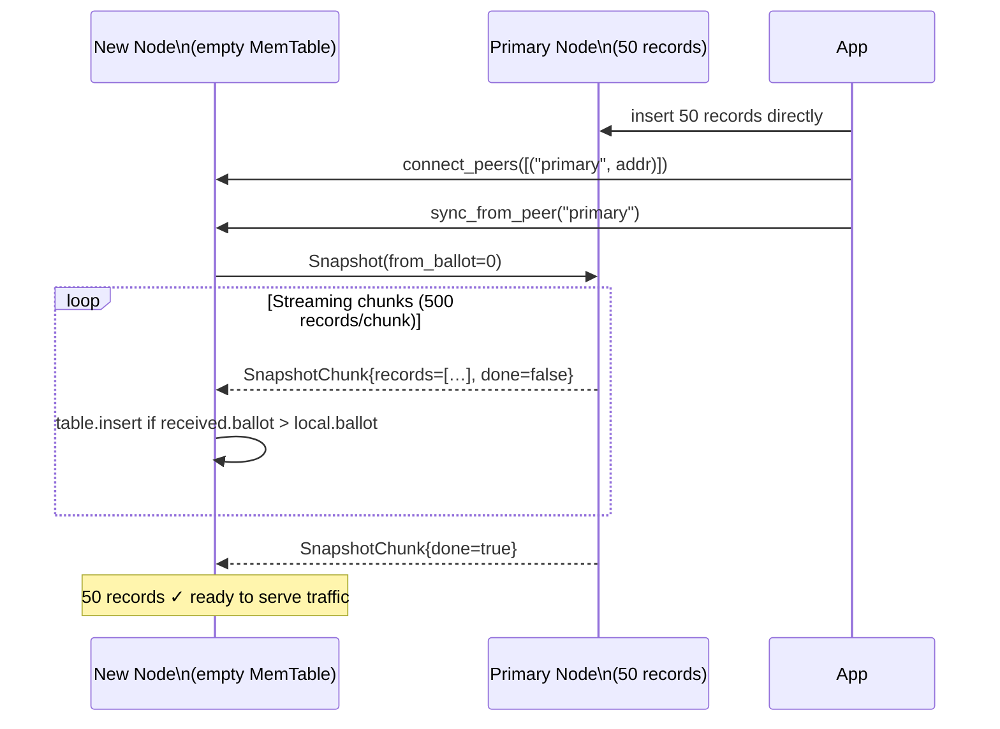

---

## Demo 9 — Observability

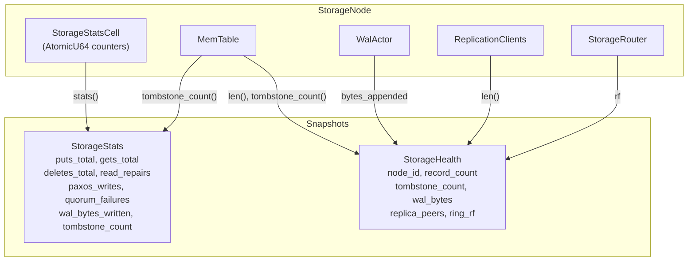

---

## Resilience Model

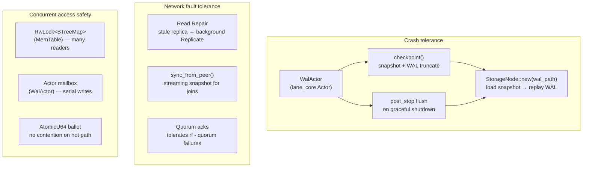

---

## Future Improvements (Roadmap)

```mermaid
graph LR
    subgraph Current["✅ Implemented"]
        P1["Phase 1-3\nMemTable, Ring, StorageNode\nBasic put/get/delete"]
        P4["Phase 4\nMulti-node replication\nRead repair, Node join"]
        P5["Phase 5\nPaxos SERIAL writes\nCompletion obligation"]
        P6["Phase 6\nWAL Actor, Checkpoint\nCrash recovery"]
        P7["Phase 7\nStorageClient gRPC\nExternal access"]
        P8["Phase 8\nStats, Health, Docs\nObservability"]
    end

    subgraph Phase9["🚧 Phase 9 — Anti-entropy"]
        AE["Merkle-tree partition\ncomparison per ring segment"]
        HH["Hinted Handoff\nwrite buffer for offline replicas"]
    end

    subgraph Phase10["🔮 Phase 10 — Persistence upgrade"]
        GC["Tombstone GC\n(gc_grace_seconds)"]
        SST["SSTable / LSM compaction\n(replace BTreeMap on disk)"]
        WAL2["Cross-node WAL\n(commitlog batching)"]
    end

    subgraph Phase11["🔮 Phase 11 — Multi-Paxos"]
        MP["Multi-Paxos log\n(overwrite semantics)"]
        CAS["Compare-and-swap\n(conditional writes)"]
        TX["Lightweight transactions\nIF NOT EXISTS"]
    end

    subgraph Phase12["🔮 Phase 12 — Operations"]
        REPAIR["Full cluster repair\n(manual anti-entropy scan)"]
        REBAL["Ring rebalancing\n(vnodes add/remove)"]
        BACKUP["Snapshot export\n(S3 / object storage)"]
    end

    P1 --> P4
    P4 --> P5
    P5 --> P6
    P6 --> P7
    P7 --> P8
    P8 --> Phase9
    Phase9 --> Phase10
    Phase9 --> Phase11
    Phase10 --> Phase12
    Phase11 --> Phase12
```

---

## Key Design Decisions

| Decision | Rationale |
|----------|-----------|
| **`WalActor` (lane_core Actor)** | Actor mailbox serialises writes without locks; `post_stop` guarantees flush; supervisor can restart on I/O error |
| **`RwLock<BTreeMap>` for MemTable** | Many concurrent readers (standard read path) with rare exclusive writes (replication receives); BTreeMap preserves key ordering for range scans and ring partition splits |
| **`PaxosAcceptorHandle` via Actor** | Acceptor state machine (promise/accept/commit) benefits from serial message processing and `lane_core` supervision |
| **Detached `tokio::spawn` for replication** | All replicas receive every write; quorum collection is decoupled from delivery; prevents 3rd replica starvation when QUORUM is satisfied by 2 |
| **Ballot = per-node `AtomicU64`** | Monotonically increasing, no coordination required for ballot generation; SystemTime stored for diagnostics only, never used for LWW ordering |
| **Tombstones, never physical deletes** | Safe concurrent reads; required for correct read repair (stale replica must not resurrect a deleted key with lower ballot) |
| **Single `StorageGateway` gRPC server** | One port per node handles both internal (StorageService: Replicate, ReadReplica, Snapshot) and external (StorageGateway: Put, Get, Delete, Scan) traffic |
