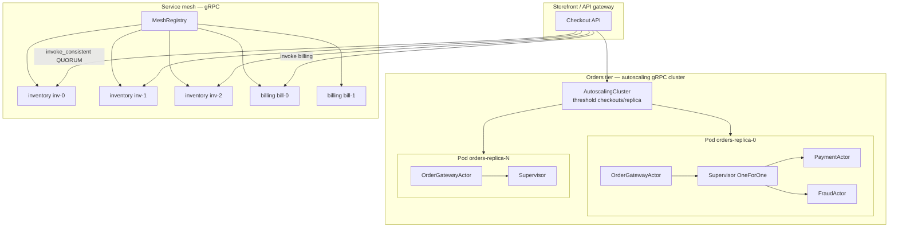
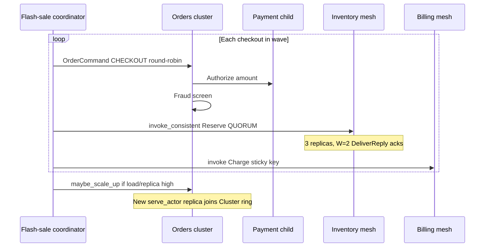
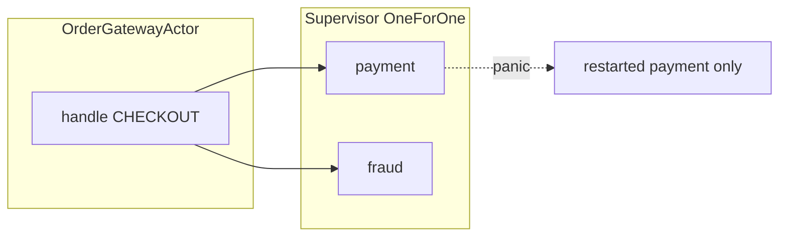

# E-commerce flash sale — mesh, supervision, autoscaling

[`ecommerce_flash_sale.rs`](./ecommerce_flash_sale.rs) models a **limited-stock flash sale** on a small e-commerce platform:

| Layer | Technology | Role |
|-------|------------|------|
| **Orders** | gRPC `Cluster` + **autoscaling** | Checkout gateways; scale out when per-replica load rises |
| **Supervision** | OneForOne per gateway | **Payment** + **fraud** children restart independently |
| **Inventory** | gRPC **service mesh** + **QUORUM** | Reserve stock on 3 replicas (W=2 acks) |
| **Billing** | Mesh hash-ring `invoke` | Charge after reserve |
| **Discovery** | `MeshRegistry` gRPC | Register inventory/billing instances |

```bash
cargo run --example ecommerce_flash_sale
```

Shared actors and autoscale helper: [`ecommerce_shared/mod.rs`](./ecommerce_shared/mod.rs).

---

## Production-shaped deployment



---

## Checkout saga (one sale wave)



---

## Autoscaling policy

| Constant | Default | Meaning |
|----------|---------|---------|
| `ORDERS_INITIAL` | 2 | Replicas at boot |
| `ORDERS_MAX` | 8 | Ceiling |
| `AUTOSCALE_REQ_PER_REPLICA` | 8 | Avg checkouts/replica in window → scale out |
| `CHECKOUTS_PER_WAVE` | 16 | Synthetic traffic per wave |

Implementation: [`AutoscalingCluster`](./ecommerce_shared/mod.rs) wraps [`Cluster`](../src/distributed.rs) — same pattern as [`service_complex_cluster.rs`](./service_complex_cluster.rs).

---

## Supervision inside each order gateway



Payment failure does **not** restart fraud (unlike RestForOne). For dependency chains (cart → payment → email), use RestForOne — see [`horizontal_scaling_rest_for_one.rs`](./horizontal_scaling_rest_for_one.rs).

---

## Benchmarks

Micro-benchmarks (localhost, release, Criterion):

```bash
cargo bench --bench wire        # primitives: send, registry list, quorum
cargo bench --bench ecommerce   # full checkout pipeline
```

| Bench | What it measures |
|-------|------------------|
| `wire::remote_actor_ref_send` | Single gRPC deliver on warm stream (~µs) |
| `wire::mesh_registry_list_32` | Control-plane list |
| `wire::invoke_consistent_quorum_rf3` | Inventory-style quorum only |
| `ecommerce::ecommerce_checkout_pipeline` | Order send + QUORUM reserve + billing invoke |

Published numbers (Apple Silicon, release, one run):

| Bench | Median |
|-------|--------|
| `ecommerce_checkout_pipeline` | **~84 µs** |
| `wire::invoke_consistent_quorum_rf3` | **~139 µs** |
| `wire::remote_actor_ref_send` | **~1.8 µs** |

Full table: [README.md](../README.md#benchmarks).

---

## Related examples

| Example | Focus |
|---------|--------|
| [`service_mesh.rs`](./service_mesh.rs) | Mesh only (orders/inventory/billing) |
| [`service_complex_cluster.rs`](./service_complex_cluster.rs) | Autoscale + supervised DAO trees |
| [`consistency.rs`](./consistency.rs) | QUORUM inventory + TLS |
| [`horizontal_scaling.rs`](./horizontal_scaling.rs) | Cluster hash-ring without mesh |
