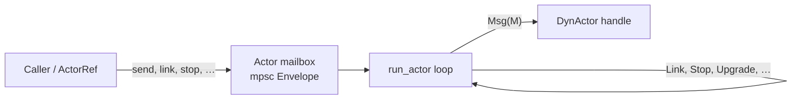
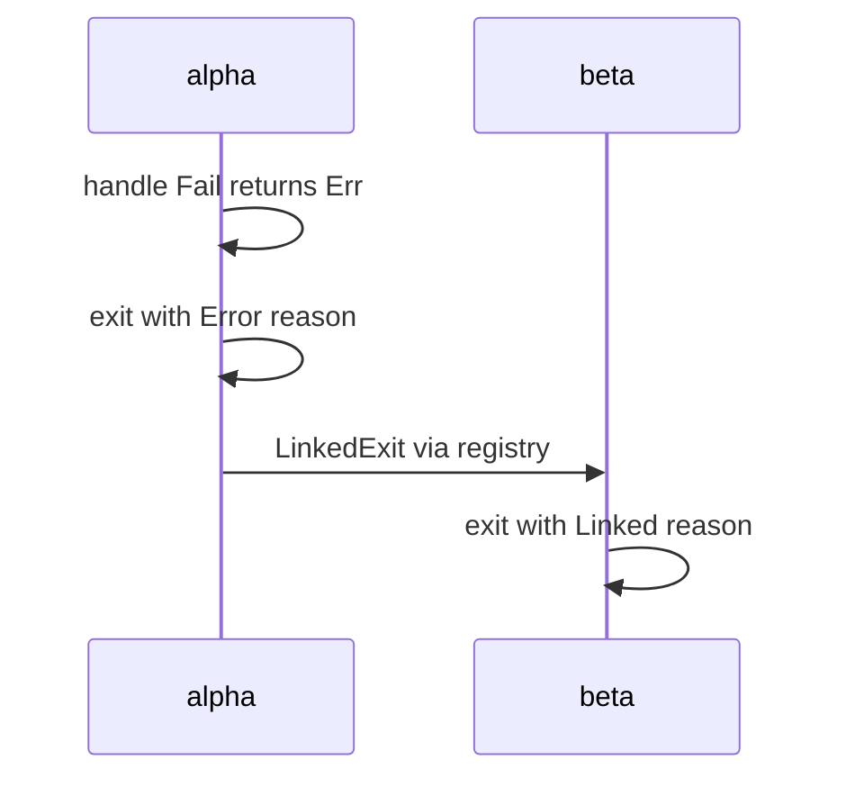

# Envelope demo — actor mailbox variants

The actor runtime delivers everything through a single mailbox type, [`Envelope<M>`](../src/actor.rs). Application code normally talks to actors via [`ActorRef`](../src/actor.rs) helpers (`send`, `link`, `stop`, …), which wrap the appropriate envelope variant.

This guide walks through [`envelope_demo.rs`](./envelope_demo.rs), which exercises **every** envelope variant in sequence.

```bash
cargo run --example envelope_demo
```

---

## Overview

Each spawned actor runs a `run_actor` loop that reads from an `mpsc` channel of envelopes. The loop distinguishes **data plane** messages (`Msg`) from **control plane** messages (link, monitor, stop, upgrade, …).



When an actor exits, it:

1. Runs `post_stop`.
2. Notifies all **monitors** with an [`ExitReason`](../src/actor.rs).
3. Propagates **linked exits** to linked peers.
4. Notifies its supervisor (if registered).
5. Unregisters from the global registry.

---

## Envelope reference

| Variant | Purpose | Public API | Demo function |
|---------|---------|------------|---------------|
| `Msg(M)` | Application message | `ActorRef::send(msg)` | `demo_msg` |
| `Link(ActorId)` | Register bidirectional failure propagation | `ActorRef::link(id)` | `demo_link_and_linked_exit` |
| `Unlink(ActorId)` | Remove a link | `ActorRef::unlink(id)` | `demo_unlink` |
| `Monitor { … }` | One-shot exit notification | `ActorRef::monitor(observer_id)` | `demo_monitor`, `demo_stop_vs_kill` |
| `Demonitor(ActorId)` | Remove a monitor | `ActorRef::demonitor(id)` | `demo_demonitor` |
| `LinkedExit(ActorId, ExitReason)` | Internal: peer failure reached this actor | *(runtime only)* | `demo_link_and_linked_exit` |
| `Upgrade(DynActor)` | Swap implementation in-place | `ActorRef::upgrade(new_impl)` | `demo_upgrade` |
| `Stop` | Graceful shutdown | `ActorRef::stop()` | `demo_msg`, `demo_monitor`, … |
| `Kill` | Forced shutdown | `ActorRef::kill()` | `demo_stop_vs_kill` |

---

## Demo walkthrough

### 1. `Msg(M)` — application message

**Purpose:** Deliver domain logic to the actor's `handle` callback.

**Code:**

```rust
worker.send(WorkerMsg::Ping).await?;
```

**What happens:**

1. `ActorRef::send` wraps the payload in `Envelope::Msg`.
2. `run_actor` matches `Envelope::Msg(m)` and calls `actor.dyn_handle(m)`.
3. If `handle` returns `Ok(())`, the loop continues.
4. If `handle` returns `Err`, the actor exits with `ExitReason::Error`.

**Expected output:**

```
=== Msg(M) — application message ===
[Msg] worker received Ping
[Stop/Kill/LinkedExit] worker post_stop
```

The demo uses a `Worker` actor with two message variants: `Ping` (success) and `Fail` (intentional error, used later for linking).

---

### 2. `Monitor` — one-shot exit notification

**Purpose:** Observe when a target actor exits without linking fates together. Monitors receive exactly one `ExitReason` on a `oneshot` channel.

**Code:**

```rust
let exit_rx = target.monitor(ActorId::new()).await;
target.stop().await?;
let reason = exit_rx.await?;  // ExitReason::Shutdown
```

**What happens:**

1. `monitor` sends `Envelope::Monitor { observer, notify }` to the target's mailbox.
2. The runtime stores the `oneshot::Sender<ExitReason>`.
3. When the actor exits (for any reason), all pending monitors are notified.

**Difference from Link:** A linked peer **dies with** the failing actor. A monitor **only observes** the exit and is unaffected.

**Expected output:**

```
=== Monitor — one-shot exit notification ===
[Stop/Kill/LinkedExit] monitored post_stop
[Monitor] observed exit: Shutdown
```

---

### 3. `Demonitor` — remove monitor

**Purpose:** Cancel a previously registered monitor.

**Code:**

```rust
target.demonitor(observer).await?;
```

**What happens:** Sends `Envelope::Demonitor(observer_id)` to the mailbox. In the current runtime this is a **no-op** — the handler is empty and monitors are not keyed by observer id for removal. The demo calls the API for completeness.

---

### 4. `Link` + `LinkedExit` — failure propagation

**Purpose:** OTP-style **linking**: when one linked actor exits abnormally, linked peers receive `LinkedExit` and also exit (unless they trap exits).

**Code:**

```rust
a.link(b.id).await?;  // alpha tracks beta
b.link(a.id).await?;  // beta tracks alpha (bidirectional)
a.send(WorkerMsg::Fail).await?;
```

**What happens:**



1. Alpha's `handle` returns an error → `ExitReason::Error`.
2. `propagate_linked_exit` looks up beta's mailbox in the global registry and sends `Envelope::LinkedExit(alpha_id, reason)`.
3. Beta's loop matches `LinkedExit`, sets `ExitReason::Linked(…)`, and breaks out.
4. Both actors run `post_stop` and terminate.

**Expected output:**

```
=== Link + LinkedExit — failure propagates to linked peer ===
[Link] alpha <-> beta linked
[Stop/Kill/LinkedExit] alpha post_stop
[Stop/Kill/LinkedExit] beta post_stop
```

**Note:** Linking is **directional** — each actor maintains its own link list. For bidirectional propagation, both actors must call `link` on each other.

---

### 5. `Unlink` — break the link before failure

**Purpose:** Remove a peer from the link list so future exits are not propagated to that peer.

**Code:**

```rust
a.link(b.id).await?;
b.link(a.id).await?;
a.unlink(b.id).await?;
b.unlink(a.id).await?;
a.send(WorkerMsg::Fail).await?;  // only alpha dies
b.send(WorkerMsg::Ping).await?; // beta still alive
```

**What happens:** After unlinking, alpha's link list is empty. When alpha fails, no `LinkedExit` is sent. Beta continues processing messages normally.

**Expected output:**

```
=== Unlink — peer survives when link is removed ===
[Unlink] peers unlinked before failure
[Stop/Kill/LinkedExit] solo-fail post_stop
[Msg] survivor received Ping
[Stop/Kill/LinkedExit] survivor post_stop
```

---

### 6. `Upgrade(DynActor)` — hot code swap

**Purpose:** Replace the actor implementation without stopping the mailbox, task, or `ActorRef`. State must be migrated manually by the caller.

**Code:**

```rust
counter.upgrade(CounterV2 { count: 1 }).await?;
```

**What happens:**

1. `upgrade` boxes the new implementation as `Box<dyn DynActor<M>>`.
2. Sends `Envelope::Upgrade(new_impl)`.
3. `run_actor` swaps `actor = new_impl` and calls `pre_start` on the new implementation.
4. The same `ActorRef` and mailbox keep working — callers see no interruption.

**Expected output:**

```
=== Upgrade(DynActor) — swap implementation in-place ===
[Upgrade] V1 count: 1
[Upgrade] V2 count after +2 increment: 3
```

V1 increments by 1; after upgrade to V2, increments add 2. See also [`hot_upgrade.rs`](./hot_upgrade.rs) for a focused version of this pattern.

---

### 7. `Stop` vs `Kill` — graceful vs forced shutdown

**Purpose:** Two ways to terminate an actor from outside.

| Envelope | API | Exit reason | Runs `post_stop`? |
|----------|-----|-------------|-------------------|
| `Stop` | `ActorRef::stop()` | `ExitReason::Shutdown` | Yes |
| `Kill` | `ActorRef::kill()` | `ExitReason::Killed` | Yes |

Both break the actor loop immediately without calling `handle`. The demo uses `monitor` to confirm the exit reason:

```rust
// Graceful
graceful.stop().await?;
assert!(matches!(exit_rx.await?, ExitReason::Shutdown));

// Forced
forced.kill().await?;
assert!(matches!(exit_rx.await?, ExitReason::Killed));
```

**Expected output:**

```
=== Stop vs Kill — graceful vs forced shutdown ===
[Stop/Kill/LinkedExit] graceful post_stop
[Stop] graceful shutdown confirmed
[Stop/Kill/LinkedExit] forced post_stop
[Kill] forced shutdown confirmed
```

---

## Exit reasons

When an actor terminates, monitors and linked peers receive an [`ExitReason`](../src/actor.rs):

| Variant | Typical cause |
|---------|---------------|
| `Normal` | Loop ended without explicit stop/kill |
| `Shutdown` | `Envelope::Stop` |
| `Killed` | `Envelope::Kill` |
| `Error(String)` | `handle` or `pre_start` returned `Err` |
| `Linked(ActorId, …)` | Received `LinkedExit` from a linked peer |
| `Linked(…)` nested | Chain of linked failures |

---

## Actors used in the demo

### `Worker`

Shared actor for Msg, Link, Unlink, Monitor, Stop, and Kill demos.

```rust
enum WorkerMsg {
    Ping,   // normal application message
    Fail,   // triggers ExitReason::Error
}
```

### `CounterV1` / `CounterV2`

Used for the Upgrade demo. Both implement `Actor<CounterMsg>` with different increment behavior (+1 vs +2).

---

## ActorRef API summary

All user-facing envelope operations go through `ActorRef<M>`:

```rust
actor.send(msg).await?;           // Msg
actor.link(peer.id).await?;       // Link
actor.unlink(peer.id).await?;     // Unlink
let rx = actor.monitor(id).await; // Monitor → oneshot Receiver
actor.demonitor(id).await?;       // Demonitor
actor.upgrade(new_impl).await?;   // Upgrade
actor.stop().await?;              // Stop
actor.kill().await?;              // Kill
```

`LinkedExit` is never sent by user code — the runtime injects it when a linked peer exits.

---

## Related docs

- [architecture.md](../architecture.md) — full system design including the local actor runtime
- [hot_upgrade.rs](./hot_upgrade.rs) — focused hot-upgrade example
- [src/actor.rs](../src/actor.rs) — `Envelope`, `run_actor`, and `ActorRef` implementation
