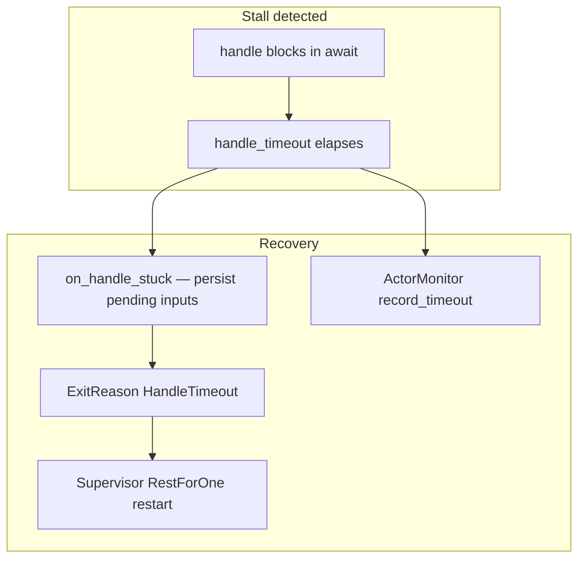
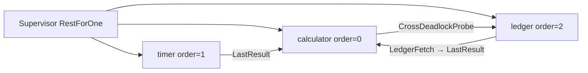

# Deadlock prevention — calculator + timer + ledger

RestForOne supervision with **`ActorConfig::handle_timeout`**, **`on_handle_begin`**, **`on_handle_stuck`**, and **`ActorMonitor`** — demonstrates slow handlers and **real actor deadlocks**, and how the runtime breaks the cycle instead of hanging forever.

```bash
cargo run --example handle_timeout_calculator_timer
```

Source: [`handle_timeout_calculator_timer.rs`](./handle_timeout_calculator_timer.rs)

Based on [`rest_for_one_calculator_timer.rs`](./rest_for_one_calculator_timer.rs). For panic-based RestForOne see that example; for panic journaling see [`recoverable_timer_calc.rs`](./recoverable_timer_calc.rs).

---

## Deadlock in actor systems

An actor processes one mailbox. With **`max_in_flight = 1`** (the default), a second message cannot enter `handle()` while the first is still running.

**Deadlock** happens when `handle()` blocks waiting for a reply that requires the same mailbox (or a circular chain of mailboxes) to make progress:

| Pattern | This example | Why it stalls |
|---------|--------------|---------------|
| **Slow handler** | `SlowDiv` sleeps 400ms | Mailbox occupied; looks like deadlock to callers |
| **Self-deadlock** | `SelfDeadlockProbe` → `Ping` to self | Calculator is inside `handle()`; `Ping` never runs |
| **Cross-actor deadlock** | `CrossDeadlockProbe` → `LedgerFetch` → `LastResult` | Calculator waits on ledger; ledger waits on calculator |

Lane Switchboards does **not** run a circular-wait graph algorithm. Prevention is **operational**: bound wall time, journal inputs, exit, supervise, monitor.

---

## Deadlock prevention stack



| Layer | Setting / API | Role in this example |
|-------|---------------|----------------------|
| Sequential mailbox | `max_in_flight: 1` | One in-flight `handle()` — reentrant self-calls deadlock |
| Wall-clock bound | `handle_timeout: 150ms` | Cancels stuck `handle()` future |
| Input snapshot | `on_handle_begin(&msg)` | Copy operands before `handle()` runs |
| Stuck persistence | `on_handle_stuck(ctx)` | Push snapshot to shared stuck journal |
| Process recovery | RestForOne supervisor | Restart calculator, timer, **and** ledger |
| Observability | `ActorMonitor::global()` | `handle_timeouts`, `messages_handled`, handle ms |

Shared `Arc<Mutex<SharedState>>` holds `last_result` (survives restart) and `stuck_actions` (populated on every timeout).

---

## Child tree



When **calculator** hits `HandleTimeout`, RestForOne restarts calculator and every child with **order ≥ 0** (timer + ledger).

---

## Demo phases

### Phase 1 — slow handler (deadlock-like)

1. Fast `add 10 + 4` — completes within 150ms.
2. `slow_div 20 / 4` with 400ms sleep — timeout → journal `{ SlowDiv(20, 4, 400) }` → restart.

### Phase 2 — deadlock prevention

**2a Self-deadlock**

```
calculator.handle(SelfDeadlockProbe)
  └─ send Ping to calculator ──► mailbox busy ──► never runs
```

**2b Cross-actor deadlock**

```
calculator.handle(CrossDeadlockProbe)
  └─ ledger.handle(LedgerFetch)
       └─ calculator.handle(LastResult) ──► mailbox busy ──► never runs
  └─ calculator blocks on pending() until handle_timeout
```

The calculator dispatches `LedgerFetch` then waits forever (`pending()`). It does **not** await the ledger reply — otherwise a ledger timeout could drop the channel and let the handler finish without journaling. Both actors may record `handle_timeouts` in `ActorMonitor`; journaling happens on the calculator via `on_handle_stuck`.

After each probe:

- Stuck journal contains `SelfDeadlockProbe` or `CrossDeadlockProbe(99.0)`
- Generations increase for calculator, timer, ledger
- `ActorMonitor` shows rising `handle_timeouts`
- Healthy `add` and fast `slow_div` work again after restart

---

## Config

```rust
ActorConfig {
    handle_timeout: Some(Duration::from_millis(150)),
    slow_handle_threshold: Some(Duration::from_millis(150)),
    max_in_flight: 1,  // sequential mailbox — required for self-deadlock demo
    ..Default::default()
}
```

Supervisor uses `Supervisor::with_actor_config(actor_config, ...)` so every child shares the timeout.

---

## Design notes

- **`on_handle_begin` runs while `msg` is still available by reference** — store what you need before `handle()` may block forever.
- When timeout fires, the in-flight `handle()` future is **dropped**; recovery reads from `on_handle_begin` / `on_handle_stuck` state, not from the dropped future.
- **Avoid synchronous actor-to-actor calls from inside `handle()`** unless you accept timeout + restart as the failure mode (or use `max_in_flight > 1` with careful design — still risky for cycles).
- Pair timeouts with a **supervisor** so `HandleTimeout` triggers child restart rather than a permanently wedged process.

See also [README.md](../README.md#deadlock--slow-handle-prevention) and [READMEv0.0.2.md](../READMEv0.0.2.md).

---

## Overall latency

Measured locally on 2026-05-31 (`cargo build --example handle_timeout_calculator_timer` then 3 runs of the binary):

| Run | Wall clock |
|-----|------------|
| 1 | 3.10 s |
| 2 | 2.62 s |
| 3 | 2.62 s |
| **Typical** | **~2.6–3.1 s** |

The demo is **not** waiting for real deadlocks to hang forever — each stall is capped by `handle_timeout` (150 ms). Most of the runtime is intentional pacing so restarts and timer ticks are visible in the log.

### Phase budget

| Step | Duration | Cumulative (approx.) |
|------|----------|----------------------|
| `start_settled` | 50 ms | 0.05 s |
| Phase 1 — fast `add`, sleep | ~300 ms | 0.35 s |
| Phase 1 — `SlowDiv` timeout + restart | ~150 ms + respawn | 0.55 s |
| Phase 1 — post-restart sleep | 300 ms | 0.85 s |
| Phase 2a — self-deadlock timeout + restart | ~150 ms + respawn | 1.05 s |
| Phase 2a — sleep | 300 ms | 1.35 s |
| Phase 2b — cross-deadlock timeout(s) + restart | ~150–300 ms | 1.55–1.65 s |
| Phase 2b — sleep | 300 ms | 1.85–1.95 s |
| Recovery — `add`, fast `slow_div`, timer ticks | ~50 ms | 2.0 s |
| Final timer tail (`sleep(900ms)`) | 900 ms | **~2.9 s** |

**Explicit sleep total:** 50 + 5×300 + 900 = **2450 ms**.  
**Timeout detection total:** 3×150 ms = **450 ms** (minimum; cross probe may also timeout ledger).  
**Actor / supervisor work:** remainder (~100–200 ms) — spawns, mailbox I/O, journal queries.

### Latency knobs

| Constant | Value | Effect |
|----------|-------|--------|
| `HANDLE_TIMEOUT` | 150 ms | Upper bound per stuck `handle()` before recovery |
| `start_settled` | 50 ms | Initial child spawn settle |
| Phase sleeps | 300 ms × 5 | Log readability between probes |
| Timer interval | 600 ms | Background `last_result` prints |
| Final sleep | 900 ms | Lets timer fire after recovery |

To run faster in CI, reduce the 300 ms / 900 ms sleeps; recovery timing is still bounded by `handle_timeout`.

### Best-case latency (success path only)

Measured at example startup by `measure_success_latencies()` — **50 samples** after **5 warmup** rounds, **no demo `sleep` between samples** (only the one-time `start_settled(50ms)` boot before this block).

#### Debug build (`cargo run --example handle_timeout_calculator_timer`)

| Operation | min | avg | max | Notes |
|-----------|-----|-----|-----|-------|
| **`add` (e2e)** | 34 µs | **58 µs** | 122 µs | Registry lookup + send + `on_handle_begin` + `handle` + `oneshot` reply |
| **`last_result` (e2e)** | 48 µs | **58 µs** | 67 µs | Same calculator path, read-only |
| **`slow_div` delay=0 (e2e)** | 1170 µs | **1268 µs** | 1696 µs | Includes `tokio::time::sleep(0)` in handler — yields to scheduler; not pure CPU |
| **ActorMonitor `max_handle_ms`** | — | — | **1 ms** | Per-actor `handle()` wall time inside the runtime |

#### Release build (`cargo run --release --example handle_timeout_calculator_timer`)

| Operation | min | avg | max |
|-----------|-----|-----|-----|
| **`add` (e2e)** | 15 µs | **21 µs** | 43 µs |
| **`last_result` (e2e)** | 17 µs | **19 µs** | 45 µs |
| **`slow_div` delay=0 (e2e)** | 53 µs | **1188 µs** | 1812 µs |

For **successful calculation latency**, use **`add`** as the representative op (~**20–60 µs** end-to-end on a local dev machine). `slow_div` with `delay_ms = 0` still calls `sleep(0)` and is dominated by Tokio scheduling, not arithmetic.

Example output:

```
=== Success-path latency (demo sleeps excluded) ===
warmup=5 samples=50 per op

[latency] add (e2e)              min=   34 µs  avg=   58 µs  max=  122 µs  (n=50)
[latency] slow_div 0ms (e2e)     min= 1170 µs  avg= 1268 µs  max= 1696 µs  (n=50)
[latency] last_result (e2e)      min=   48 µs  avg=   58 µs  max=   67 µs  (n=50)
[latency] ActorMonitor (calculator) last_handle_ms=0 max_handle_ms=1
```

Contrast with the full demo (~2.6–3.1 s): timeouts (3×150 ms), intentional pacing sleeps (2.45 s), and RestForOne restarts dominate — not successful handle cost.
