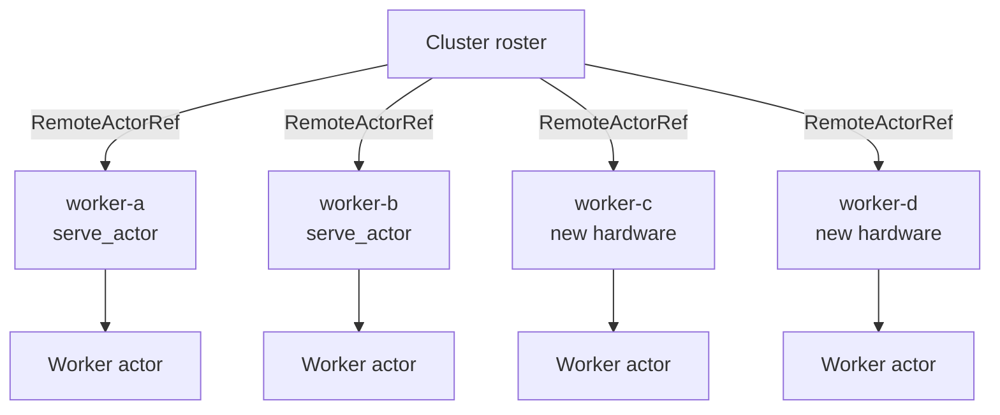

# Horizontal scaling — add nodes to a cluster

Erlang/OTP clusters grow by **starting new BEAM nodes** and connecting them to the existing mesh. Each node runs processes; remote processes are addressed by `{Name, Node}` — new hardware means new node names and more capacity, not bigger single machines.

**lane_switchboards** provides built-in clustering in [`distributed.rs`](../src/distributed.rs):

| Type | Role |
|------|------|
| **`serve_actor`** | Bind a TCP node and bridge frames to a local actor |
| **`ClusterMember`** | Name + address + frame target for one node |
| **`Cluster`** | Roster of remote refs — `join`, `send_round_robin`, `broadcast` |

```bash
cargo run --example horizontal_scaling
```

Source: [`horizontal_scaling.rs`](./horizontal_scaling.rs)

Compare with the minimal two-node ping in [`distributed_demo.rs`](./distributed_demo.rs).

---

## Idea

| Telecom / Erlang | Library API |
|------------------|-------------|
| Add a switch or exchange blade | `serve_actor("worker-c", addr, "worker", actor)` |
| Register node in the cluster | `cluster.join(node.member.clone())` |
| Route calls to any node in the mesh | `cluster.send_by_key(&job_id, msg)` — same key → same node |
| More nodes → more concurrent workers | Roster grows; round-robin uses all members |

You can add computing capacity by launching new nodes on additional hardware and hooking them into the existing cluster — `Cluster::join` is the hook.

---

## Architecture



Each worker node:

1. **`serve_actor(name, bind_addr, "worker", actor)`** — bind TCP + register target + bridge to local actor
2. Returns **`NodeHandle`** with **`member()`** metadata for the roster
3. Coordinator uses **`Cluster::send_by_key`** — hash ring picks the node per job id

---

## Cluster roster (library)

```rust
use lane_switchboards::distributed::{serve_actor, Cluster};

let mut cluster = Cluster::new();

let node_a = serve_actor("worker-a", "127.0.0.1:0", "worker", worker_a).await?;
cluster.join(node_a.member.clone());

// Scale out — existing nodes unchanged
let node_c = serve_actor("worker-c", "127.0.0.1:0", "worker", worker_c).await?;
cluster.join(node_c.member.clone());

cluster.send_by_key(&job_id, WorkMsg::Process { job_id }).await?;
```

Each `join` also registers the node on the internal **`HashRing`** (150 virtual nodes by default). The same `job_id` always routes to the same worker until the ring membership changes.

### Hash ring API (standalone)

```rust
use lane_switchboards::{HashRing, RingNode};

let mut ring = HashRing::default();
ring.add_node(RingNode::new("worker-a", "10.0.0.1", 9001));
ring.add_node(RingNode::new("worker-b", "10.0.0.2", 9001));

let node = ring.get_node(&"user-42");           // primary owner
let replicas = ring.get_nodes(&"user-42", 2);   // primary + next on ring
```

| Method | Description |
|--------|-------------|
| `HashRing::new(virtual_nodes)` | Ring with vnode count (default 150) |
| `add_node` / `remove_node` | Membership changes |
| `get_node(key)` | Primary node for a key |
| `get_nodes(key, n)` | Walk clockwise for n distinct nodes |
| `Cluster::ring()` | Access the cluster's ring |
| `Cluster::leave(id)` | Remove from roster and ring |

**Adding capacity:**

1. `serve_actor` on the new host (get `NodeHandle::address()`).
2. `cluster.join(handle.member.clone())`.

No service discovery in the core — production uses DNS, etcd, or [`registry.rs`](../src/registry.rs). The roster is the minimal hook.

### API reference

| Method | Description |
|--------|-------------|
| `Cluster::new()` | Empty roster |
| `Cluster::join(member)` | Append a `ClusterMember` |
| `Cluster::len()` | Current worker count |
| `Cluster::send_by_key(key, msg)` | Hash-ring routing |
| `Cluster::send_round_robin(msg)` | Round-robin (no stickiness) |
| `Cluster::broadcast(msg)` | Send to every member (`M: Clone`) |
| `Cluster::next()` | Pick ref without sending (custom dispatch) |
| `ClusterMember::remote_ref()` | Build a `RemoteActorRef` manually |

---

## Demo phases

### Phase 1 — initial cluster (2 nodes)

| Step | Action |
|------|--------|
| 1 | `serve_actor` for `worker-a` and `worker-b` |
| 2 | `Cluster::new()`, `join` both members |
| 3 | Jobs 1–6 via `send_by_key(&job_id, …)` |

### Phase 2 — scale out (+2 nodes)

| Step | Action |
|------|--------|
| 1 | `serve_actor` for `worker-c` and `worker-d` |
| 2 | `cluster.join` each — roster 2 → 4 |
| 3 | Jobs 7–14 — hash ring includes all four nodes |

---

## Expected output (excerpt)

```
=== Phase 1: initial cluster (2 worker nodes) ===

[cluster] node worker-a online at 127.0.0.1:65140
[cluster] hooking worker-a into roster (1 workers total)
[worker-a] processed job 2 (total on this node: 1)
...

=== Phase 2: horizontal scale-out (+2 nodes on new hardware) ===

[cluster] capacity: 2 → 4 workers

[worker-c] processed job 10 (total on this node: 1)
...
```

Port numbers vary (`127.0.0.1:0` ephemeral bind).

---

## Wire protocol (reminder)

Each `RemoteActorRef::send` opens a TCP connection and writes:

| Field | Content |
|-------|---------|
| 4 bytes LE | JSON frame length |
| JSON body | `{ "target": "worker", "payload": { ... } }` |

---

## Real deployment mapping

| Demo | Production |
|------|------------|
| `127.0.0.1:0` on one machine | Bind `0.0.0.0:9000` on each new host |
| In-memory `Cluster` + `HashRing` | Load balancer, service mesh, or external registry |
| Consistent hash on `job_id` | User/session sharding; minimal remapping when nodes join |
| Single process, four nodes | Four processes / four VMs |

---

## Limitations (by design)

| Topic | Detail |
|-------|--------|
| No auto-discovery | Propagate new addresses to the coordinator yourself |
| Fire-and-forget | `RemoteActorRef::send` has no request-reply |
| One connection per send | Demo transport; pool in production |
| No node failure handling | Remove dead members from the roster explicitly |

---

## Related docs

- [horizontal_scaling_rest_for_one.md](./horizontal_scaling_rest_for_one.md) — RestForOne processor + reporter per site, multi-send APIs
- [distributed_demo.rs](./distributed_demo.rs) — minimal remote ping
- [README — horizontal scaling](../README.md#horizontal-scaling-cluster-roster)
- [envelope_demo.md](./envelope_demo.md) — local mailbox control messages
