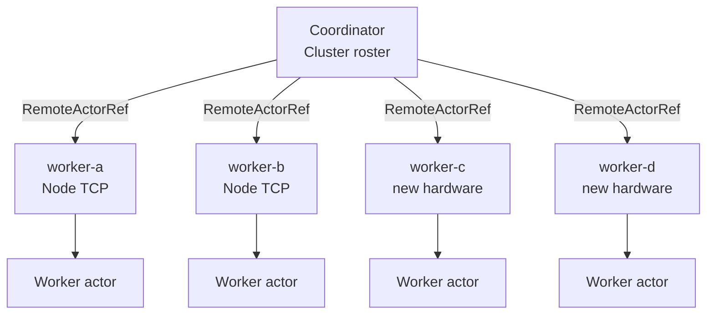

# Horizontal scaling — add nodes to a cluster

Erlang/OTP clusters grow by **starting new BEAM nodes** and connecting them to the existing mesh. Each node runs processes; remote processes are addressed by `{Name, Node}` — new hardware means new node names and more capacity, not bigger single machines.

**lane_switchboards** models the same idea at a small scale: each **`Node`** binds a TCP listener; **`RemoteActorRef`** routes frames to actors registered on any node. To scale out, bind a new node, register its address in your cluster roster, and keep dispatching work.

```bash
cargo run --example horizontal_scaling
```

Source: [`horizontal_scaling.rs`](./horizontal_scaling.rs)

Compare with the minimal two-node ping in [`distributed_demo.rs`](./distributed_demo.rs).

---

## Idea

| Telecom / Erlang | This example |
|------------------|--------------|
| Add a switch or exchange blade | `WorkerNode::launch("worker-c")` binds a new TCP listener |
| Register node in the cluster | `cluster.add_node(&node_c)` stores a `RemoteActorRef` |
| Route calls to any node in the mesh | Coordinator round-robins `WorkMsg::Process` across the roster |
| More nodes → more concurrent workers | Jobs 7–14 spread across **four** nodes instead of two |

You can add computing capacity by launching new nodes on additional hardware and hooking them into the existing cluster — the roster is the hook.

---

## Architecture



Each worker node:

1. **`Node::bind(name, addr)`** — listen for length-prefixed JSON frames ([`distributed.rs`](../src/distributed.rs))
2. **`node.register("worker", tx)`** — map frame target `"worker"` to a local mailbox
3. Local **`Worker`** actor processes `WorkMsg::Process { job_id }`

The coordinator never talks to actors directly — only to **`RemoteActorRef { node_addr, target }`**.

---

## Cluster roster

There is no built-in global service discovery. Production systems use DNS, etcd, or a registry; this demo uses an in-memory **`Cluster`**:

```rust
struct Cluster {
    workers: Vec<RemoteActorRef<WorkMsg>>,
}

impl Cluster {
    fn add_node(&mut self, node: &WorkerNode) {
        self.workers.push(RemoteActorRef::new(&node.address, "worker"));
    }

    async fn dispatch(&mut self, job_id: u64) -> Result<(), ...> {
        let worker = &self.workers[job_id as usize % self.workers.len()];
        worker.send(WorkMsg::Process { job_id }).await?;
        Ok(())
    }
}
```

**Adding capacity** is two steps:

1. Launch and bind the new node (get its `address()`).
2. Push a `RemoteActorRef` into the roster your coordinator already uses.

Existing nodes keep running; no restart required.

---

## Demo phases

### Phase 1 — initial cluster (2 nodes)

| Step | Action |
|------|--------|
| 1 | `WorkerNode::launch("worker-a")` and `worker-b` |
| 2 | Build `Cluster`, `add_node` both |
| 3 | Dispatch jobs 1–6 round-robin across 2 workers |

Each worker prints which `job_id` it handled and a running total on that node.

### Phase 2 — scale out (+2 nodes)

| Step | Action |
|------|--------|
| 1 | Launch `worker-c` and `worker-d` (simulates new machines / ports) |
| 2 | `cluster.add_node` for each — roster grows 2 → 4 |
| 3 | Dispatch jobs 7–14 — load spreads across all four |

Round-robin modulo worker count automatically uses the new capacity once addresses are in the roster.

---

## Expected output (excerpt)

```
=== Phase 1: initial cluster (2 worker nodes) ===

[cluster] node worker-a online at 127.0.0.1:54321
[cluster] node worker-b online at 127.0.0.1:54322
[cluster] hooking worker-a into roster (1 workers total)
[cluster] hooking worker-b into roster (2 workers total)
[worker-a] processed job 1 (total on this node: 1)
[worker-b] processed job 2 (total on this node: 1)
...

=== Phase 2: horizontal scale-out (+2 nodes on new hardware) ===

[cluster] node worker-c online at 127.0.0.1:54323
[cluster] node worker-d online at 127.0.0.1:54324
[cluster] hooking worker-c into roster (3 workers total)
[cluster] hooking worker-d into roster (4 workers total)

[cluster] capacity: 2 → 4 workers

[worker-c] processed job 7 (total on this node: 1)
[worker-d] processed job 8 (total on this node: 1)
...
```

Port numbers vary (`127.0.0.1:0` ephemeral bind).

---

## Wire protocol (reminder)

Each `RemoteActorRef::send` opens a TCP connection and writes:

| Field | Content |
|-------|---------|
| 4 bytes LE | JSON frame length |
| JSON body | `{ "target": "worker", "payload": { ... } }` |

The remote `Node` deserializes the payload as `WorkMsg` and forwards to the registered mailbox.

---

## Real deployment mapping

| Demo | Production |
|------|------------|
| `127.0.0.1:0` on one machine | Bind `0.0.0.0:9000` on each new host |
| In-memory `Cluster` | Load balancer, service mesh, or `registry.rs` index |
| Round-robin by `job_id` | Consistent hash, queue consumer groups, or OTP `pg` |
| Single process, four nodes | Four processes / four VMs, coordinator on any node |

This example keeps all nodes in one process for easy `cargo run`; the **bind + register + roster** steps are the same when processes move to separate hardware.

---

## Limitations (by design)

| Topic | Detail |
|-------|--------|
| No auto-discovery | You must propagate new `node.address()` to the coordinator |
| Fire-and-forget | `RemoteActorRef::send` has no request-reply; use local actors for RPC patterns |
| One connection per send | Simple demo transport; production would pool connections |
| No node failure handling | Crashed node stays in roster until you remove it |

---

## Related docs

- [distributed_demo.rs](./distributed_demo.rs) — minimal remote ping
- [README — distributed actors](../README.md#library-src)
- [envelope_demo.md](./envelope_demo.md) — local mailbox control messages
