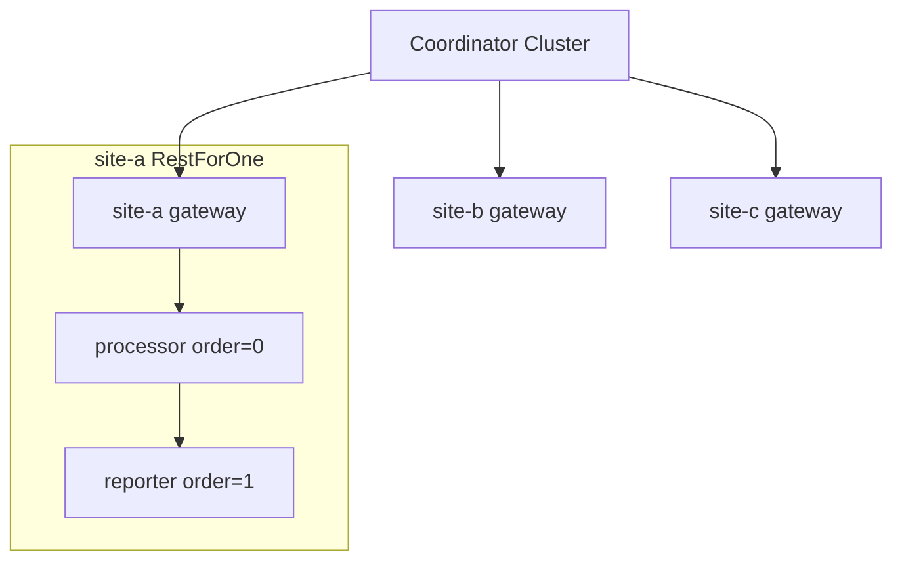

# Horizontal scaling + RestForOne (multi-actor sites)

Each **cluster site** runs two **different** local actors under **RestForOne**:

| Child | `order` | Role |
|-------|---------|------|
| `processor` | 0 | Computes; on failure restarts downstream |
| `reporter` | 1 | Logs results from processor |

A **gateway** actor on each site is the TCP entry point. The coordinator sends **one wire message type** (`WorkMsg`) to the cluster; the gateway fans out to local processor/reporter as needed.

Scale out by launching new sites and `cluster.join`. Send to **one** node, **all** nodes, or a **named subset** in one call.

```bash
cargo run --example horizontal_scaling_rest_for_one
```

Source: [`horizontal_scaling_rest_for_one.rs`](./horizontal_scaling_rest_for_one.rs)

Related: [horizontal_scaling.md](./horizontal_scaling.md) (single actor per node), [rest_for_one_calculator_timer.md](./rest_for_one_calculator_timer.md) (RestForOne on one machine).

---

## Architecture



| Layer | Message type | Actors |
|-------|--------------|--------|
| Cluster (TCP) | `WorkMsg` | One gateway per site |
| Local supervisor | `LocalMsg` | `LocalMsg::Processor(…)` / `LocalMsg::Reporter(…)` under RestForOne |

### Role enum

Child identity and RestForOne order come from one enum — no scattered string literals:

```rust
#[derive(Debug, Clone, Copy, PartialEq, Eq)]
enum LocalRole {
    Processor,  // order 0
    Reporter,   // order 1
}

impl LocalRole {
    const ALL: [Self; 2] = [Self::Processor, Self::Reporter];

    const fn order(self) -> usize { /* 0 or 1 */ }
    const fn name(self) -> &'static str { /* registry key */ }
}
```

Specs are built by iterating `LocalRole::ALL`:

```rust
for role in LocalRole::ALL {
    spawn_child_spec(role.order(), role.name(), registry.clone(), move || LocalWorker { role, .. });
}
```

Local messages are tagged by role:

```rust
enum LocalMsg {
    Processor(ProcessorMsg),
    Reporter(ReporterMsg),
}
```

**Why two message types?** A supervisor requires one `M` for all its children. Remote cluster routing also requires one `M` per `Cluster<M>`. Gateways translate `WorkMsg` → `LocalMsg`.

---

## RestForOne per site

```rust
Supervisor::new(
    SupervisorConfig {
        strategy: RestartStrategy::RestForOne,
        ..
    },
    LocalRole::ALL.into_iter().map(|role| {
        spawn_child_spec(role.order(), role.name(), registry.clone(), move || LocalWorker { role, .. })
    }).collect(),
)
```

When `processor` panics on one site, **only that site** restarts processor + reporter. Other cluster sites are unaffected.

---

## Sending to multiple actors / nodes

### One remote message → two local actors (same site)

The gateway handles fan-out inside one node:

```rust
WorkMsg::Process { job_id, value } => {
    role_ref(&registry, LocalRole::Processor).await?
        .send(LocalMsg::Processor(ProcessorMsg::Compute { job_id, value }))
        .await?;
    // processor sends LocalMsg::Reporter(Report { .. }) to reporter
}
```

One `WorkMsg::Process` hits the gateway once; processor and reporter both run locally.

### One coordinator call → all cluster sites

| API | Behavior |
|-----|----------|
| **`cluster.broadcast(msg)`** | Clone `msg` to **every** member; fails fast on first error |
| **`cluster.send_all(msg)`** | Clone to every member; returns `Vec<(name, Result)>` — continues on failure |
| **`cluster.send_to(&["site-a", "site-b"], msg)`** | Named subset only |
| **`cluster.send_replicas(&key, n, msg)`** | Primary hash-ring node + next `n-1` clockwise |
| **`cluster.send_by_key(&key, msg)`** | Exactly one node (consistent hash) |

Examples from this demo:

```rust
// All nodes
cluster.broadcast(WorkMsg::Ping).await?;

// All nodes, collect results
let results = cluster.send_all(WorkMsg::Process { job_id: 100, value: 3.0 }).await;
for (name, result) in results {
    println!("{name}: {result:?}");
}

// Subset
cluster.send_to(&["site-a"], WorkMsg::Process { job_id: 101, value: 5.0 }).await;

// Hash ring: owner of key 7 + one replica
cluster.send_replicas(&7u64, 2, WorkMsg::Process { job_id: 7, value: 1.0 }).await;

// Single owner
cluster.send_by_key(&42u64, WorkMsg::Process { job_id: 42, value: 10.0 }).await;
```

`broadcast` / `send_all` / `send_to` / `send_replicas` require **`M: Clone`** because each send gets its own copy.

---

## Demo flow

| Phase | What happens |
|-------|----------------|
| 1 | Launch `site-a`, `site-b`; join cluster; `send_by_key` one job |
| 1b | `broadcast` Ping; `send_all` Process; `send_to` site-a; `send_replicas` |
| 2 | Launch `site-c`, `site-d`; join; ping all four |
| 2b | `FailProcessor` on site-a → RestForOne bumps processor + reporter generations |

---

## Expected output (excerpt)

```
[cluster] site site-a online at 127.0.0.1:… (RestForOne: processor=0, reporter=1)
[site-a] processor generation 1
[site-a] reporter generation 1
...
[coordinator] broadcast Ping → all nodes
[site-a] gateway ping
[site-b] gateway ping
...
[site-a] processor gen 1 -> 2, reporter gen 1 -> 2
```

---

## When to use which send

| Goal | Use |
|------|-----|
| Sticky sharding (same user → same site) | `send_by_key` |
| Fan-out job to every site | `broadcast` or `send_all` |
| Rolling op to a known list | `send_to` |
| Primary + backup replicas on ring | `send_replicas` |
| Fan-out inside one site (processor + reporter) | Gateway / local `ChildRegistry` |

---

## Related docs

- [horizontal_scaling.md](./horizontal_scaling.md) — hash ring + single worker actor
- [rest_for_one_calculator_timer.md](./rest_for_one_calculator_timer.md) — RestForOne intensity limits
- [README — horizontal scaling](../README.md#horizontal-scaling-cluster-roster)
