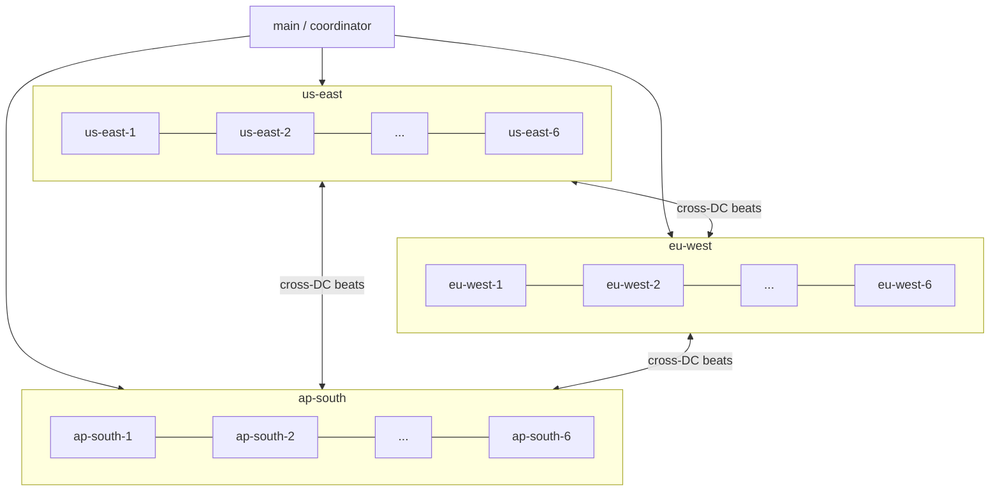
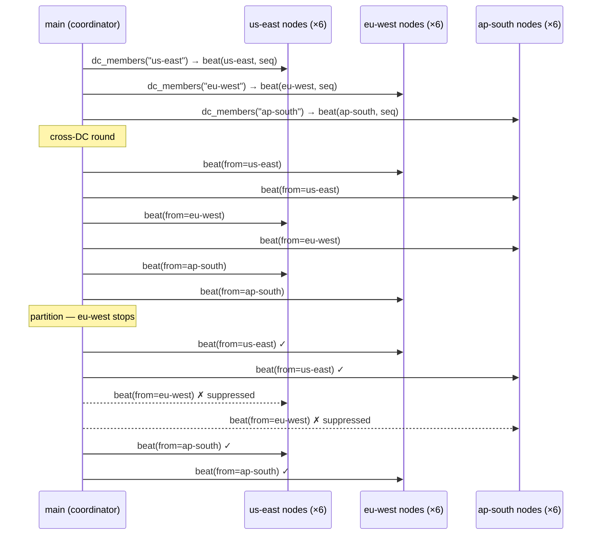

# multi_dc_heartbeat

[`multi_dc_heartbeat.rs`](./multi_dc_heartbeat.rs) is a **3-datacenter × 6-node heartbeat demo** that covers every DC-aware API on [`Cluster`](../src/distributed.rs).

```bash
cargo run --example multi_dc_heartbeat
```

---

## Topology

| Datacenter | Nodes | Tag |
|-----------|-------|-----|
| `us-east` | `us-east-1` … `us-east-6` | `.with_dc("us-east")` |
| `eu-west` | `eu-west-1` … `eu-west-6` | `.with_dc("eu-west")` |
| `ap-south` | `ap-south-1` … `ap-south-6` | `.with_dc("ap-south")` |

18 `serve_actor` nodes form a single `Cluster<HbMsg>`. Each node's `HeartbeatActor` records received beats in a shared `Arc<Mutex<NodeStats>>` keyed by *source datacenter*, allowing main to read a live summary after every round.

---

## Architecture



---

## Heartbeat rounds

### Round 1 — intra-DC broadcast

Each DC sends one heartbeat to all 6 of its own members via `cluster.dc_members(dc)`.

```
us-east  → us-east   (6 nodes)
eu-west  → eu-west   (6 nodes)
ap-south → ap-south  (6 nodes)
```

After round 1, the stats matrix is diagonal — every node has only seen beats from its own DC:

```
ap-south  ←  ap-south×6
eu-west   ←  eu-west×6
us-east   ←  us-east×6
```

### Round 2 — cross-DC probes (all 6 directed pairs)

Every DC probes all members of every *other* DC:

```
us-east  → eu-west     us-east  → ap-south
eu-west  → us-east     eu-west  → ap-south
ap-south → us-east     ap-south → eu-west
```

After round 2, every DC shows beats from all three DCs:

```
ap-south  ←  ap-south×6   eu-west×6   us-east×6
eu-west   ←  ap-south×6   eu-west×6   us-east×6
us-east   ←  ap-south×6   eu-west×6   us-east×6
```

### Round 3 — eu-west partition simulation

`eu-west` stops sending (all its outbound beats are suppressed). The other two DCs continue their cross-DC probes normally.

After round 3, `us-east` and `ap-south` show `eu-west×6` — unchanged from round 2:

```
ap-south  ←  ap-south×12   eu-west×6   us-east×12
us-east   ←  ap-south×12   eu-west×6   us-east×12
```

`eu-west×6` is frozen while all other counts have grown, making the partition visible.

---

## Partition detection

```rust
// Snapshot eu-west beat counts before round 3
let mut snap_eu: HashMap<String, u64> = HashMap::new();
for node in all_nodes.iter().filter(|n| n.dc != "eu-west") {
    let count = node.stats.lock().await
        .beats_from_dc.get("eu-west").copied().unwrap_or(0);
    snap_eu.insert(node.name.clone(), count);
}

// ... run round 3 ...

// Compare: nodes with no new eu-west beats detected the partition
for node in all_nodes.iter().filter(|n| n.dc != "eu-west") {
    let after = node.stats.lock().await
        .beats_from_dc.get("eu-west").copied().unwrap_or(0);
    if after == snap_eu[&node.name] {
        println!("⚠  {} — eu-west silent", node.name);
    }
}
```

All 12 non-eu-west nodes (6 in us-east, 6 in ap-south) print the warning — both DCs independently detect the partition.

---

## DC-aware Cluster APIs exercised

### `ClusterMember::with_dc`

Tag each member at join time so the cluster can group and route by DC:

```rust
fn member(&self) -> ClusterMember {
    ClusterMember::new(&self.name, self.handle.address(), "heartbeat")
        .with_dc(self.dc.clone())  // ← DC tag
}
cluster.join(node.member());
```

### `Cluster::dc_members`

Get all `RemoteActorRef`s for a specific datacenter:

```rust
// Broadcast within one DC
for r in cluster.dc_members("us-east") {
    r.send(HbMsg::beat("us-east", "us-east", seq)).await?;
}
```

### `Cluster::datacenters`

Enumerate distinct DC names in the roster (untagged members count as `local_dc`):

```rust
let dcs = cluster.datacenters("local");
// → ["ap-south", "eu-west", "us-east"]
```

### `Cluster::dc_replicas_for_key`

Consistent-hash replicas *within* a single DC — useful for routing a request to the right nodes in the nearest DC without crossing datacenters:

```rust
// 3 replicas for key "session-abc123" that live in us-east
let replicas = cluster.dc_replicas_for_key(&"session-abc123", "us-east", "local", 3);
// → [us-east-3, us-east-4, us-east-1]  (stable across runs for same key)
```

The `local_dc` parameter (`"local"`) controls how untagged members are classified — members without a `dc` tag are treated as belonging to `local_dc`.

### `Cluster::send_all`

Global fan-out with per-node result collection:

```rust
let results = cluster.send_all(HbMsg::beat("coordinator", "control-plane", seq)).await;
let (ok, err): (Vec<_>, Vec<_>) = results.iter().partition(|(_, r)| r.is_ok());
println!("{} ok, {} err", ok.len(), err.len());
```

---

## Sequence diagram — one cross-DC round



---

## Wire message

| Field | Type | Purpose |
|-------|------|---------|
| `from_node` | `string` | Logical node name (`"eu-west-3"`) |
| `from_dc` | `string` | Datacenter label (`"eu-west"`) |
| `seq` | `uint64` | Monotonic sequence number |

The `Heartbeat` struct is wrapped in `HbMsg` with a `oneof Kind` so the wire type can be extended (e.g. add `StatusQuery`, `AckReply`) without breaking existing nodes.

---

## Production notes

| Topic | This example | Production recommendation |
|-------|-------------|--------------------------|
| Supervision | `serve_actor` — no supervisor | Wrap `HeartbeatActor` in a `OneForOne` supervisor; bind a new port on restart |
| Heartbeat interval | Manual rounds in `main` | Periodic `tokio::time::interval` inside the actor or a dedicated timer actor |
| Failure detection | Count comparison between rounds | Sliding window with configurable miss threshold; fire `ExitReason` on breach |
| Node gossip | Central coordinator | Each node keeps its own `Cluster` roster and gossips membership changes |
| TLS | Plain TCP | Add `DistributedConfig { tls: Some(…) }` to `serve_actor_on_current_runtime` |

---

## Expected output (abbreviated)

```
=== multi_dc_heartbeat — 3 DCs × 6 nodes ===

18 nodes online

Cluster roster: 18 nodes  |  DCs: [ap-south, eu-west, us-east]
  dc_members(ap-south  ) → 6 nodes
  dc_members(eu-west   ) → 6 nodes
  dc_members(us-east   ) → 6 nodes

─── Round 1: intra-DC broadcast ───────────────────────────────
Stats after round 1  (own_dc×6 per DC):
  ap-south     ←  ap-south×6
  eu-west      ←  eu-west×6
  us-east      ←  us-east×6

─── Round 2: cross-DC probes (all 6 directed pairs) ───────────
Stats after round 2  (each DC hears from all 3 DCs):
  ap-south     ←  ap-south×6   eu-west×6   us-east×6
  eu-west      ←  ap-south×6   eu-west×6   us-east×6
  us-east      ←  ap-south×6   eu-west×6   us-east×6

─── Round 3: eu-west partition (eu-west stops sending) ────────
Stats after round 3  (eu-west count frozen on us-east and ap-south):
  ap-south     ←  ap-south×12   eu-west×6   us-east×12
  eu-west      ←  ap-south×12   eu-west×6   us-east×12
  us-east      ←  ap-south×12   eu-west×6   us-east×12

─── Partition detection ────────────────────────────────────────
  ⚠  us-east-1   (us-east)  eu-west silent  [had 1, still 1]
  ...  (12 nodes total)
  → 12 nodes detected the eu-west partition

─── DC-aware routing (dc_replicas_for_key) ─────────────────────
  key="session-abc123"  dc=us-east    n=3  →  [us-east-3, us-east-4, us-east-1]
  key="session-abc123"  dc=eu-west    n=3  →  [eu-west-3, eu-west-5, eu-west-6]
  key="session-abc123"  dc=ap-south   n=3  →  [ap-south-4, ap-south-1, ap-south-6]

─── Global broadcast (send_all) ────────────────────────────────
  broadcast to 18 nodes → 18 ok, 0 err
```

---

## Related

| Example | Focus |
|---------|-------|
| **multi_dc_heartbeat** | DC topology, partition detection, `dc_members` / `dc_replicas_for_key` |
| [`horizontal_scaling`](./horizontal_scaling.md) | Single-DC scale-out, `send_by_key` hash ring |
| [`horizontal_scaling_rest_for_one`](./horizontal_scaling_rest_for_one.md) | Multi-actor supervised sites, `broadcast` / `send_all` / `send_to` |
| [`grpc_cluster`](./grpc_cluster.rs) | gRPC cluster basics, round-robin routing |
| [`consistency`](./consistency.md) | QUORUM / LOCAL_QUORUM across DCs (`--features tls`) |
