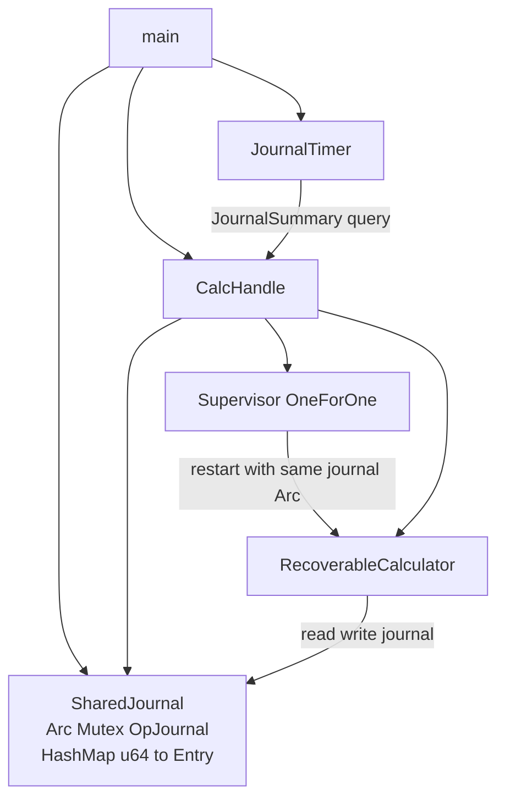
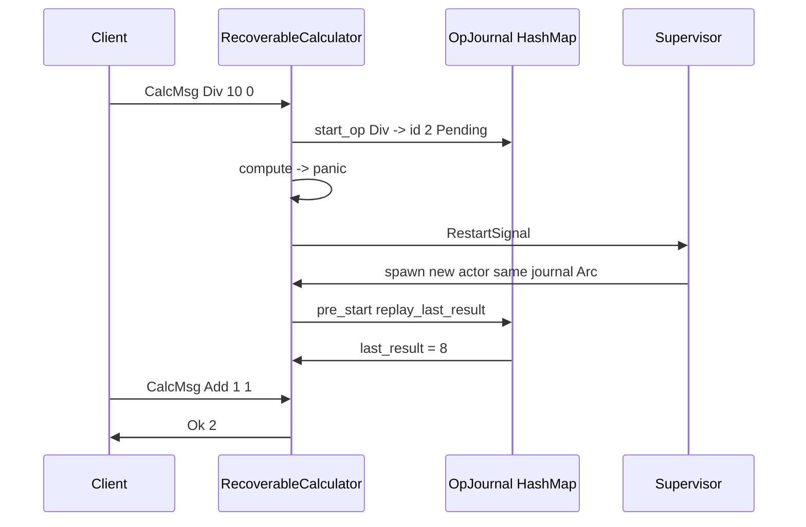
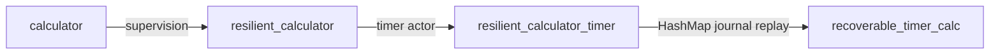

# Recoverable timer calculator — journal-backed state recovery

A **supervised calculator** plus a **timer actor** that periodically prints `last_result` and journal statistics. Unlike [`resilient_calculator_timer.rs`](./resilient_calculator_timer.rs), this example **persists every operation in a shared `HashMap` journal** that outlives actor panics. After a restart, the new calculator **replays** completed ops in `pre_start` and restores `last_result`.

```bash
cargo run --example recoverable_timer_calc
```

Source: [`recoverable_timer_calc.rs`](./recoverable_timer_calc.rs)

---

## Problem

| Example | After panic | `last_result` |
|---------|-------------|---------------|
| [`calculator.rs`](./calculator.rs) | Actor dead | Lost |
| [`resilient_calculator.rs`](./resilient_calculator.rs) | Supervisor restarts actor | Lost (fresh actor) |
| [`resilient_calculator_timer.rs`](./resilient_calculator_timer.rs) | Same as resilient | Timer shows `(none)` until next op |
| **`recoverable_timer_calc.rs`** | Supervisor restarts + **journal replay** | **Restored** from `HashMap` |

When divide-by-zero panics, the failing operation is recorded as **pending** in the journal. Successful operations remain **ok**. The replacement actor reads the journal on startup and rebuilds in-memory state.

---

## Architecture



| Component | Role |
|-----------|------|
| `OpJournal` | `HashMap<u64, JournalEntry>` + monotonic `next_id` |
| `SharedJournal` | `Arc<Mutex<OpJournal>>` — shared across restarts |
| `RecoverableCalculator` | Runs ops, writes journal, replays on `pre_start` |
| `Supervisor` | Restarts calculator after panic |
| `CalcHandle` | `ChildSlot` for stable `ActorRef` + direct journal reads |
| `JournalTimer` | Prints `last_result` and journal counts every 800ms |

---

## Why `Arc<Mutex<OpJournal>>`?

```rust
type SharedJournal = Arc<Mutex<OpJournal>>;
```

### `Arc` — shared ownership

The journal must survive **actor death** and be the **same object** passed into every restarted calculator:

- Created once in `main` before the supervisor starts
- Cloned into `CalcHandle`, each `RecoverableCalculator`, and the `ChildSlot::child_spec` factory
- Without `Arc`, each restart would get an empty copy and recovery would fail

### `Mutex` — safe concurrent mutation

Multiple async tasks access the journal:

| Accessor | Access |
|----------|--------|
| `RecoverableCalculator::run_op` | Insert pending, mark ok |
| `RecoverableCalculator::pre_start` | Replay completed ops |
| `CalcHandle::pending_ops` | Read pending entries |
| `JournalSummary` handler | Count ok / pending |

`HashMap` cannot be mutated from several tasks without synchronization. `tokio::sync::Mutex` is used (not `std::sync::Mutex`) because locks are held across `.await` in async actor code.

---

## Journal data model

### `OpKind` — what was requested

```rust
enum OpKind {
    Add(f64, f64),
    Sub(f64, f64),
    Mul(f64, f64),
    Div(f64, f64),
}
```

### `OpStatus` — outcome

```rust
enum OpStatus {
    Pending,   // started but never completed (panic interrupted)
    Ok(f64),   // completed successfully
}
```

### `JournalEntry` — one row in the log

```rust
struct JournalEntry {
    kind: OpKind,
    status: OpStatus,
}
```

### `OpJournal` — the `HashMap`

```rust
struct OpJournal {
    ops: HashMap<u64, JournalEntry>,
    next_id: u64,
}
```

| Method | Purpose |
|--------|---------|
| `start_op(kind)` | Allocate id, insert as `Pending`, return id |
| `complete_op(id, result)` | Set status to `Ok(result)` |
| `replay_last_result()` | Walk ids in order, return last `Ok` value |
| `counts()` | Return `(ok_count, pending_count)` |

### Journal state through a panic

After `add 10+4`, `add 5+3`, then `div 10/0`:

| id | kind | status |
|----|------|--------|
| 0 | Add(10, 4) | Ok(14) |
| 1 | Add(5, 3) | Ok(8) |
| 2 | Div(10, 0) | **Pending** |

Op #2 is inserted **before** `compute` runs. The panic happens inside `compute`, so `complete_op` never runs.

---

## Operation lifecycle



### `run_op` — journal-first execution

```rust
async fn run_op(&mut self, kind: OpKind, reply: oneshot::Sender<Result<f64, String>>) {
    let op_id = self.journal.lock().await.start_op(kind.clone());  // 1. log first
    let result = Self::compute(&kind);                              // 2. compute (may panic)
    match result {
        Ok(value) => {
            self.journal.lock().await.complete_op(op_id, value);   // 3. mark ok
            self.last_result = Some(value);
            let _ = reply.send(Ok(value));
        }
        Err(e) => { let _ = reply.send(Err(e)); }
    }
}
```

**Journal-before-compute** is intentional: if `compute` panics, the op is already in the map as `Pending`.

### `pre_start` — replay on every spawn/restart

```rust
async fn pre_start(&mut self) -> Result<(), ActorProcessingErr> {
    self.replay_journal().await;
    Ok(())
}
```

`replay_last_result()` sorts keys, walks all `Ok` entries, and sets `last_result` to the final successful value. The new actor starts with the same logical state as before the panic (minus the interrupted op).

---

## Calculator messages

```rust
enum CalcMsg {
    Add(f64, f64, oneshot::Sender<Result<f64, String>>),
    Sub(f64, f64, oneshot::Sender<Result<f64, String>>),
    Mul(f64, f64, oneshot::Sender<Result<f64, String>>),
    Div(f64, f64, oneshot::Sender<Result<f64, String>>),
    LastResult(oneshot::Sender<Option<f64>>),
    JournalSummary(oneshot::Sender<(Option<f64>, usize, usize)>),
}
```

| Message | Purpose |
|---------|---------|
| `Add` / `Sub` / `Mul` / `Div` | Request-reply arithmetic |
| `LastResult` | Query in-memory `last_result` |
| `JournalSummary` | Returns `(last_result, ok_count, pending_count)` for the timer |

Division by zero **panics** (same as other resilient calculator examples). The runtime catches it via `catch_unwind` in [`src/actor.rs`](../src/actor.rs) and notifies the supervisor.

---

## `CalcHandle` — stable ref + journal access

Two shared slots, two purposes:

```rust
struct CalcHandle {
    slot: Arc<ChildSlot<CalcMsg>>,   // live actor (changes on restart)
    journal: SharedJournal,            // survives restart
    _supervisor: SupervisorHandle<CalcMsg>,
}
```

| Field | Why |
|-------|-----|
| `slot` | `ChildSlot` is updated by `ChildSlot::child_spec` on every restart |
| `journal` | Same `Arc` for all calculator instances; state persists |

Started with:

```rust
let slot = Arc::new(ChildSlot::new());
let spec = ChildSlot::child_spec(0, slot.clone(), move || {
    RecoverableCalculator::new(journal.clone())
});
```

`pending_ops()` reads the journal directly (no message to the calculator) and returns all `(id, OpKind)` pairs still `Pending`.

---

## `JournalTimer` — periodic status actor

A separate unsupervised actor ticks every **800ms**:

```rust
enum TimerMsg {
    Start(ActorRef<TimerMsg>),  // bootstrap self-scheduling
    Tick,                       // query and reschedule
}
```

On each `Tick`:

1. Send `CalcMsg::JournalSummary` to the supervised calculator
2. Print `[timer] last_result = X, journal: N ok, M pending`
3. Schedule the next tick via `tokio::spawn` + `sleep`

The timer is **not** supervised — it keeps running through calculator panics because it talks to `CalcHandle`, not a stale `ActorRef`.

---

## Demo script (`main`)

| Step | Action | Expected |
|------|--------|----------|
| 1 | Start journal, supervisor, timer | Timer begins ticking |
| 2 | `add 10+4` | Journal: 1 ok, last_result=14 |
| 3 | `add 5+3` | Journal: 2 ok, last_result=8 |
| 4 | `div 10/0` | Panic, op #2 pending, no reply |
| 5 | `pending_ops()` | Prints pending div op |
| 6 | Wait for restart | Timer shows last_result=8 (replayed) |
| 7 | `add 1+1` | Journal: 3 ok, 1 pending, last_result=2 |
| 8 | Stop timer and calculator | Clean shutdown |

---

## Expected output

```
Recoverable calculator + journal timer started (every 800ms)

[calc] add: 10 and 4 = 14
[timer] last_result = 14, journal: 1 ok, 0 pending
[calc] add: 5 and 3 = 8
[timer] last_result = 8, journal: 2 ok, 0 pending

--- panic: divide by zero (stored as pending in journal) ---
[calc] div: 10 and 0 -> calculator crashed before reply (supervisor will restart and replay journal)
[recover] pending op #2: div 10 and 0 (never completed — panic interrupted it)
[timer] last_result = 8, journal: 2 ok, 1 pending

--- after supervisor restart: last_result restored from journal ---
[calc] add: 1 and 1 = 2
[timer] last_result = 2, journal: 3 ok, 1 pending

Timer and calculator stopped.
```

Note the contrast with `resilient_calculator_timer`: after panic, the timer here shows **`8`**, not `(none)`.

---

## Comparison with related examples



| Feature | calculator | resilient_calculator | resilient_calculator_timer | recoverable_timer_calc |
|---------|------------|----------------------|----------------------------|------------------------|
| Supervision | No | Yes | Yes | Yes |
| Survives panic | No | Yes (empty restart) | Yes (empty restart) | Yes |
| Timer | No | No | Yes | Yes |
| Persistent op log | No | No | No | **HashMap journal** |
| Replay on restart | No | No | No | **`pre_start` replay** |
| Pending panic ops visible | No | No | No | **Yes** |

---

## Design trade-offs

### What this example does

- Logs every op before execution
- Persists completed results outside the actor process
- Replays completed ops into `last_result` on restart
- Surfaces interrupted ops as `Pending` for inspection

### What it does not do

- **Retry pending ops** — the div-by-zero entry stays pending forever
- **Durable storage** — journal is in-memory; process exit loses it
- **Transactional compute** — panic after `complete_op` but before reply is still an edge case
- **Distributed journal** — single-process `Arc` only

### Possible extensions

| Idea | Approach |
|------|----------|
| Retry pending ops | On `pre_start`, re-run `Pending` entries (skip or fix invalid ones) |
| Disk-backed journal | Serialize `OpJournal` to file or SQLite |
| Mark failed ops | Catch panic metadata, set `OpStatus::Failed(reason)` |
| Supervise timer too | Wrap `JournalTimer` in its own supervisor, or use `ChildRegistry` + `spawn_child_spec` under RestForOne — see [rest_for_one_calculator_timer.md](./rest_for_one_calculator_timer.md) |
| Remove pending on replay | GC ops that can never succeed |

---

## Key code locations

| Symbol | File section | Purpose |
|--------|--------------|---------|
| `OpJournal` | journal types | HashMap operation log |
| `SharedJournal` | type alias | `Arc<Mutex<OpJournal>>` |
| `RecoverableCalculator` | calculator actor | compute + replay |
| `CalcHandle::start` | handle + supervisor | `ChildSlot::child_spec` wires journal into factory |
| `JournalTimer` | timer actor | periodic summary |
| `print_pending` | main helper | shows panic-interrupted ops |

---

## Related docs

- [calculator.md](./calculator.md) — basic request-reply calculator
- [resilient_calculator.md](./resilient_calculator.md) — `ChildSlot` supervision without journal
- [resilient_calculator_timer.rs](./resilient_calculator_timer.rs) — timer without journal replay
- [rest_for_one_calculator_timer.md](./rest_for_one_calculator_timer.md) — supervised calculator + timer under RestForOne
- [README — One supervisor, many children](../README.md#one-supervisor-many-children)
- [envelope_demo.md](./envelope_demo.md) — mailbox control messages
