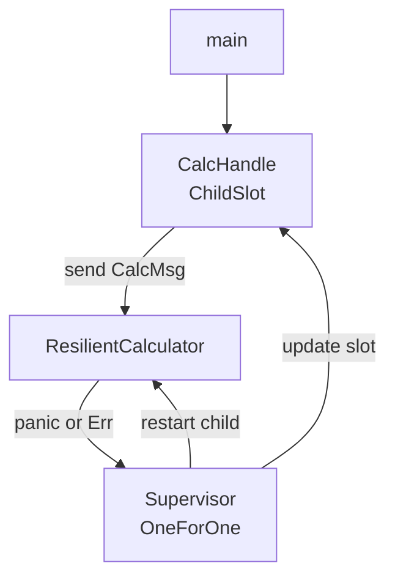
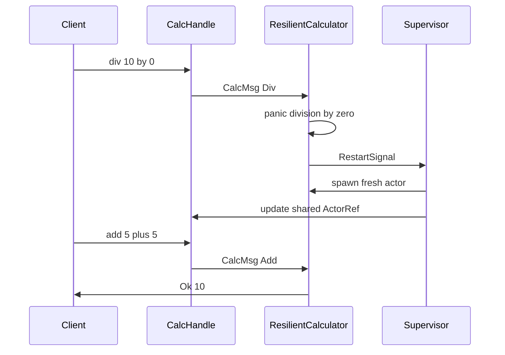

# Resilient calculator — supervised panic recovery

A **supervised calculator** that keeps working after panics. An OTP-style supervisor (`OneForOne` strategy) restarts the calculator when `handle` panics or returns an error, and a stable `CalcHandle` always routes requests to the live actor.

```bash
cargo run --example resilient_calculator
```

Source: [`resilient_calculator.rs`](./resilient_calculator.rs)

Compare with the unsupervised [`calculator.rs`](./calculator.rs) example.

---

## Problem

In the basic calculator, a panic in `handle` (e.g. divide by zero) kills the actor task. The caller's `ActorRef` is permanently dead.

The resilient version wraps the calculator in a **supervisor** that:

1. Catches panics in `handle` (via `catch_unwind` in `run_actor`).
2. Receives a `RestartSignal` from the failed child.
3. Spawns a fresh calculator and updates the shared handle.

---

## Architecture



| Component | Role |
|-----------|------|
| `ResilientCalculator` | Same add/sub/mul/div as calculator; panics on divide-by-zero |
| `Supervisor` | Restarts failed child up to intensity limit |
| `CalcHandle` | Wraps `ChildSlot<CalcMsg>` — always points at the live `ActorRef` |
| `ChildSlot::child_spec` | Spawns calculator with supervisor channel, updates slot on every restart |

---

## Operations

Same four arithmetic operations as the basic calculator, plus a test hook:

| Operation | Behavior |
|-----------|----------|
| **Add** | `a + b` |
| **Sub** | `a - b` |
| **Mul** | `a * b` |
| **Div** | `a / b`, **panics** if `b == 0.0` |
| **Panic** | Sends ack then panics (simulated bug) |

---

## Panic recovery flow



1. Panic is caught in `run_actor` and converted to `ExitReason::Error("panic in handle")`.
2. Supervisor receives `RestartSignal` and re-runs the child factory.
3. `ChildSlot::child_spec` spawns a new `ResilientCalculator` and stores its `ActorRef` in the slot.
4. Next request via `CalcHandle::actor()` uses the new ref.

---

## Stable handle pattern

Supervised actors get a **new `ActorId`** on each restart, so a plain `ActorRef` goes stale. The library provides `ChildSlot` for the single-child case:

```rust
let slot = Arc::new(ChildSlot::new());
let spec = ChildSlot::child_spec(0, slot.clone(), || ResilientCalculator::default());

let sup_handle = Supervisor::new(config, vec![spec]).start().await?;
slot.require().await?; // live ref after initial spawn
```

`CalcHandle::actor()` reads from `slot.get().await` before every request.

For **multiple named children**, use `ChildRegistry` + `spawn_child_spec` — see [rest_for_one_calculator_timer.md](./rest_for_one_calculator_timer.md).

---

## Expected output

```
Supervised resilient calculator started

add: 10 and 4 = 14
sub: 10 and 4 = 6
mul: 10 and 4 = 40
div: 10 and 4 = 2.5

--- panic: divide by zero ---
div: 10 and 0 -> calculator crashed before reply (supervisor will restart it)
add: 5 and 5 = 10

--- panic: simulated bug ---
mul: 3 and 7 = 21

Calculator stopped cleanly.
```

After each panic, the next operation succeeds — the calculator was restarted transparently.

---

## Runtime change

Panic recovery requires a small change in [`src/actor.rs`](../src/actor.rs):

```rust
AssertUnwindSafe(actor.dyn_handle(m)).catch_unwind().await
```

Panics in `handle` now trigger the same exit path as `Err` returns: supervisor notification, linked-exit propagation, and actor teardown.

---

## Related docs

- [calculator.md](./calculator.md) — unsupervised calculator
- [supervisor_strategies.md](./supervisor_strategies.md) — all restart strategies + `ChildRegistry`
- [resilient_calculator_timer.rs](./resilient_calculator_timer.rs) — timer without journal (uses `ChildSlot`)
- [recoverable_timer_calc.md](./recoverable_timer_calc.md) — journal-backed recovery + timer
- [rest_for_one_calculator_timer.md](./rest_for_one_calculator_timer.md) — multi-child RestForOne with `ChildRegistry`
- [envelope_demo.md](./envelope_demo.md) — actor mailbox variants
