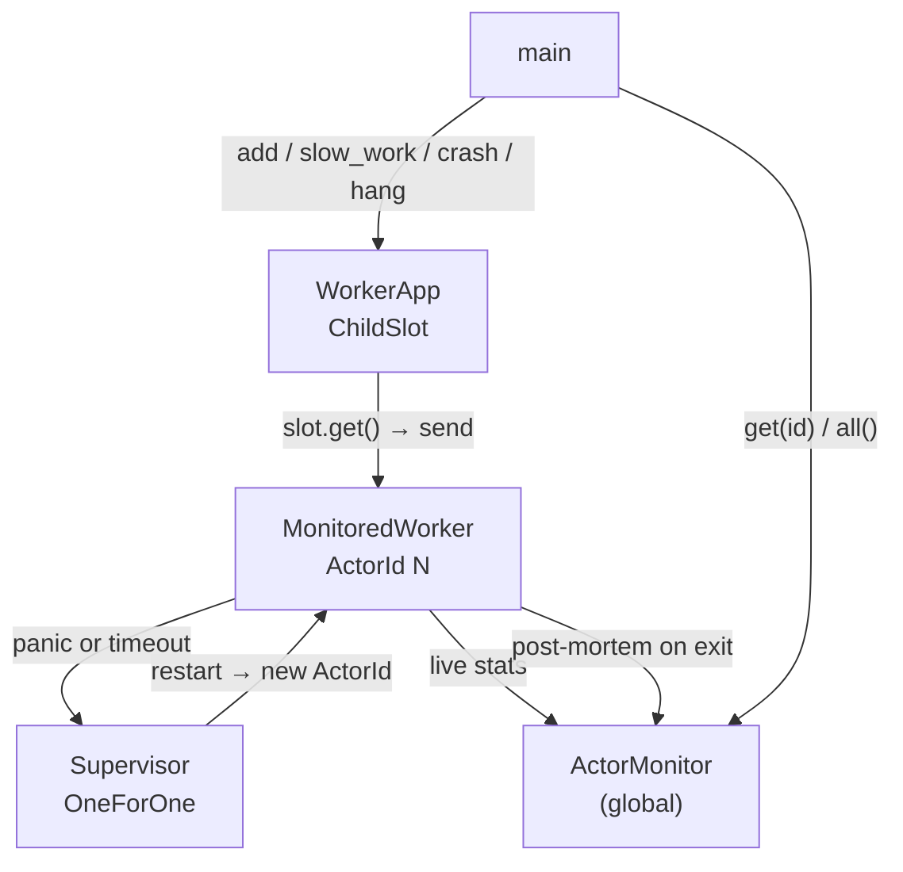

# resilient_monitor — ActorMonitor in action

[`resilient_monitor.rs`](./resilient_monitor.rs) walks through every counter in [`ActorMonitor`](../lane_core/src/monitor.rs) across five phases: normal work, slow handles, panics, handle timeouts, and a global snapshot.

```bash
cargo run --example resilient_monitor
```

---

## What `ActorMonitor` tracks

| `ActorStats` field | When it increments |
|--------------------|--------------------|
| `messages_handled` | `handle()` completed successfully |
| `handle_errors` | `handle()` returned `Err(…)` |
| `panics` | `handle()` panicked (caught by `catch_unwind`) |
| `handle_timeouts` | `handle_timeout` fired before `handle()` finished |
| `slow_handles` | `handle()` finished but exceeded `slow_handle_threshold` |
| `in_flight` | Handles started but not yet finished (0 for stopped actors) |
| `last_handle_ms` | Duration of the most recent handle call |
| `max_handle_ms` | Longest handle call ever recorded |
| `total_handle_ms` | Sum of all successful handle durations; `/ messages_handled` = mean |

Stats for a stopped actor are preserved as a **post-mortem snapshot** — readable via `ActorMonitor::global().get(id)` until `purge(id)` is called.

---

## Architecture



| Component | Role |
|-----------|------|
| `MonitoredWorker` | Four message variants; tracks pending op in `on_handle_begin` for `on_handle_stuck` reporting |
| `WorkerApp` | Wraps `ChildSlot<WorkerMsg>`; always returns the live `ActorRef` |
| `Supervisor` (OneForOne) | Restarts the worker after panics and handle timeouts |
| `ActorMonitor::global()` | Accumulates counters per actor; retains final snapshot post-exit |

---

## Configuration

```rust
ActorConfig {
    handle_timeout:       Some(Duration::from_millis(80)),  // actor exits if handle() hangs
    slow_handle_threshold: Some(Duration::from_millis(15)), // warns + counts slow-but-successful handles
    ..Default::default()
}
```

---

## Demo phases

### Phase 1 — normal work

Five `add` operations complete in microseconds.

```rust
for i in 1..=5u32 {
    let result = add(&app, i as f64, 1.0).await;  // sub-millisecond
}
let stats = ActorMonitor::global().get(id).expect("stats present");
// stats.messages_handled == 5, all other counters == 0
```

### Phase 2 — slow handle

`SlowWork` sleeps 25ms — above `slow_handle_threshold` (15ms) but below `handle_timeout` (80ms).
The handle completes; `slow_handles` increments, `messages_handled` increments, `handle_timeouts` stays 0.

```rust
slow_work(&app, 25).await;
// stats.slow_handles     == 1
// stats.messages_handled == 6   (5 adds + 1 slow work)
// stats.last_handle_ms   ≈ 27
// stats.mean_handle_ms   ≈ 4    (27ms / 6 messages)
```

### Phase 3 — panic → post-mortem

`CrashNow` panics in `handle()`. `catch_unwind` catches it; `panics++`. The supervisor restarts the actor, which gets a **new `ActorId`**. The old actor's final stats move to the post-mortem store.

```rust
let pre_crash_id = app.actor_id();
app.actor_ref().send(WorkerMsg::CrashNow).await.expect("send");
tokio::time::sleep(Duration::from_millis(150)).await;  // let supervisor restart

// Old actor is gone from the live registry; post-mortem snapshot is still readable:
let post_mortem = ActorMonitor::global().get(pre_crash_id).expect("post-mortem present");
// post_mortem.panics           == 1
// post_mortem.messages_handled == 6   (preserved from before crash)
// post_mortem.in_flight        == 0   (forced to 0 in post-mortem)
```

### Phase 4 — handle timeout → post-mortem

`HangForever` sleeps for 600s. After 80ms, `handle_timeout` fires:

1. `on_handle_stuck` is called (logs the pending op).
2. `handle_timeouts++`, actor exits with `ExitReason::HandleTimeout`.
3. Post-mortem snapshot stored; supervisor restarts the actor.

```rust
let pre_timeout_id = app.actor_id();
app.actor_ref().send(WorkerMsg::HangForever).await.expect("send");
tokio::time::sleep(Duration::from_millis(300)).await;  // timeout=80ms + restart

let post_mortem = ActorMonitor::global().get(pre_timeout_id).expect("post-mortem present");
// post_mortem.handle_timeouts == 1
// post_mortem.in_flight       == 0
```

### Phase 5 — global snapshot

`ActorMonitor::global().all()` returns a snapshot of every **currently live** actor sorted by id.

```rust
let all = ActorMonitor::global().all();
// 1 live actor (latest generation after timeout restart)
```

---

## Expected output

```
[worker] generation 1 starting

=== Phase 1: normal work (5 × add) ===

  add(1, 1) = 2
  add(2, 1) = 3
  add(3, 1) = 4
  add(4, 1) = 5
  add(5, 1) = 6
  [actor#2  live]
    messages_handled : 5
    panics           : 0
    handle_timeouts  : 0
    slow_handles     : 0
    handle_errors    : 0
    last_handle_ms   : 0
    max_handle_ms    : 0
    mean_handle_ms   : 0
    in_flight        : 0

=== Phase 2: slow handle (delay 25ms > threshold 15ms) ===

  slow_work reply: done after 25ms
  [actor#2  live — after slow work]
    messages_handled : 6
    panics           : 0
    handle_timeouts  : 0
    slow_handles     : 1
    handle_errors    : 0
    last_handle_ms   : 27
    max_handle_ms    : 27
    mean_handle_ms   : 4
    in_flight        : 0

=== Phase 3: panic → supervisor restart ===

[worker] post_stop
[worker] generation 2 starting
  [actor#2  post-mortem (crashed)]
    messages_handled : 6
    panics           : 1
    handle_timeouts  : 0
    slow_handles     : 1
    handle_errors    : 0
    last_handle_ms   : 27
    max_handle_ms    : 27
    mean_handle_ms   : 4
    in_flight        : 0

  new actor after restart: actor#3
  add(100, 1) = 101
  [actor#3  live — fresh generation]
    messages_handled : 1
    panics           : 0
    …

=== Phase 4: handle timeout (hang forever, limit 80ms) ===

[worker] stuck on Some("HangForever") — elapsed 81ms (limit 80ms)
[worker] post_stop
[worker] generation 3 starting
  [actor#3  post-mortem (timed out)]
    messages_handled : 1
    handle_timeouts  : 1
    last_handle_ms   : 81
    in_flight        : 0

  new actor after timeout restart: actor#4
  add(7, 3) = 10

=== Phase 5: ActorMonitor::global().all() ===

  1 live actor(s):
    actor#4  handled=1 panics=0 timeouts=0 slow=0 mean_ms=0

  total actor generations (includes initial): 3

Done.
```

Actor IDs are monotonically assigned at spawn time, so the exact numbers will vary across runs. What matters: each restart produces a **new id**, the old id's post-mortem is readable, and `in_flight` is always 0 in post-mortem snapshots.

---

## Key patterns

### Live stats during operation

```rust
let stats = ActorMonitor::global().get(actor.id)?;
let mean_ms = stats.total_handle_ms.checked_div(stats.messages_handled).unwrap_or(0);
```

### Reading post-mortem after exit

```rust
// After crash + supervisor restart:
let final_snapshot = ActorMonitor::global().get(old_id)?; // still readable
ActorMonitor::global().purge(old_id);                      // evict when done
```

### One-shot consume on exit

```rust
// Structured logging: capture + remove in one step
if let Some(stats) = ActorMonitor::global().snapshot_and_unregister(id) {
    tracing::info!(
        messages = stats.messages_handled,
        panics   = stats.panics,
        timeouts = stats.handle_timeouts,
        "actor exited"
    );
}
```

### Dashboard / health-check endpoint

```rust
// Returns stats for every running actor; sort/filter as needed
let all: Vec<ActorStats> = ActorMonitor::global().all();
```

---

## Related

- [`resilient_calculator.md`](./resilient_calculator.md) — supervised panic recovery without monitor focus
- [`single_child_supervisor.md`](./single_child_supervisor.md) — `ChildSlot` + `handle_timeout` + stuck journal
- [`handle_timeout_calculator_timer_latency.rs`](./handle_timeout_calculator_timer_latency.rs) — latency benchmark with monitor stats
- [`lane_core/README.md`](../lane_core/README.md) — `ActorStats` field reference
