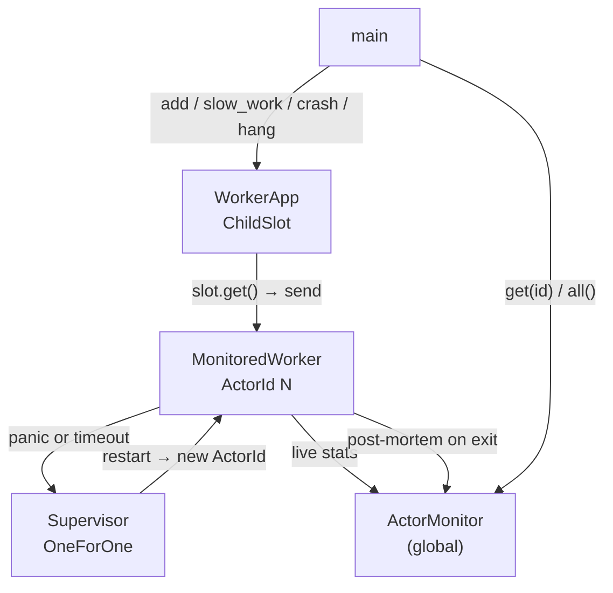

# resilient_monitor — ActorMonitor in action

[`resilient_monitor.rs`](./resilient_monitor.rs) walks through every counter in [`ActorMonitor`](../lane_core/src/monitor/mod.rs) across five phases: normal work, slow handles, panics, handle timeouts, and a global snapshot.

```bash
# In-process stats only (stdout)
cargo run --example resilient_monitor --features monitor

# Same demo + Prometheus export on :9090 (for Grafana)
cargo run --example resilient_monitor --features metrics
```

---

## Run with Docker (Prometheus + Grafana)

Use two terminals. Port **9090** on the host is the metrics exporter — run **one** example at a time.

### Terminal 1 — observability stack

```bash
docker compose -f docs/grafana/docker-compose.yml up
```

| Service | URL |
|---------|-----|
| Grafana | http://localhost:3000 (`admin` / `admin`) |
| Prometheus | http://localhost:9091 |

Grafana auto-loads the **Lane Actor Runtime** dashboard (see [`docs/grafana/docker-compose.yml`](../docs/grafana/docker-compose.yml)).

### Terminal 2 — monitor demo with metrics export

```bash
cargo run --example resilient_monitor --features metrics
```

The example:

1. Prints all five phases to stdout (panics, slow handles, timeouts).
2. Exposes `http://127.0.0.1:9090/metrics` for Prometheus to scrape.
3. Waits for Ctrl-C after `Done.` so Grafana can read the final counters.

While it runs, check Prometheus (http://localhost:9091):

```promql
rate(lane_actor_panics_total[5m])
rate(lane_actor_slow_handles_total[5m])
rate(lane_actor_handle_timeouts_total[5m])
```

Open Grafana → **Lane → Lane Actor Runtime** and set the time range to **Last 15 minutes**.

### Alternative — steady traffic demo

For continuous message rate instead of the phased tour, use [`metrics_exporter`](./metrics_exporter.md) in Terminal 2 instead (stop `resilient_monitor` first).

---

## Manual setup (no Docker)

### 1. Run the example

**Stdout only:**

```bash
cargo run --example resilient_monitor --features monitor
```

**With Prometheus export:**

```bash
cargo run --example resilient_monitor --features metrics
```

Leave the process running after `Done.` when using metrics (Ctrl-C to exit).

### 2. Point Prometheus at the exporter

Add to your `prometheus.yml`:

```yaml
scrape_configs:
  - job_name: lane_resilient_monitor
    static_configs:
      - targets: ["127.0.0.1:9090"]
```

Reload Prometheus. Confirm **Targets** shows the job **UP** and:

```bash
curl -s http://127.0.0.1:9090/metrics | grep lane_actor_panics
```

### 3. Grafana (existing install)

1. Add a Prometheus datasource pointing at your Prometheus server.
2. Import [`docs/grafana/actor-runtime.json`](../docs/grafana/actor-runtime.json).
3. Run the example with `--features metrics`, then query panels for panics, timeouts, and slow handles.

See [`metrics_exporter.md`](./metrics_exporter.md) for full manual Prometheus + Grafana install steps (Homebrew, ports, import flow).

---

## What `ActorMonitor` tracks

All counters and millisecond fields in [`ActorStats`](../lane_core/src/monitor/mod.rs) are [`usize`].
Hot-path updates use saturating arithmetic — when a counter would exceed [`usize::MAX`], it is
clamped and `tracing::warn!` records the field and actor id (counters never wrap).

| `ActorStats` field | Type | When it increments |
|--------------------|------|--------------------|
| `messages_handled` | `usize` | `handle()` completed successfully |
| `handle_errors` | `usize` | `handle()` returned `Err(…)` |
| `panics` | `usize` | `handle()` panicked (caught by `catch_unwind`) |
| `handle_timeouts` | `usize` | `handle_timeout` fired before `handle()` finished |
| `slow_handles` | `usize` | `handle()` finished but exceeded `slow_handle_threshold` |
| `in_flight` | `usize` | Handles started but not yet finished (0 for stopped actors) |
| `last_handle_ms` | `usize` | Duration of the most recent handle call |
| `max_handle_ms` | `usize` | Longest handle call ever recorded |
| `total_handle_ms` | `usize` | Sum of all successful handle durations |
| `mean_handle_ms` | `usize` | `total_handle_ms / messages_handled` — computed in `snapshot()`; `0` when no messages handled |

Stats for a stopped actor are preserved as a **post-mortem snapshot** — readable via `ActorMonitor::global().get(id)` until `purge(id)` is called.

For Grafana dashboards, use `--features metrics` or see the [Prometheus series mapping](../lane_core/README.md#prometheus-series-mapping) in `lane_core/README.md`.

| Demo phase | Prometheus series (with `metrics` feature) |
|------------|---------------------------------------------|
| Normal work | `lane_actor_messages_handled_total` |
| Slow handle | `lane_actor_slow_handles_total` |
| Panic | `lane_actor_panics_total`, `lane_actor_exits_total{reason="panic"}` |
| Handle timeout | `lane_actor_handle_timeouts_total`, `lane_actor_exits_total{reason="handle_timeout"}` |

---

## Architecture


```mermaid
flowchart TB
    Main["main"]
    App["WorkerApp\nChildSlot"]
    Sup["Supervisor\nOneForOne"]
    W["MonitoredWorker\nActorId N"]
    Mon["ActorMonitor\n(global)"]

    Main -->|"add / slow_work / crash / hang"| App
    App -->|"slot.get() → send"| W
    W -->|"panic or timeout"| Sup
    Sup -->|"restart → new ActorId"| W
    W -->|"live stats"| Mon
    W -->|"post-mortem on exit"| Mon
    Main -->|"get(id) / all()"| Mon
```

| Component | Role |
|-----------|------|
| `MonitoredWorker` | Four message variants; tracks pending op in `on_handle_begin` for `on_handle_stuck` reporting |
| `WorkerApp` | Wraps `ChildSlot<WorkerMsg>`; always returns the live `ActorRef` |
| `Supervisor` (OneForOne) | Restarts the worker after panics and handle timeouts |
| `ActorMonitor::global()` | Accumulates counters per actor; retains final snapshot post-exit |

---

## Configuration

```rust
ActorConfig {
    handle_timeout:       Some(Duration::from_millis(80)),  // actor exits if handle() hangs
    slow_handle_threshold: Some(Duration::from_millis(15)), // warns + counts slow-but-successful handles
    ..Default::default()
}
```

With `--features metrics`, `monitor_meta` is set automatically (`worker` / `MonitoredWorker` labels).

---

## Demo phases

### Phase 1 — normal work

Five `add` operations complete in microseconds.

```rust
for i in 1..=5u32 {
    let result = add(&app, i as f64, 1.0).await;  // sub-millisecond
}
let stats = ActorMonitor::global().get(id).expect("stats present");
// stats.messages_handled == 5, all other counters == 0
```

### Phase 2 — slow handle

`SlowWork` sleeps 25ms — above `slow_handle_threshold` (15ms) but below `handle_timeout` (80ms).
The handle completes; `slow_handles` increments, `messages_handled` increments, `handle_timeouts` stays 0.

```rust
slow_work(&app, 25).await;
// stats.slow_handles     == 1
// stats.messages_handled == 6   (5 adds + 1 slow work)
// stats.last_handle_ms   ≈ 27
// stats.mean_handle_ms   ≈ 4    (27ms / 6 messages)
```

### Phase 3 — panic → post-mortem

`CrashNow` panics in `handle()`. `catch_unwind` catches it; `panics++`. The supervisor restarts the actor, which gets a **new `ActorId`**. The old actor's final stats move to the post-mortem store.

```rust
let pre_crash_id = app.actor_id();
app.actor_ref().send(WorkerMsg::CrashNow).await.expect("send");
tokio::time::sleep(Duration::from_millis(150)).await;  // let supervisor restart

// Old actor is gone from the live registry; post-mortem snapshot is still readable:
let post_mortem = ActorMonitor::global().get(pre_crash_id).expect("post-mortem present");
// post_mortem.panics           == 1
// post_mortem.messages_handled == 6   (preserved from before crash)
// post_mortem.in_flight        == 0   (forced to 0 in post-mortem)
```

### Phase 4 — handle timeout → post-mortem

`HangForever` sleeps for 600s. After 80ms, `handle_timeout` fires:

1. `on_handle_stuck` is called (logs the pending op).
2. `handle_timeouts++`, actor exits with `ExitReason::HandleTimeout`.
3. Post-mortem snapshot stored; supervisor restarts the actor.

```rust
let pre_timeout_id = app.actor_id();
app.actor_ref().send(WorkerMsg::HangForever).await.expect("send");
tokio::time::sleep(Duration::from_millis(300)).await;  // timeout=80ms + restart

let post_mortem = ActorMonitor::global().get(pre_timeout_id).expect("post-mortem present");
// post_mortem.handle_timeouts == 1
// post_mortem.in_flight       == 0
```

### Phase 5 — global snapshot

`ActorMonitor::global().all()` returns a snapshot of every **currently live** actor sorted by id.

```rust
let all = ActorMonitor::global().all();
// 1 live actor (latest generation after timeout restart)
```

---

## Expected output

```
[worker] generation 1 starting

=== Phase 1: normal work (5 × add) ===

  [actor#2  live]
    messages_handled : 5
    ...

=== Phase 2: slow handle (delay 25ms > threshold 15ms) ===
  ...

Done.

Metrics exported — open Grafana (http://localhost:3000) and query panics/timeouts.
Press Ctrl-C to stop the metrics server.
```

Actor IDs are monotonically assigned at spawn time, so the exact numbers will vary across runs. What matters: each restart produces a **new id**, the old id's post-mortem is readable, and `in_flight` is always 0 in post-mortem snapshots.

---

## Key patterns

### Live stats during operation

```rust
let stats = ActorMonitor::global().get(actor.id)?;
println!("mean {}ms  max {}ms  total {}ms",
    stats.mean_handle_ms, stats.max_handle_ms, stats.total_handle_ms);
```

### Reading post-mortem after exit

```rust
// After crash + supervisor restart:
let final_snapshot = ActorMonitor::global().get(old_id)?; // still readable
ActorMonitor::global().purge(old_id);                      // evict when done
```

### One-shot consume on exit

```rust
// Structured logging: capture + remove in one step
if let Some(stats) = ActorMonitor::global().snapshot_and_unregister(id) {
    tracing::info!(
        messages = stats.messages_handled,
        panics   = stats.panics,
        timeouts = stats.handle_timeouts,
        "actor exited"
    );
}
```

### Dashboard / health-check endpoint

```rust
// Returns stats for every running actor; sort/filter as needed
let all: Vec<ActorStats> = ActorMonitor::global().all();
```

### Counter limits

Every numeric field in `ActorStats` is [`usize`]. Updates on the hot path use saturating
arithmetic — counters clamp at [`usize::MAX`] and emit `tracing::warn!` when an increment
would overflow. This prevents silent wrap-around on long-lived actors with very high message
rates or accumulated handle time.

---

## Related

- [`metrics_exporter.md`](./metrics_exporter.md) — steady `/metrics` traffic + Docker/manual Grafana setup
- [`lane_core/monitor.md`](../lane_core/monitor.md) — production integration guide
- [`resilient_calculator.md`](./resilient_calculator.md) — supervised panic recovery without monitor focus
- [`single_child_supervisor.md`](./single_child_supervisor.md) — `ChildSlot` + `handle_timeout` + stuck journal
- [`lane_core/README.md`](../lane_core/README.md) — `ActorStats` field reference
