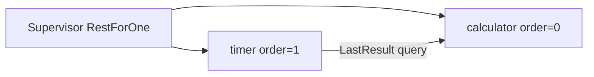

# RestForOne calculator + timer

A **minimal** example of `RestartStrategy::RestForOne`: a **calculator** (order `0`) and a **result timer** (order `1`) share one supervisor. When the calculator panics, the supervisor restarts **both** the calculator and the timer — because the timer depends on the calculator and has higher `order`.

```bash
cargo run --example rest_for_one_calculator_timer
```

Source: [`rest_for_one_calculator_timer.rs`](./rest_for_one_calculator_timer.rs)

For all strategies see [supervisor_strategies.md](./supervisor_strategies.md). For a single supervised calculator see [resilient_calculator_timer.rs](./resilient_calculator_timer.rs).

---

## Child chain



| Child | `order` | Role |
|-------|---------|------|
| `calculator` | 0 | `Add`, `Div`, stores `last_result` |
| `timer` | 1 | Every 600ms, queries and prints `last_result` |

---

## RestForOne rule

When **calculator** (order `0`) fails:

- Restart calculator (failed child)
- Restart timer (order `1` ≥ `0`)

When **timer** (order `1`) would fail alone: only timer restarts. This demo only fails the calculator.

Compare with `OneForOne` in [resilient_calculator_timer.rs](./resilient_calculator_timer.rs) — there only the calculator is supervised; the timer is outside the tree.

---

## Shared message type

One supervisor requires one `M`. Both actors implement `Actor<AppMsg>`:

```rust
enum AppMsg {
    Add(f64, f64, oneshot::Sender<Result<f64, String>>),
    Div(f64, f64, oneshot::Sender<Result<f64, String>>),
    LastResult(oneshot::Sender<Option<f64>>),
    TimerStart(ActorRef<AppMsg>),
    TimerTick,
}
```

Each actor handles only its variants; others are ignored.

---

## Generation counter

Both actors bump a shared generation map in `pre_start`:

```
[spawn] calculator generation 1
[spawn] timer generation 1
```

After divide-by-zero and RestForOne restart:

```
[after] generations (both should increase)
  calculator: generation 2
  timer: generation 2
```

That proves the timer was restarted even though it did not fail.

---

## Demo flow

1. Start supervisor with `RestForOne`.
2. Start timer ticks via `TimerStart`.
3. `add 10+4`, `add 5+3` — timer prints `last_result`.
4. `div 10/0` — calculator panics.
5. Supervisor restarts calculator **and** timer.
6. Main calls `start_timer()` again (new timer instance needs bootstrap).
7. `add 1+1` — timer prints `2`.

---

## Expected output (excerpt)

```
RestForOne supervisor: calculator order=0, timer order=1

[spawn] calculator generation 1
[spawn] timer generation 1
[calc] add 10 + 4 = 14
[timer] last_result = 14
[calc] add 5 + 3 = 8
[timer] last_result = 8

[before] generations
  calculator: generation 1
  timer: generation 1

--- calculator divide by zero (RestForOne restarts timer too) ---
[calc] div 10/0 -> calculator crashed ...
[spawn] timer generation 2
[spawn] calculator generation 2

[after] generations (both should increase)
  calculator: generation 2
  timer: generation 2

[calc] add 1 + 1 = 2
[timer] last_result = 2
```

---

## Why restart the timer?

The timer holds a `self_ref` for scheduling and assumes the calculator ref in `ChildRefs` is stable. After calculator restart:

- The calculator gets a new `ActorId`.
- The timer’s schedule was tied to the old process.

`RestForOne` tears down downstream (order `1`) with upstream — matching OTP’s “rest of the chain” model. In production you might instead use a stable proxy; this example keeps the tree small and explicit.

---

## Related docs

- [supervisor_strategies.md](./supervisor_strategies.md) — all strategies + intensity
- [recoverable_timer_calc.md](./recoverable_timer_calc.md) — journal survives restart
- [README — One supervisor, many children](../README.md#one-supervisor-many-children)
