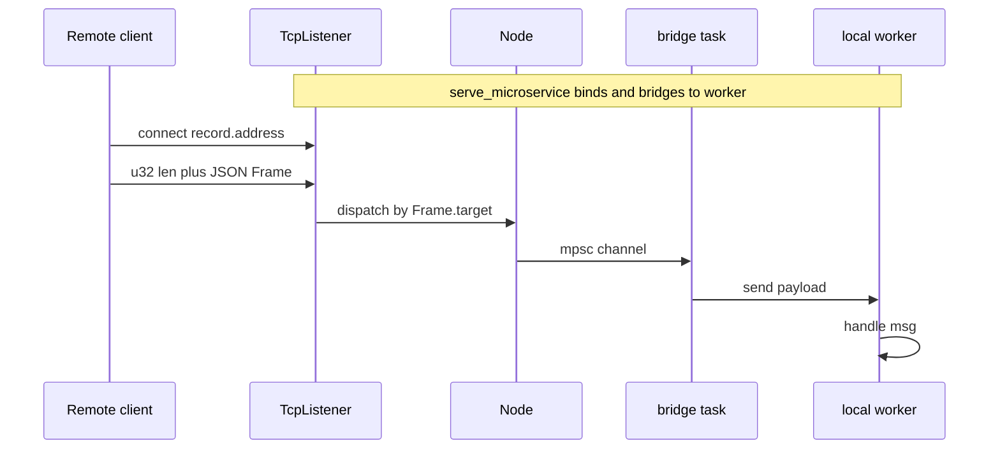
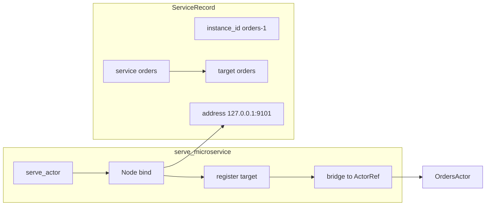
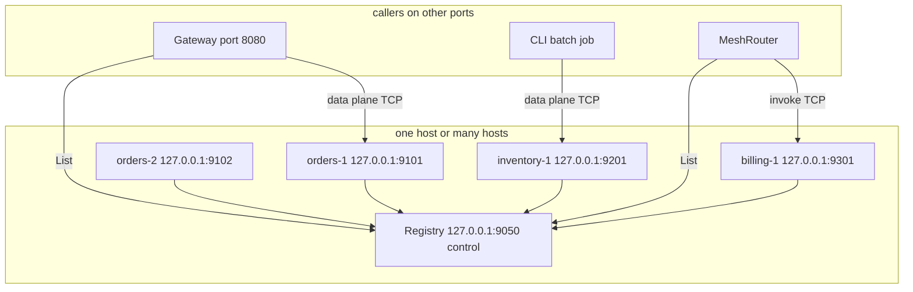

# `serve_microservice` — bind, listen, and call from other ports

[`serve_microservice`](../src/mesh.rs) starts one **data-plane** TCP listener and bridges incoming frames to a local actor. This doc covers how binding works, which port each component uses, and how callers on **other ports or processes** reach your service.

See also: [service_mesh.md](./service_mesh.md) (full mesh demo), [service_mesh.rs](./service_mesh.rs) (example source).

```bash
cargo run --example service_mesh
```

---

## What `serve_microservice` does

```rust
let handle = serve_microservice(
    "orders",           // service name (also Frame.target)
    "orders-1",         // instance id (registry key)
    "127.0.0.1:9101",   // bind address — see below
    OrdersActor { .. },
)
.await?;

println!("listening on {}", handle.address()); // actual host:port
```

Returns a [`MicroserviceHandle`](../src/mesh.rs) with:

| Field | Meaning |
|-------|---------|
| `record.service` | Logical name (`"orders"`) |
| `record.instance_id` | Unique instance (`"orders-1"`) |
| `record.address` | **Actual** TCP address clients connect to |
| `record.target` | Frame routing key (defaults to service name) |

---

## Internal flow (mermaid)





Each instance owns **one TCP port**. The mesh registry stores `address` so routers and other processes know where to connect.

---

## Choosing a bind address

The third argument is passed to `TcpListener::bind` (via [`Node::bind`](../src/distributed.rs)).

| `bind_addr` | Listen on | Typical use |
|-------------|-----------|-------------|
| `"127.0.0.1:0"` | Loopback, **ephemeral port** (OS picks) | Tests, single-machine demos ([`service_mesh.rs`](./service_mesh.rs)) |
| `"127.0.0.1:9101"` | Loopback, **fixed port** 9101 | Local dev with known ports |
| `"0.0.0.0:9101"` | **All interfaces**, port 9101 | Docker / VM / LAN — other machines connect via host IP |
| `"[::]:9101"` | IPv6 all interfaces | Dual-stack deployments |

After bind, always use the **resolved** address (ephemeral ports change every run):

```rust
let handle = serve_microservice("orders", "orders-1", "127.0.0.1:0", actor).await?;
let listen_addr = handle.address(); // e.g. "127.0.0.1:54370"
```

Register `listen_addr` with the mesh — not the pre-bind `"127.0.0.1:0"`.

---

## Multi-port deployment (mermaid)

Control plane and each microservice use **separate ports**:



| Component | Default in demo | Fixed-port example |
|-----------|-----------------|---------------------|
| Registry (control) | `127.0.0.1:9050` | `0.0.0.0:9050` |
| orders-1 (data) | ephemeral | `127.0.0.1:9101` |
| orders-2 (data) | ephemeral | `127.0.0.1:9102` |
| inventory-1 (data) | ephemeral | `127.0.0.1:9201` |
| billing-1 (data) | ephemeral | `127.0.0.1:9301` |

**Rule:** one `serve_microservice` call → one TCP port. Scale replicas by launching more instances on **different ports**.

---

## Fixed ports example

```rust
const REGISTRY: &str = "127.0.0.1:9050";

let registry = MeshRegistryServer::bind(REGISTRY).await?;

let orders1 = serve_microservice("orders", "orders-1", "127.0.0.1:9101", OrdersActor).await?;
let orders2 = serve_microservice("orders", "orders-2", "127.0.0.1:9102", OrdersActor).await?;
let inv1    = serve_microservice("inventory", "inv-1", "127.0.0.1:9201", InventoryActor).await?;

join_mesh(&mut mesh, Some(REGISTRY), &orders1).await?;
join_mesh(&mut mesh, Some(REGISTRY), &orders2).await?;
join_mesh(&mut mesh, Some(REGISTRY), &inv1).await?;
```

Registry records contain the fixed addresses; routers connect to `9101`, `9102`, `9201` directly after `sync()`.

---

## Calling from another process or port

Callers do **not** bind the service port — they **connect** to `ServiceRecord.address` as TCP clients.

### Option A — `MeshRouter` (recommended)

Router runs anywhere (HTTP gateway on `:8080`, worker, CLI). It only needs the **registry** address:

```rust
let mut router = MeshRouter::with_registry("127.0.0.1:9050");
router.sync().await?; // loads all instance host:ports

router.invoke("orders", &order_id, msg).await?;
```

The router opens a **new TCP connection** to the chosen instance port for each `invoke` (same as [`RemoteActorRef::send`](../src/distributed.rs)).

### Option B — Direct TCP after discovery

```rust
let records = MeshRegistryClient::list("127.0.0.1:9050").await?;
let orders = records.iter().find(|r| r.service == "orders").unwrap();

// Connect to orders instance data plane (e.g. 127.0.0.1:9101)
let remote = RemoteActorRef::<MeshMsg>::new(&orders.address, &orders.target);
remote.send(MeshMsg::Orders(/* ... */)).await?;
```

### Option C — In-process `ServiceMesh`

Same process that hosts services can register handles without TCP for local routing, but remote callers still use TCP + registry.

---

## Wire frame (data plane)

Every call — from any client port — sends:

| Bytes | Content |
|-------|---------|
| 4 LE | JSON body length |
| N | `{ "target": "orders", "payload": { ... } }` |

`target` must match `record.target` (defaults to service name from `serve_microservice`).

---

## Cross-host checklist

1. Bind services with **`0.0.0.0:PORT`** (or host-specific IP), not only `127.0.0.1`, if callers are on other machines.
2. Register **`handle.address()`** — for `0.0.0.0` binds, advertise the **reachable** IP (e.g. `10.0.1.5:9101`) in `ServiceRecord` if NAT/firewall requires it.
3. Open firewall rules for data-plane ports (`9101`, …) and registry (`9050`).
4. Point all routers at **`registry_host:9050`**; they learn data-plane ports via `List`.

```rust
// Service on machine A (LAN IP 10.0.1.5)
let handle = serve_microservice("orders", "orders-1", "0.0.0.0:9101", actor).await?;

// If needed, register reachable address explicitly:
let mut record = handle.record.clone();
record.address = "10.0.1.5:9101".into();
MeshRegistryClient::register("10.0.1.5:9050", record).await?;

// Router on machine B
let mut router = MeshRouter::with_registry("10.0.1.5:9050");
router.sync().await?;
router.invoke("orders", &key, msg).await?;
```

---

## Environment-style port map (example)

| Env var | Maps to |
|---------|---------|
| `MESH_REGISTRY_ADDR` | `127.0.0.1:9050` |
| `ORDERS_1_ADDR` | bind `127.0.0.1:9101` |
| `ORDERS_2_ADDR` | bind `127.0.0.1:9102` |
| `INVENTORY_1_ADDR` | bind `127.0.0.1:9201` |

```rust
let registry_addr = std::env::var("MESH_REGISTRY_ADDR").unwrap_or_else(|_| "127.0.0.1:9050".into());
let orders_bind   = std::env::var("ORDERS_BIND").unwrap_or_else(|_| "127.0.0.1:9101".into());

let registry = MeshRegistryServer::bind(&registry_addr).await?;
let orders   = serve_microservice("orders", "orders-1", &orders_bind, actor).await?;
```

---

## Related

- [service_mesh.md](./service_mesh.md) — full orders / inventory / billing demo
- [horizontal_scaling.md](./horizontal_scaling.md) — cluster routing without service names
- [README — TCP service mesh](../README.md#tcp-service-mesh)
