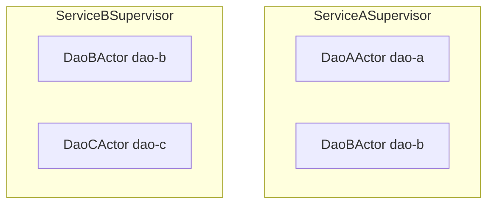
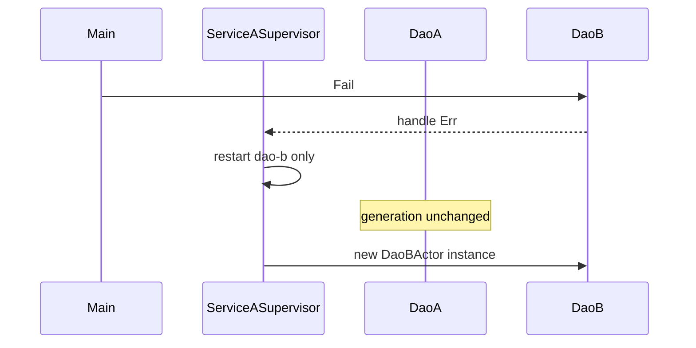

# Service supervisors — ServiceA and ServiceB

[`service.rs`](./service.rs) runs **`ServiceASupervisor`** and **`ServiceBSupervisor`** as **separate** OTP supervisors. Each supervises two DAO actors under **`OneForOne`**: a crash restarts only that child, not its sibling or the other supervisor.

```bash
cargo run --example service
```

Related: [`supervisor_strategies.md`](./supervisor_strategies.md) (all restart strategies).

---

## Layout

| Supervisor | Children | Actor | Message type |
|------------|----------|-------|----------------|
| **`ServiceASupervisor`** | `dao-a`, `dao-b` | `DaoAActor`, `DaoBActor` | `DaoAMsg`, `DaoBMsg` |
| **`ServiceBSupervisor`** | `dao-b`, `dao-c` | `DaoBActor`, `DaoCActor` | `DaoBMsg`, `DaoCMsg` |

Each DAO uses its **own message enum** (`Actor<DaoAMsg>`, etc.). A single `Supervisor<M>` cannot mix message types, so each child runs under its own one-child `OneForOne` supervisor inside `ServiceASupervisor` / `ServiceBSupervisor`.

`DaoB` under `ServiceASupervisor` and `DaoB` under `ServiceBSupervisor` are **different actor instances** (separate `ChildRegistry` + `Supervisor` task). Crashing one does not restart the other.



---

## What happens on crash / panic?

`ServiceASupervisor` and `ServiceBSupervisor` in this example are **plain Rust structs in `main`**, not `Actor` implementations and not a single `Supervisor` task. Each one owns **two** inner `SupervisorHandle`s (one per DAO). There is **no parent supervisor** above Service A or Service B in this demo.

| Failure | What restarts | What keeps running |
|---------|----------------|-------------------|
| **DAO returns `Err` from `handle`** (e.g. `DaoBMsg::Fail`) | That DAO only, via its inner `OneForOne` supervisor | Sibling DAO under the same service struct; the other service struct entirely |
| **Panic inside DAO `handle`** | Same as `Err` — caught, reported as `RestartSignal`, child restarted | Same as above |
| **Restart intensity exceeded** on one inner supervisor (`max_restarts` / `within_secs`, default `IntensityAction::ShutdownSupervisor`) | That inner supervisor **stops its child and exits**; no more automatic restarts for that DAO | The **other** inner supervisor under the same `Service*Supervisor` keeps running |
| **Inner supervisor task ends** (intensity shutdown, channel closed, or `SupervisorHandle::stop`) | That one DAO is stopped | Other inner supervisor + the other `Service*Supervisor` struct |
| **`main` panics or process exits** | Nothing is supervised at the process level — **everything** stops (Service A and Service B) | — |

### Service A vs Service B isolation

Crashing or restarting a DAO under **`ServiceASupervisor`** does **not** touch **`ServiceBSupervisor`** (separate registries, separate supervisor tasks, separate `DaoB` instances). The demo’s generation snapshots after `fail_dao_b` / `fail_dao_c` show this.

### There is no “service supervisor” restart

If both inner supervisors under `ServiceASupervisor` died, the `ServiceASupervisor` value in `main` would still exist, but `ping_all` would fail (`child not in registry` or send errors on dead refs). **`main` does not automatically rebuild Service A** — you would call `ServiceASupervisor::start()` again (or wrap the service in a real top-level `Supervisor` / actor in production).

Dropping a `SupervisorHandle` without calling `stop()` still shuts down that inner supervisor task (the oneshot shutdown sender is dropped); the sibling handle is unaffected.

### Production follow-up

To recover when a whole service boundary fails, add an outer layer, for example:

- A top-level `Supervisor` whose children are “service” actors, or
- `main` / orchestrator logic that detects dead handles and re-runs `ServiceASupervisor::start()`.

See [`supervisor_strategies.md`](./supervisor_strategies.md) for intensity limits (`ShutdownSupervisor` vs `AbandonChild`).

---

## OneForOne behaviour



The example prints **generation counters** from `ChildRegistry::bump_generation` in each actor's `pre_start`:

| Delta | Meaning |
|-------|---------|
| `+0` | Child was not restarted |
| `+2` | Child restarted once (`track_and_bump` + `pre_start` bump per spawn) |
| `+1` | Would indicate one bump only if you drop `bump_generation` from `pre_start` |

---

## What the demo runs

| Step | Action | Expected |
|------|--------|----------|
| 1 | `ServiceASupervisor::start` + `ServiceBSupervisor::start` | Two supervisor start lines + four DAO spawns |
| 2 | `ping_all` on both | Four ping lines |
| 3 | `ServiceASupervisor::fail_dao_b` | ServiceA: `dao-b` bumps; `dao-a` +0 |
| 4 | Snapshot `ServiceBSupervisor` | Generations unchanged |
| 5 | `ServiceBSupervisor::fail_dao_c` | ServiceB: `dao-c` bumps; `dao-b` +0 |
| 6 | Snapshot `ServiceASupervisor` | Generations unchanged |

---

## Core code pattern

```rust
let service_a = ServiceASupervisor::start().await?;
let service_b = ServiceBSupervisor::start().await?;

service_a.ping_all().await?;
service_a.fail_dao_b().await?; // only dao-b restarts inside ServiceASupervisor
```

Inside `ServiceASupervisor::start` — **two** one-child supervisors (typed messages):

```rust
let dao_a_sup = start_one_child("dao-a", dao_a_registry.clone(), || DaoAActor { /* DaoAMsg */ }).await?;
let dao_b_sup = start_one_child("dao-b", dao_b_registry.clone(), || DaoBActor { /* DaoBMsg */ }).await?;
```

- **`spawn_child_spec`** — one child per inner supervisor + typed `ChildRegistry`.
- **`DaoAMsg::Fail` / `DaoBMsg::Fail` / `DaoCMsg::Fail`** — `handle` returns `Err` to trigger that child's supervisor restart.

---

## When to use this pattern

| Use case | Why two supervisors |
|----------|---------------------|
| Domain boundary A vs B | Isolate failure blast radius per `Service*Supervisor` |
| Shared actor *name* (`DaoB`) | Different supervisors/registries — no cross-supervisor restart |
| Independent restart policy | Each supervisor can use its own `SupervisorConfig` later |

For **OneForAll** or **RestForOne**, change `SupervisorConfig::strategy` on one service and compare with [`supervisor_strategies`](./supervisor_strategies.rs).

---

## File map

| File | Role |
|------|------|
| [`service.rs`](./service.rs) | Runnable demo |
| [`service.md`](./service.md) | This doc |
