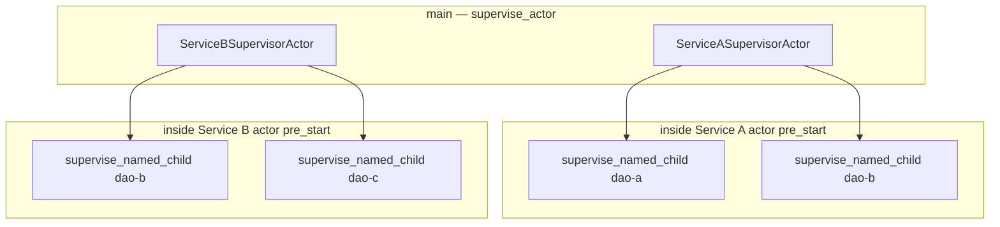
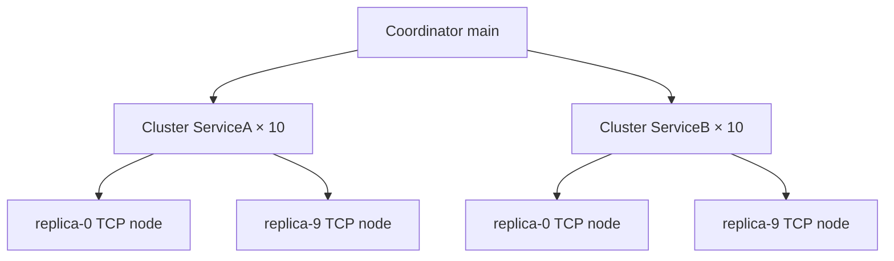

# Service supervisors as actors — `service_complex`

[`service_complex.rs`](./service_complex.rs) extends [`service.rs`](./service.rs): same DAO layout and isolation demo, but **each service boundary is a supervised actor**.

```bash
cargo run --example service_complex
cargo run --example service_complex_cluster   # 10 replicas × ServiceA + ServiceB on TCP nodes
```

Compare with: [`service.md`](./service.md) (coordinator structs in `main` only). Cluster layout follows [`horizontal_scaling.md`](./horizontal_scaling.md).

---

## Layout



| Layer | What | Restart scope |
|-------|------|----------------|
| **Outer** | `supervise_actor(Service*SupervisorActor)` | If the **service actor** fails, the whole service restarts (`pre_start` respawns both DAO supervisors) |
| **Inner** | `supervise_named_child!` per DAO | `OneForOne` — only the failed DAO restarts |

---

## vs `service.rs`

| | `service` | `service_complex` |
|---|-----------|-------------------|
| Service A / B | Plain struct in `main` | `Actor<ServiceAMsg>` / `Actor<ServiceBMsg>` + outer `supervise_actor` |
| `main` talks to DAOs | Via struct methods | Via `ActorRef::send(Service*Msg::…)` |
| Service actor crash | N/A (not an actor) | Outer supervisor restarts service actor → new DAO trees in `pre_start` |
| DAO crash | Inner `supervise_named_child!` | Same |

---

## One-child supervisor helper (no proc-macro)

Spawning one named child under `OneForOne` used to require `spawn_child_spec` + `Supervisor::new` + `start_settled`. The library now provides:

| API | Role |
|-----|------|
| [`supervise_named_child`](../src/supervisor.rs) | Async function |
| [`supervise_named_child!`](../src/macros.rs) | Declarative macro — `move \|\| actor` boilerplate removed |

```rust
let sup = supervise_named_child!(
    "dao-a",
    registry.clone(),
    one_for_one_config(),
    Duration::from_millis(50),
    DaoAActor { supervisor: SERVICE_A, registry: registry.clone() }
)
.await?;
```

**Feature flags:** not required. Declarative macros ship with the crate (like `registry_child_spec!`). A proc-macro crate would be optional future work; it would not change runtime behaviour.

For actors **without** a `ChildRegistry`, use [`supervise_actor`](../src/supervisor.rs) (cloneable prototype actor).

---

## Crash / panic (service_complex)

| Failure | Effect |
|---------|--------|
| DAO `Fail` / panic in `handle` | Inner `supervise_named_child!` restarts that DAO only |
| **Service actor** fails (if you add `ServiceAMsg::Fail`) | Outer `supervise_actor` restarts the service actor; `post_stop` stops inner DAO supervisors; `pre_start` spawns fresh DAOs |
| Service A vs B | Still isolated — separate outer supervisors and registries |

---

## Multi-node cluster (`service_complex_cluster`)

[`service_complex_cluster.rs`](./service_complex_cluster.rs) runs **`CLUSTER_REPLICAS` (10)** independent copies of each service on separate TCP nodes.

| Piece | Role |
|-------|------|
| **`serve_actor`** | One node per replica — binds `127.0.0.1:0`, target name `"service"` |
| **`Cluster<ServiceACommand>`** | Roster of 10 Service A replicas |
| **`Cluster<ServiceBCommand>`** | Roster of 10 Service B replicas (isolated from A) |
| **`ServiceACommand` / `ServiceBCommand`** | `Serialize` remote commands (`PingAll`, `FailDaoB` / `FailDaoC`) |



### What the cluster demo runs

| Step | API | Expected |
|------|-----|----------|
| 1 | Launch 10× `serve_actor` per service | 20 nodes online, printed addresses |
| 2 | `cluster.broadcast(PingAll)` | Every replica pings its local DAOs |
| 3 | `cluster_a.send_by_key(&3, FailDaoB)` | Only replica 3 restarts its DaoB |
| 4 | `send_by_key` + `PingAll` on replica 3 | DaoB back after inner restart |
| 5 | `cluster_b.send_round_robin(PingAll)` | Spreads calls across B replicas |
| 6 | `send_by_key(&7, FailDaoC)` on B | Only replica 7’s DaoC restarts |

Unlike single-node `service_complex`, there is **no** outer `supervise_actor` on each replica — `serve_actor` owns the service actor mailbox; **inner** `supervise_named_child!` per DAO is unchanged.

### Shared code

| File | Role |
|------|------|
| [`service_complex_shared.rs`](./service_complex_shared.rs) | DAO + service actors, commands, helpers |
| [`service_complex.rs`](./service_complex.rs) | Local supervised demo + generation counters |
| [`service_complex_cluster.rs`](./service_complex_cluster.rs) | Multi-node 10+10 replicas |

---

## File map

| File | Role |
|------|------|
| [`service_complex.rs`](./service_complex.rs) | Single-node runnable demo |
| [`service_complex_cluster.rs`](./service_complex_cluster.rs) | 10 replicas per service on TCP nodes |
| [`service_complex_shared.rs`](./service_complex_shared.rs) | Shared actors and commands |
| [`service_complex.md`](./service_complex.md) | This doc |
| [`service.rs`](./service.rs) | Simpler coordinator version (same macros) |
