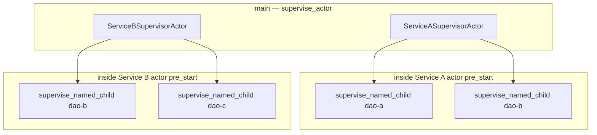

# Service supervisors as actors — `service_complex`

[`service_complex.rs`](./service_complex.rs) extends [`service.rs`](./service.rs): same DAO layout and isolation demo, but **each service boundary is a supervised actor**.

```bash
cargo run --example service_complex
```

Compare with: [`service.md`](./service.md) (coordinator structs in `main` only).

---

## Layout



| Layer | What | Restart scope |
|-------|------|----------------|
| **Outer** | `supervise_actor(Service*SupervisorActor)` | If the **service actor** fails, the whole service restarts (`pre_start` respawns both DAO supervisors) |
| **Inner** | `supervise_named_child!` per DAO | `OneForOne` — only the failed DAO restarts |

---

## vs `service.rs`

| | `service` | `service_complex` |
|---|-----------|-------------------|
| Service A / B | Plain struct in `main` | `Actor<ServiceAMsg>` / `Actor<ServiceBMsg>` + outer `supervise_actor` |
| `main` talks to DAOs | Via struct methods | Via `ActorRef::send(Service*Msg::…)` |
| Service actor crash | N/A (not an actor) | Outer supervisor restarts service actor → new DAO trees in `pre_start` |
| DAO crash | Inner `supervise_named_child!` | Same |

---

## One-child supervisor helper (no proc-macro)

Spawning one named child under `OneForOne` used to require `spawn_child_spec` + `Supervisor::new` + `start_settled`. The library now provides:

| API | Role |
|-----|------|
| [`supervise_named_child`](../src/supervisor.rs) | Async function |
| [`supervise_named_child!`](../src/macros.rs) | Declarative macro — `move \|\| actor` boilerplate removed |

```rust
let sup = supervise_named_child!(
    "dao-a",
    registry.clone(),
    one_for_one_config(),
    Duration::from_millis(50),
    DaoAActor { supervisor: SERVICE_A, registry: registry.clone() }
)
.await?;
```

**Feature flags:** not required. Declarative macros ship with the crate (like `registry_child_spec!`). A proc-macro crate would be optional future work; it would not change runtime behaviour.

For actors **without** a `ChildRegistry`, use [`supervise_actor`](../src/supervisor.rs) (cloneable prototype actor).

---

## Crash / panic (service_complex)

| Failure | Effect |
|---------|--------|
| DAO `Fail` / panic in `handle` | Inner `supervise_named_child!` restarts that DAO only |
| **Service actor** fails (if you add `ServiceAMsg::Fail`) | Outer `supervise_actor` restarts the service actor; `post_stop` stops inner DAO supervisors; `pre_start` spawns fresh DAOs |
| Service A vs B | Still isolated — separate outer supervisors and registries |

---

## File map

| File | Role |
|------|------|
| [`service_complex.rs`](./service_complex.rs) | Runnable demo |
| [`service_complex.md`](./service_complex.md) | This doc |
| [`service.rs`](./service.rs) | Simpler coordinator version (same macros) |
