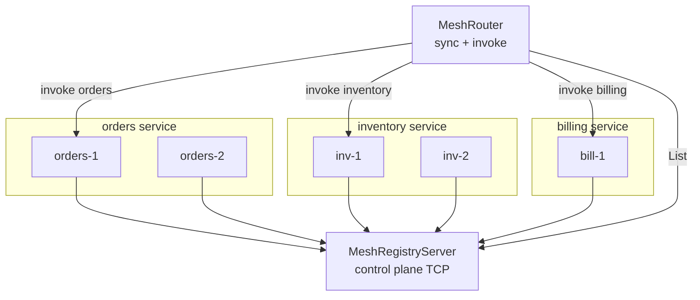

# TCP service mesh for microservices

A lightweight **service mesh** built on lane_switchboards TCP framing:

| Plane | Component | Role |
|-------|-----------|------|
| **Control** | `MeshRegistryServer` | Register / list service instances over TCP |
| **Data** | `serve_microservice` | Each instance listens for length-prefixed JSON frames |
| **Router** | `MeshRouter` / `ServiceMesh` | Route by **service name** + consistent-hash **key** |

```bash
cargo run --example service_mesh
```

Source: [`service_mesh.rs`](./service_mesh.rs)

---

## Architecture



Each microservice:

1. Binds TCP via `serve_microservice(service, instance_id, addr, actor)`
2. Registers with the control plane via `join_mesh`
3. Receives frames where `Frame.target == service name`

The router:

1. Calls `MeshRegistryClient::list` (or `router.sync()`)
2. Builds a per-service hash ring in `ServiceMesh`
3. Invokes with `router.invoke("orders", &order_id, msg)` — sticky sharding per service

---

## Wire formats

### Data plane (same as [`distributed.rs`](../src/distributed.rs))

| Field | Content |
|-------|---------|
| 4 bytes LE | JSON frame length |
| JSON | `{ "target": "orders", "payload": { ... } }` |

### Control plane ([`mesh.rs`](../src/mesh.rs))

Same length-prefix JSON encoding for `MeshControlMsg`:

| Variant | Purpose |
|---------|---------|
| `Register(ServiceRecord)` | Upsert instance |
| `Deregister { service, instance_id }` | Remove instance |
| `List` | Request all records |
| `ListReply(Vec<ServiceRecord>)` | Registry snapshot |
| `Ping` / `Pong` | Liveness |

```rust
pub struct ServiceRecord {
    pub service: String,      // e.g. "orders"
    pub instance_id: String,  // e.g. "orders-1"
    pub address: String,      // e.g. "127.0.0.1:54321"
    pub target: String,        // frame target (defaults to service name)
}
```

---

## Quick start

### 1. Start control plane

```rust
let registry = MeshRegistryServer::bind("127.0.0.1:9050").await?;
```

### 2. Launch a microservice instance

```rust
let handle = serve_microservice(
    "orders",
    "orders-1",
    "127.0.0.1:0",
    OrdersService { .. },
)
.await?;

join_mesh(&mut mesh, Some(&registry.address), &handle).await?;
```

### 3. Route from a gateway / BFF

```rust
let mut router = MeshRouter::with_registry("127.0.0.1:9050");
router.sync().await?;

router.invoke(
    "orders",
    &order_id,
    MeshMsg::Orders(OrdersMsg::Create { order_id, sku, qty }),
)
.await?;
```

---

## Routing API

| Method | Description |
|--------|-------------|
| `ServiceMesh::register(record)` | Add instance to local routing table |
| `ServiceMesh::invoke(service, key, msg)` | Hash-ring route to one instance |
| `ServiceMesh::invoke_all(service, msg)` | Fan-out to every instance (`M: Clone`) |
| `ServiceMesh::invoke_any(service, msg)` | Round-robin |
| `MeshRouter::sync()` | Refresh from TCP registry |
| `MeshRegistryClient::list(addr)` | Raw discovery |

### Invoke patterns

**Sticky order processing** — same `order_id` hits the same orders instance:

```rust
router.invoke("orders", &order_id, msg).await?;
router.invoke("inventory", &order_id, msg).await?;
router.invoke("billing", &order_id, msg).await?;
```

**Health check all replicas**:

```rust
router.invoke_all("orders", MeshMsg::HealthCheck).await;
```

**Scale out** — register new instance, re-sync:

```rust
join_mesh(&mut mesh, Some(registry_addr), &new_handle).await?;
router.sync().await?;
```

---

## Service enum pattern (example)

The demo tags messages by microservice:

```rust
enum MeshMsg {
    Orders(OrdersMsg),
    Inventory(InventoryMsg),
    Billing(BillingMsg),
    HealthCheck,
}
```

Each actor ignores variants it does not handle. Production code often uses one message type per service and separate `ServiceMesh<M>` types, or a JSON RPC envelope.

---

## vs Kubernetes / Istio

| This mesh | Production mesh |
|-----------|-----------------|
| In-process + TCP registry | etcd / K8s API |
| Hash ring per service name | Envoy xDS / DNS |
| Length-prefixed JSON | gRPC / HTTP/2 |
| Single-process demo | Sidecar per pod |

lane_switchboards mesh is a **minimal teaching mesh** — same control/data split, small enough to read and extend (TLS, retries, circuit breaking on `RemoteActorRef::send`).

---

## Related

- [horizontal_scaling.md](./horizontal_scaling.md) — cluster without service names
- [horizontal_scaling_rest_for_one.md](./horizontal_scaling_rest_for_one.md) — RestForOne per site
- [README — service mesh](../README.md#tcp-service-mesh)
