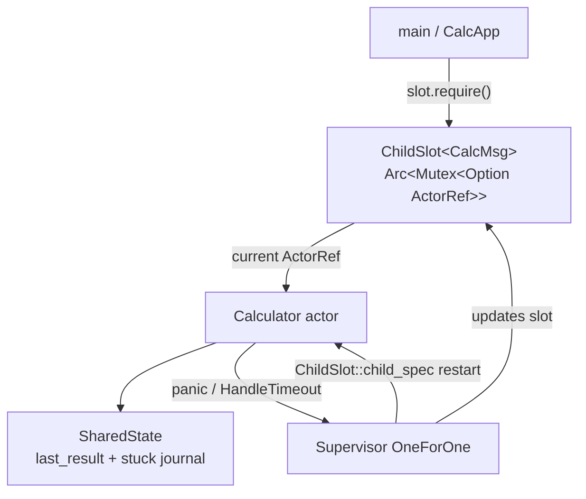

# Single-child supervisor — `ChildSlot`

[`single_child_supervisor.rs`](./single_child_supervisor.rs) supervises **one** calculator with [`ChildSlot`](../src/supervisor.rs) instead of [`ChildRegistry`](../src/supervisor.rs). It is a slim version of [`handle_timeout_calculator_timer_latency.rs`](./handle_timeout_calculator_timer_latency.rs) focused on the **single-child** OTP pattern from [READMEv0.0.9.md](../READMEv0.0.9.md).

```bash
cargo run --example single_child_supervisor
```

| | This example | `handle_timeout_calculator_timer_latency` |
|---|--------------|-------------------------------------------|
| Children | **1** calculator | Calculator + timer + ledger |
| Stable ref | **`ChildSlot`** | **`ChildRegistry`** + typed keys |
| Strategy | **OneForOne** | RestForOne |
| Cross-actor deadlock | No (single actor) | Calculator ↔ ledger |

---

## Architecture



---

## Why `ChildSlot`?

| Need | `ChildSlot` | `ChildRegistry` |
|------|-------------|-----------------|
| Exactly **one** supervised child | ✅ Minimal API | Heavier named map |
| Stable `ActorRef` after restart | `slot.get()` / `require()` | `registry.get(name)` |
| Actor looks up **itself** (self-deadlock demo) | Pass `Arc<ChildSlot>` into actor | Pass `Arc<ChildRegistry>` + name |
| Multiple named siblings | ❌ Use registry | ✅ |

`ChildSlot::child_spec` wires the supervisor factory: every `restart()` spawns a new actor and writes the fresh `ActorRef` into the slot.

---

## What the demo runs

### 1) Success-path latency

Warmup + 30 `add` samples through `CalcApp::actor()` → `ChildSlot::require()`. Reports min/avg/max µs (same idea as the latency example, without timer/ledger noise).

### 2) Slow handler → `handle_timeout`

`SlowDiv` sleeps 400ms; `handle_timeout` is 150ms. The runtime cancels the stuck `handle()`, `on_handle_stuck` journals the input into **`SharedState`** (survives restart), and **OneForOne** respawns the calculator. The slot points at the new actor automatically.

### 3) Panic recovery

`Div` by zero panics; supervisor restarts the lone child; `add` works again.

### 4) Self-deadlock probe

With `max_in_flight = 1`, the calculator cannot serve `Ping` while stuck in `SelfDeadlockProbe`. It looks up itself via **`self.slot.get()`** (same pattern as registry lookup, but for a single child). `handle_timeout` breaks the stall and restarts.

---

## Key code patterns

### Start supervisor + slot

```rust
let slot = Arc::new(ChildSlot::new());
let spec = ChildSlot::child_spec(0, slot.clone(), || Calculator { … });
let sup = Supervisor::with_actor_config(actor_config, config, vec![spec])
    .start_settled(Duration::from_millis(50))
    .await?;
slot.require().await?; // wait for first spawn
```

### Send from application code

```rust
let calc = self.slot.require().await?;
calc.send(CalcMsg::Add(a, b, tx)).await?;
```

### Hold supervisor alive

```rust
struct CalcApp {
    slot: Arc<ChildSlot<CalcMsg>>,
    _supervisor: SupervisorHandle<CalcMsg>, // drop = stop tree
}
```

---

## Related examples

| Example | Focus |
|---------|--------|
| [`resilient_calculator.md`](./resilient_calculator.md) | ChildSlot + panic only (no handle_timeout) |
| [`handle_timeout_calculator_timer_latency.rs`](./handle_timeout_calculator_timer_latency.rs) | Full multi-child + RestForOne + cross-deadlock |
| [`rest_for_one_calculator_timer_optimized.md`](./rest_for_one_calculator_timer_optimized.md) | ChildRegistry + macros for 2+ children |
| [READMEv0.0.9.md](../READMEv0.0.9.md) | When to use `ChildSlot` vs `ChildRegistry` |
