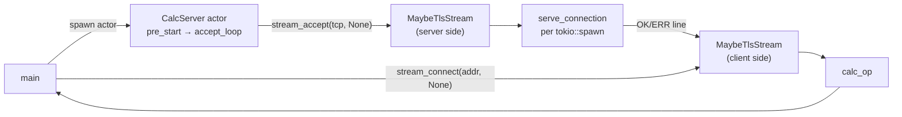
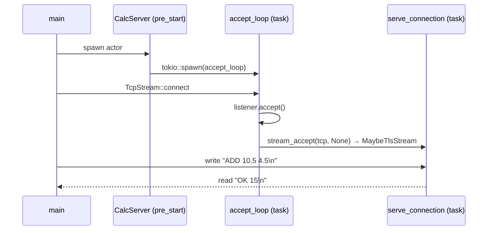

# stream_calc

[`stream_calc.rs`](./stream_calc.rs) is a **raw-TCP calculator** that exercises the full [`src/stream.rs`](../src/stream.rs) API in a single self-contained process.

```bash
cargo run --example stream_calc
```

---

## What `src/stream.rs` provides

| Symbol | Purpose |
|--------|---------|
| `stream_connect(addr, connector)` | Dial a TCP server; wrap in `MaybeTlsStream` |
| `stream_accept(tcp, acceptor)` | Upgrade an accepted `TcpStream` to `MaybeTlsStream` |
| `MaybeTlsStream` | Implements `AsyncRead + AsyncWrite` — plain TCP or TLS-wrapped |
| `host_from_addr(addr)` | Extract hostname from `"host:port"` for TLS SNI |

**Transparent TLS** — both `stream_connect` and `stream_accept` take an optional `TlsConnector` / `TlsAcceptor`. Passing `None` gives plain TCP. Passing a real connector/acceptor (enabled with `features = ["tls"]`) gives TLS. The rest of the code — `serve_connection`, `calc_op` — is unchanged either way.

---

## Architecture



---

## Connection flow



---

## Protocol

Newline-framed ASCII over a single TCP connection per request.

| Direction | Format | Example |
|-----------|--------|---------|
| Client → server | `OP A B\n` | `ADD 10.5 4.5\n` |
| Server → client | `OK result\n` | `OK 15\n` |
| Server → client (error) | `ERR reason\n` | `ERR division by zero\n` |

Supported ops: `ADD`, `SUB`, `MUL`, `DIV`.

---

## Key code patterns

### Server side — `stream_accept`

```rust
// accept_loop receives a raw TcpStream from the OS
let (tcp, peer) = listener.accept().await?;

// stream_accept wraps it in MaybeTlsStream.
// Swap None for a TlsAcceptor to enable TLS with zero other changes.
let stream: MaybeTlsStream = stream_accept(tcp, None).await?;

serve_connection(peer, stream).await;
```

### Server connection handler — `tokio::io::split`

`MaybeTlsStream` implements both `AsyncRead` and `AsyncWrite`, so it can be
split into independent halves and wrapped in `BufReader` for line-by-line reads:

```rust
async fn serve_connection(peer: SocketAddr, stream: MaybeTlsStream) {
    let (read_half, mut write_half) = tokio::io::split(stream);
    let mut lines = BufReader::new(read_half).lines();

    while let Ok(Some(line)) = lines.next_line().await {
        let response = match eval(&line) {
            Ok(v)  => format!("OK {v}\n"),
            Err(e) => format!("ERR {e}\n"),
        };
        write_half.write_all(response.as_bytes()).await?;
    }
}
```

### Client side — `stream_connect`

```rust
async fn calc_op(addr: &str, op: &str, a: f64, b: f64) -> anyhow::Result<f64> {
    // stream_connect returns MaybeTlsStream.
    // Swap None for a TlsConnector to dial a TLS server.
    let stream = stream_connect(addr, None).await?;
    let (read_half, mut write_half) = tokio::io::split(stream);
    let mut lines = BufReader::new(read_half).lines();

    write_half.write_all(format!("{op} {a} {b}\n").as_bytes()).await?;

    match lines.next_line().await?.as_deref() {
        Some(r) if r.starts_with("OK ")  => Ok(r[3..].trim().parse()?),
        Some(r) if r.starts_with("ERR ") => Err(anyhow::anyhow!("{}", &r[4..])),
        other => Err(anyhow::anyhow!("unexpected: {other:?}")),
    }
}
```

---

## Enabling TLS

Add `features = ["tls"]` to your dependency and swap the two `None` arguments:

```rust
// Server
use lane_switchboards::TlsAcceptor;
let acceptor: TlsAcceptor = build_acceptor(cert_pem, key_pem)?;
let stream = stream_accept(tcp, Some(&acceptor)).await?;

// Client
use lane_switchboards::TlsConnector;
let connector: TlsConnector = build_connector(ca_pem)?;
let stream = stream_connect("myhost:8443", Some(&connector)).await?;
```

`serve_connection` and `calc_op` require no further changes — `MaybeTlsStream`
dispatches through the correct `AsyncRead`/`AsyncWrite` impl at runtime.

---

## Actor design note

`CalcServer` uses an **uninhabited message type** (`enum ServerMsg {}`) because
all logic runs inside the background accept task started in `pre_start`.  The
actor loop simply parks in the mailbox `select!` until the `ActorRef` is
dropped, at which point it exits cleanly.

`TcpListener` is not `Clone`, so the server is spawned without a supervisor.
To make it supervisor-restartable in production, bind a fresh listener on each
restart inside a factory closure passed to `child_spec`.

---

## Expected output

```
=== stream_calc — raw TCP calculator via MaybeTlsStream ===

[server] accept loop started on 127.0.0.1:XXXXX

--- Arithmetic ---
[server] "ADD 10.5 4.5"  →  OK 15
ADD 10.5  4.5  = 15
[server] "SUB 100.0 37.5"  →  OK 62.5
SUB 100.0 37.5 = 62.5
[server] "MUL 6.0 7.0"  →  OK 42
MUL   6.0  7.0 = 42
[server] "DIV 22.0 7.0"  →  OK 3.142857142857143
DIV  22.0  7.0 = 3.142857

--- Error case ---
[server] "DIV 9.0 0.0"  →  ERR division by zero
DIV 9.0 0.0 → ERR: division by zero

--- Concurrent connections ---
1+2=3  3×4=12  10−5=5

Done. See examples/stream_calc.md for architecture details.
```

---

## Related

| Example | Focus |
|---------|-------|
| **stream_calc** | `stream_connect` / `stream_accept` / `MaybeTlsStream` |
| [`tls_distributed`](./tls_distributed.rs) | gRPC over TLS — `TlsAcceptor` + `TlsConnector` with rustls certs |
| [`distributed_demo`](./distributed_demo.rs) | gRPC actor-to-actor messaging without raw stream management |
| [`calculator_mesh_simplified`](./calculator_mesh_simplified.md) | mesh + supervision, no raw TCP |
