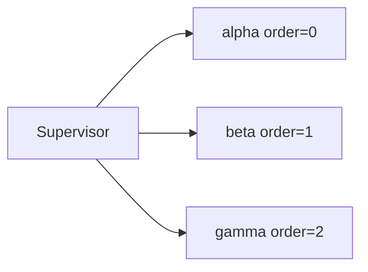
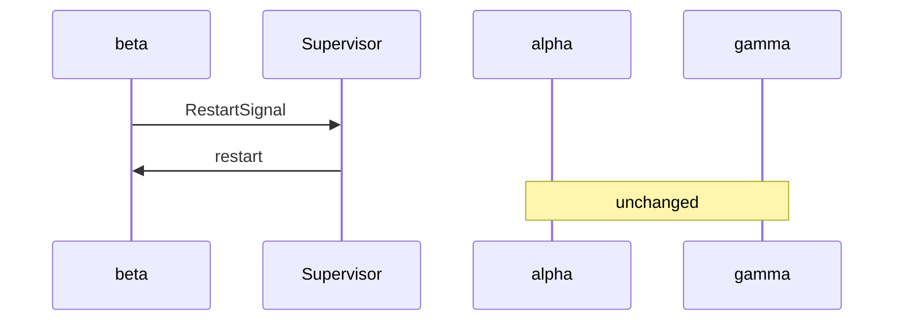
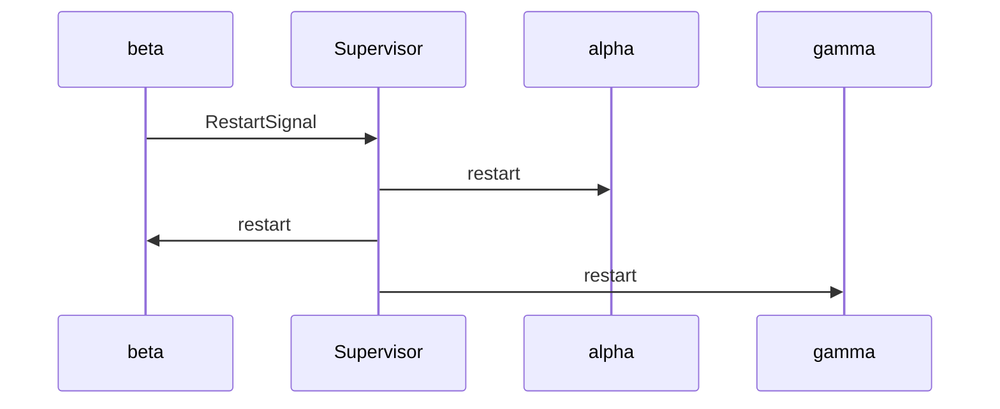
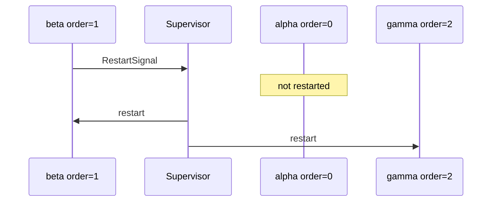
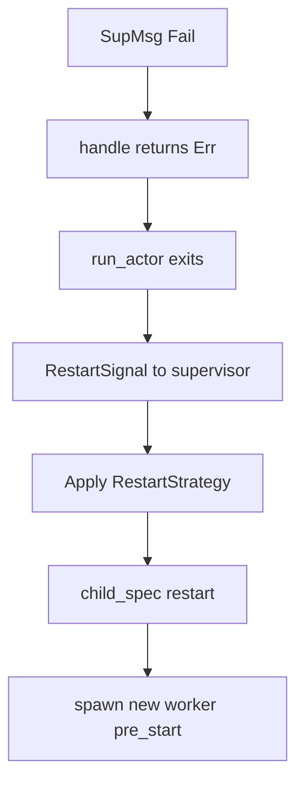

# Supervisor strategies — OneForOne, OneForAll, RestForOne, intensity

Live walkthrough of every restart strategy and intensity limit in [`supervisor.rs`](../src/supervisor.rs). Three named workers (`alpha`, `beta`, `gamma`) run under one supervisor; each demo fails `beta` or `gamma` and prints **generation counters** to show who restarted.

```bash
cargo run --example supervisor_strategies
```

Source: [`supervisor_strategies.rs`](./supervisor_strategies.rs)

---

## Overview

Lane Switchboards mirrors Erlang/OTP supervision:

| Concept | Rust type |
|---------|-----------|
| Supervisor | `Supervisor<M>` + `SupervisorConfig` |
| Child factory | `child_spec(order, factory)` |
| Failure signal | `RestartSignal { child_id, reason }` |
| Restart strategy | `RestartStrategy` |
| Restart budget | `max_restarts` within `within_secs` |
| Budget exceeded | `IntensityAction` |

The example runs **five sequential demos**, each with a fresh supervisor and three children.

---

## Child layout

All demos use the same three workers under one supervisor:

| Name | `order` | Role in demos |
|------|---------|---------------|
| `alpha` | 0 | Leftmost / upstream in `RestForOne` |
| `beta` | 1 | Usually the worker that fails |
| `gamma` | 2 | Downstream in `RestForOne` |



Every child implements `Actor<SupMsg>` with:

- `SupMsg::Ping` — prove the worker is alive after restarts
- `SupMsg::Fail` — return `Err` from `handle` to trigger supervisor restart

---

## Generation counter

Each worker increments a shared generation count in `pre_start`:

```rust
async fn pre_start(&mut self) -> Result<(), ActorProcessingErr> {
    let mut gens = self.generations.lock().await;
    *gens.entry(self.name.clone()).or_insert(0) += 1;
    println!("[spawn] {} generation {}", self.name, gens[&self.name]);
    Ok(())
}
```

| Generation change | Meaning |
|-------------------|---------|
| +0 after failure | Worker was **not** restarted |
| +1 after failure | Worker was **restarted once** |

The demo snapshots generations before and after each failure to make restart scope visible.

---

## Wiring multiple children

One supervisor, three `child_spec`s, shared ref slots:

```rust
let refs = ChildRefs::new();

let children: Vec<_> = ["alpha", "beta", "gamma"]
    .iter()
    .enumerate()
    .map(|(order, name)| make_spec(order, name, &refs))
    .collect();

let handle = Supervisor::new(config, children).start().await?;
```

`ChildRefs` holds:

- `by_name` — `ActorRef<SupMsg>` updated on every spawn/restart
- `generations` — shared counter map for observability

---

## Demo 1: `OneForOne`

**Config:** `RestartStrategy::OneForOne`

**When `beta` fails:** only `beta` is restarted. `alpha` and `gamma` keep running.



**Expected generation deltas:**

| Worker | Delta |
|--------|-------|
| alpha | +0 |
| beta | +1 |
| gamma | +0 |

**Use when:** children are independent — one crash should not disturb siblings (e.g. separate HTTP handlers, isolated workers).

---

## Demo 2: `OneForAll`

**Config:** `RestartStrategy::OneForAll`

**When `beta` fails:** **every** child is stopped and restarted.



**Expected generation deltas:**

| Worker | Delta |
|--------|-------|
| alpha | +1 |
| beta | +1 |
| gamma | +1 |

**Use when:** children share tight coupling or state — if one is corrupt, reset the whole group (e.g. pipeline stages that must stay in sync).

---

## Demo 3: `RestForOne`

**Config:** `RestartStrategy::RestForOne`

**When `beta` (order=1) fails:** restart `beta` and every child with **higher** order (`gamma`). `alpha` (order=0) is left alone.



**Expected generation deltas:**

| Worker | Delta |
|--------|-------|
| alpha | +0 |
| beta | +1 |
| gamma | +1 |

**Use when:** children form a **dependency chain** — a failure in the middle invalidates everything downstream but not upstream (e.g. parser → processor → writer).

The `order` argument to `child_spec(order, …)` defines this chain. Lower numbers start first and are considered upstream.

---

## Demo 4: Intensity — `ShutdownSupervisor`

**Config:**

```rust
SupervisorConfig {
    strategy: RestartStrategy::OneForOne,
    max_restarts: 3,
    within_secs: 10,
    intensity_action: IntensityAction::ShutdownSupervisor,
}
```

**Behavior:** every restart is recorded in a sliding window. When restarts exceed `max_restarts` within `within_secs`, the **supervisor task exits** and no further restarts occur.

The demo fails `gamma` four times in quick succession:

| Attempt | Result |
|---------|--------|
| 1–3 | `gamma` restarts (generations 2, 3, 4) |
| 4 | Supervisor logs `restart intensity exceeded — shutting down` |

**Use when:** repeated failures indicate a systemic problem — stop the whole tree rather than spin forever.

---

## Demo 5: Intensity — `AbandonChild`

**Config:**

```rust
SupervisorConfig {
    max_restarts: 2,
    within_secs: 10,
    intensity_action: IntensityAction::AbandonChild,
}
```

**Behavior:** when intensity is exceeded, the supervisor **keeps running** but stops restarting the offending child. Siblings continue to work.

The demo fails `beta` five times, then pings `alpha` and `gamma` — both still respond.

**Use when:** one flaky child should not take down the supervisor or its siblings.

---

## Strategy comparison

| Strategy | Fail `beta` | alpha | beta | gamma |
|----------|-------------|-------|------|-------|
| `OneForOne` | Restart failed only | ok | restart | ok |
| `OneForAll` | Restart all | restart | restart | restart |
| `RestForOne` | Restart order ≥ 1 | ok | restart | restart |

| Intensity action | Budget exceeded |
|------------------|-----------------|
| `ShutdownSupervisor` | Supervisor loop exits |
| `AbandonChild` | Skip restart, supervisor continues |

---

## `SupervisorConfig` reference

```rust
pub struct SupervisorConfig {
    pub strategy: RestartStrategy,       // OneForOne | OneForAll | RestForOne
    pub max_restarts: usize,             // max events in window
    pub within_secs: u64,                // sliding window size
    pub intensity_action: IntensityAction, // ShutdownSupervisor | AbandonChild
}
```

Defaults (`SupervisorConfig::default()`):

| Field | Default |
|-------|---------|
| `strategy` | `OneForOne` |
| `max_restarts` | `5` |
| `within_secs` | `10` |
| `intensity_action` | `ShutdownSupervisor` |

Intensity is **shared across the whole supervisor**, not per child.

---

## Failure path (how a restart is triggered)



Panics in `handle` follow the same path via `catch_unwind` in [`src/actor.rs`](../src/actor.rs).

---

## Sample output

```
========== OneForOne — only the failed child restarts ==========

[spawn] alpha generation 1
[spawn] beta generation 1
[spawn] gamma generation 1
[stop] beta
[spawn] beta generation 2
[generations after beta fails]
  alpha: 1 -> 1 (+0)
  beta: 1 -> 2 (+1)
  gamma: 1 -> 1 (+0)

========== OneForAll — one failure restarts every child ==========
...
  alpha: 1 -> 2 (+1)
  beta: 1 -> 2 (+1)
  gamma: 1 -> 2 (+1)

========== RestForOne — failed child and all with higher order restart ==========
...
  alpha: 1 -> 1 (+0)
  beta: 1 -> 2 (+1)
  gamma: 1 -> 2 (+1)

========== Intensity limit — ShutdownSupervisor after max_restarts ==========
...
ERROR supervisor restart intensity exceeded — shutting down

========== Intensity limit — AbandonChild keeps supervisor alive ==========
...
[ping] alpha
[ping] gamma
```

---

## Constraints

| Topic | Detail |
|-------|--------|
| Same message type | All children under one supervisor share `Supervisor<M>` — here `M = SupMsg` |
| `supervise_actor` | Single-child helper only; use `Supervisor::new(vec![…])` for multiple |
| Child refs | `start()` does not return refs — capture in factory via `ChildRefs` pattern |
| Stale refs after restart | `ChildRefs.by_name` is updated on every restart in `make_spec` |

---

## Related docs

- [README — One supervisor, many children](../README.md#one-supervisor-many-children)
- [architecture.md](../architecture.md) — supervision section
- [resilient_calculator.md](./resilient_calculator.md) — single supervised child in practice
- [envelope_demo.md](./envelope_demo.md) — actor mailbox control messages
