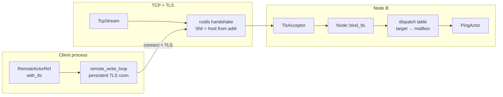
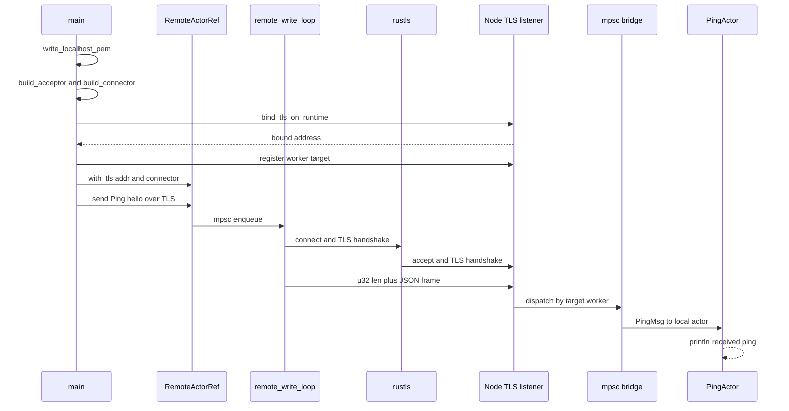

# TLS distributed demo — encrypted remote actor frames

[`tls_distributed.rs`](./tls_distributed.rs) is the TLS counterpart to [`distributed_demo.rs`](./distributed_demo.rs). Same length-prefixed JSON framing — but the TCP byte stream is wrapped in **TLS 1.2+** via **rustls** before any frame is read or written.

```bash
cargo run --example tls_distributed
```

Expected output:

```text
TLS node listening on 127.0.0.1:56542
received remote ping (TLS): hello over TLS
```

See also: [horizontal_scaling.md](./horizontal_scaling.md) (plain TCP cluster), [serve_microservice.md](./serve_microservice.md) (mesh data plane).

---

## Idea

| Plain TCP (`distributed_demo`) | TLS (`tls_distributed`) |
|--------------------------------|-------------------------|
| `Node::bind(...)` | `Node::bind_tls_on_runtime(..., acceptor)` |
| `RemoteActorRef::new(...)` | `RemoteActorRef::with_tls(..., connector)` |
| Anyone on the wire can read frames | Encrypted + server identity verified by client |

TLS is **optional** — omit `TlsAcceptor` / `TlsConnector` and behaviour matches v0.0.4 plain TCP.

Production deployments should use real PEM certificates (or your PKI), not the ephemeral self-signed certs this demo generates at startup.

Ephemeral self-signed certificates are short-lived digital credentials generated on-the-fly without a trusted Certificate Authority (CA). They automatically expire in minutes or hours and are discarded. Designed for internal system-to-system communication, they enhance security by eliminating the need to store long-term keys.

---

## Architecture



Each [`RemoteActorRef`](../src/distributed.rs) still uses a **persistent write channel** and background reconnect loop — TLS is negotiated once per connection, then frames flow identically to plain TCP.

---

## Sequence — one remote send



Frame format is unchanged: `u32` little-endian length + JSON `{"target":"worker","payload":...}`.

---

## Certificate setup (demo vs production)

### Demo — ephemeral self-signed (in the example)

The example writes PEM files under `$TMP/lane_switchboards_tls_demo/`:

- **DNS SAN:** `localhost`
- **IP SAN:** `127.0.0.1`
- Client trusts the same cert file as CA (`client_config_from_pem(Some(&cert_path), ...)`)

Both sides must agree on trust material. The client validates the server name against the **host** portion of `"host:port"` (SNI).

### Production — your PEM paths

```rust
use lane_switchboards::tls::{
    build_acceptor, build_connector, client_config_from_pem, server_config_from_pem,
};
use std::sync::Arc;

let acceptor = Arc::new(build_acceptor(server_config_from_pem(
    "/etc/lane/server.crt",
    "/etc/lane/server.key",
    None::<&str>,              // Some("client-ca.crt") for mTLS
)?));

let connector = Arc::new(build_connector(client_config_from_pem(
    Some("/etc/lane/ca.crt"),  // omit for webpki-roots
    None,                      // client cert + key for mTLS
    None,
)?));
```

| Helper | Role |
|--------|------|
| `server_config_from_pem(cert, key, client_ca?)` | Server identity; optional client CA for mTLS |
| `client_config_from_pem(ca?, client_cert?, client_key?)` | Trust roots + optional client identity |
| `build_acceptor` / `build_connector` | Wrap configs for Tokio |
| `load_certs` / `load_private_key` / `load_ca_store` | Lower-level PEM loaders |

---

## API used in this example

| Step | API |
|------|-----|
| Server TLS | `Node::bind_tls_on_runtime(runtime, name, addr, &DistributedConfig, Arc<TlsAcceptor>)` |
| Client TLS | `RemoteActorRef::with_tls(addr, target, &DistributedConfig, Arc<TlsConnector>)` |
| Register target | `node.register("worker", tx)` — same as plain TCP |
| Local actor bridge | `spawn(PingActor)` + forward from `rx` — same pattern as `distributed_demo` |

---

## Cluster and mesh with TLS

The same `TlsAcceptor` / `TlsConnector` apply elsewhere:

| Layer | Server (accept) | Client (connect) |
|-------|-----------------|------------------|
| **Distributed** | `Node::bind_tls_on_runtime`, `serve_actor_tls_on_runtime` | `RemoteActorRef::with_tls`, `Cluster::set_tls_connector` |
| **Service mesh** | `MeshRegistryServer::bind_tls`, `serve_microservice_tls` | `MeshRegistryClient::with_tls`, `MeshRouter::with_registry_tls` |

All TLS-enabled paths use [`MaybeTlsStream`](../src/tls.rs) internally — framing, timeouts, and frame size limits behave the same as plain TCP.

---

## Troubleshooting

| Error | Likely cause |
|-------|----------------|
| `InvalidCertificate(NotValidForName...)` | Cert SAN does not match connect address — add IP/DNS SAN or connect using matching host |
| `missing port in address` | Address must be `"host:port"`, not bare host |
| Handshake fails after upgrade | Client and server must both enable TLS (or both use plain TCP) |
| `no process-level CryptoProvider` | rustls crypto provider is installed automatically when building configs via `server_config_from_pem` / `client_config_from_pem` |

---

## Related

- Release notes: [READMEv0.0.5.md](../READMEv0.0.5.md)
- Module reference: [`src/tls.rs`](../src/tls.rs)
- Plain two-node demo: [`distributed_demo.rs`](./distributed_demo.rs)
