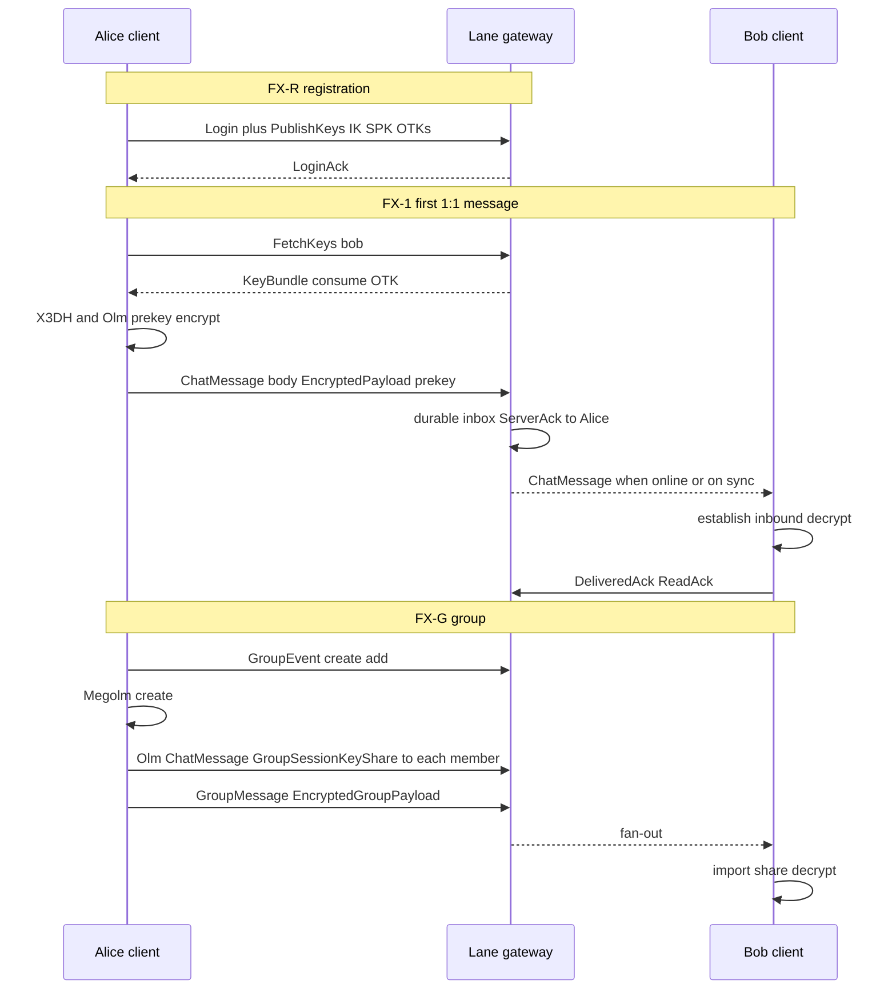

# FunXMPP + Signal-shape TODO (from Antunes monograph)

Actionable backlog to align Lane’s messenger plane with the **WhatsApp FunXMPP
+ Signal Protocol flows** documented in:

> Igor Palmieri Antunes — *Explorando o Sistema de Criptografia Signal Protocol
> em Grupos do WhatsApp* (UFF, 2018).  
> PDF: <https://app.uff.br/riuff/bitstream/handle/1/30574/IgorAntunes-monografia-versao_final.pdf?sequence=1&isAllowed=y>  
> Primary chapter for this file: **Capítulo 4** (Registro → Comunicação /
> FunXMPP → Conversa 1:1 → Conversas em Grupo).  
> Companion paper (SBSeg): <https://sol.sbc.org.br/index.php/sbseg/article/view/4252>

Related: [`gap.md`](gap.md) (WA vs Lane fidelity), [`todo.md`](todo.md) (server),
[`docs/messenger/10_e2ee.md`](docs/messenger/10_e2ee.md),
[`docs/messenger/01_wire_protocol.md`](docs/messenger/01_wire_protocol.md).

Legend: `[ ]` todo · `[~]` partial · `[x]` done in Lane · **WA-literal** = do
not implement (legal / opacity / non-goal)

---

## 0. Scope & honesty

| Topic | Antunes / WhatsApp | Lane today | Goal |
|-------|--------------------|------------|------|
| Transport | FunXMPP = XMPP concepts + **token dictionary** binary XML nodes | Typed packets `ver\|type\|len\|protobuf` (“FunXMPP-*style*”) | Keep Lane framing; optionally add **token-node codec** behind a feature |
| 1:1 E2EE | X3DH + Double Ratchet; wire `enc type=pkmsg\|msg` | Olm via **vodozemac** + `EncryptedPayload` prekey/normal | Match **semantics**, not WA XML |
| Groups E2EE | **Sender Key** + Symmetric Ratchet; `skmsg`; distribute keys over 1:1 Signal | **Megolm** sender-keys + Olm key share | Same silhouette (encrypt-once); keep Megolm |
| Server role | Opaque relay; key directory; acks | Same intent | Strengthen directory + fan-out parity |
| Analysis method | FRIDA on Android WA | N/A | Use for **reference only** — never ship WA reverse-engineering |

**Non-goals:** byte-compatible WhatsApp servers, cloning `s.whatsapp.net` JIDs,
or claiming protocol identity with Meta’s FunXMPP.

---

## 1. Capítulo 4.1 — Registro (device bootstrap)

Monograph: on first install the device generates and registers:

| Artifact | Antunes | Lane | TODO |
|----------|---------|------|------|
| Registration Id | Random device registration id | `device_id` (Keychain / connect opts) | [~] Stable device id — OK |
| SMS Token | SMS confirmation | Identity HTTPS / DEBUG HMAC | [ ] Phone/SMS (or email OTP) identity path for prod |
| Identity Key Pair | Long-term Curve25519 | `E2eeDevice` / vodozemac Account | [x] |
| Signed Pre Key + signature | SPK signed by IK | Published in key directory | [x] (vodozemac account keys) |
| One-Time Prekey bundle | Uploaded async after register | `PublishKeys` + consume on fetch | [x] |
| Post-register OTK upload | Async flood of OTKs | Publish batch | [~] Ensure refill when OTKs low |
| Channel crypto before chat | TLS + app-layer | TCP+TLS FunXMPP Login | [x] TLS feature; [ ] Noise/WAUTH-class (see [`gap.md`](gap.md) G4) |

### FX-R — Registration checklist

- [x] Generate IK / SPK / OTKs on client boot (`E2eeDevice`)
- [x] Publish public material to server key directory
- [x] Fetch peer bundle consumes one OTK (single-use)
- [ ] **OTK refill policy**: watermark + background republish
- [ ] **Signed Pre Key rotation** schedule (monograph: renewable over time)
- [ ] **Registration attestation** hook (optional): proof device owns phone/email
- [ ] Docs: map Antunes “Registro” → Lane `PublishKeys` / iOS Keychain pickle

**Exit:** new device can register keys, send first prekey message to offline peer,
OTK count never silently hits zero in soak test.

---

## 2. Capítulo 4.2 — Comunicação / FunXMPP compression

Monograph **Mensagem 4.1**: verbose XMPP tags compressed via a **shared
dictionary** (one byte per common token):

```text
<59 a5="…@91" a7="a2" 44="…"><12>Teste</12></59>
  ↕ dictionary
<message to="…@s.whatsapp.net" type="text" id="…"><body>Teste</body></message>
```

### FX-W — Wire / FunXMPP checklist

| Item | Status | Notes |
|------|--------|-------|
| Long-lived TCP session | [x] | Gateway + FFI client |
| Presence-capable session | [x] | `Presence` / `SubscribePresence` |
| Length-prefixed frames | [x] | `codec.rs` |
| Token dictionary binary XML | [ ] **optional** | Feature `funxmpp-nodes` — research only unless product needs WA-like nodes |
| Typed packet table (Lane) | [x] | Preferred production path |
| Max frame / backpressure | [x] | See `limits.md` |
| Compare size vs XML stanza | [x] | `benches/messenger_codec.rs` |

Optional research track (not blocking product):

- [ ] Spec `docs/messenger/12_funxmpp_nodes.md`: list/token tags (`0xf8` lists, etc.) citing Antunes + public FunXMPP writeups
- [ ] Prototype encode/decode of a **subset** (`message`, `ack`, `iq` key fetch) for education
- [ ] **Do not** connect to WhatsApp infrastructure

**Exit (Lane path):** keep protobuf FunXMPP-style as default. Node codec is
extra credit behind a Cargo feature.

---

## 3. Capítulo 4.3 — Conversa 1:1 (X3DH + Double Ratchet)

Monograph flow (Mensagens 4.2–4.6):

```text
Alice ──iq get key──► Server ──key bundle──► Alice
Alice: verify SPK signature → X3DH → root/chain → Double Ratchet
Alice ──message/enc type=pkmsg──► Server ──(+ t, notify)──► Bob
Bob: establish session → decrypt → ack
Later: enc type=msg (Signal Message only)
```

### FX-1 — 1:1 E2EE checklist

- [x] Fetch peer prekey bundle from directory (`FetchKeys` / `fetch_key_bundle`)
- [x] X3DH-style outbound session establish (vodozemac Olm)
- [x] First messages as **pre-key** Olm (`message_type = 0` / `pkmsg` analog)
- [x] Subsequent **normal** ratchet messages (`message_type = 1` / `msg` analog)
- [x] Server never sees plaintext body
- [x] Delivery ack ladder (ServerAck / DeliveredAck / ReadAck) — product ticks
- [~] Server stamps `sent_at` / display name on forward (monograph `t`, `notify`)
- [ ] **Force pkmsg until first inbound** from peer (monograph: keep PreKey wrapper until Bob replies) — verify/fix if Olm already implies this
- [ ] **Out-of-order / skipped message keys** soak (Double Ratchet skipped-key store limits)
- [ ] Safety number / identity change UX when IK changes (iOS I8 partial)
- [ ] Multi-device: encrypt to **all** published `device_id`s (directory lists devices)
- [ ] Formal test vectors: Antunes-style “third system decrypts with captured keys” using **our** fixtures only

**Exit:** e2e test — Alice offline-first message to Bob; Bob decrypts; reply uses
normal ratchet; identity key change surfaces warning.

---

## 4. Capítulo 4.4 — Conversas em Grupo (Sender Keys)

Monograph model (Figura 4.1, Mensagens 4.7–4.11):

1. Each member creates **chain key + signature key** → **Sender Key**
2. Distribute Sender Key to each member over **1:1 Signal sessions**
3. Group ciphertext = Symmetric-Key Ratchet + AES + signature → `skmsg`
4. On **member leave**, reset group crypto so ex-member cannot decrypt future
5. On **member join**, each member sends their Sender Key to the newcomer
6. Optional combined frame: `skmsg` + per-participant `msg`/`pkmsg` key shares

Lane maps this to **Megolm** (Matrix/Signal-family sender-key construction) +
Olm-wrapped `GroupSessionKeyShare`.

### FX-G — Group E2EE checklist

- [x] Create outbound group session (Megolm)
- [x] Distribute session key via Olm 1:1 (`distribute_group_session_key`)
- [x] Import key share on receive (`try_import_group_key_from_chat`)
- [x] Encrypt/decrypt group bodies (`EncryptedGroupPayload`)
- [x] Group membership events (create / add / remove / leave) on wire
- [~] **On leave: rotate / reset** Megolm so removed member cannot read new msgs
- [~] **On join: fan-out** current sender keys to newcomer (all members, not only admin)
- [ ] Combined “skmsg + participants key shares” single logical send (API sugar)
- [ ] `phash`-like membership hash for stale-membership detection (monograph `phash`)
- [ ] Group admin authorization parity with Antunes invite checks
- [ ] Document Rösler et al. group E2EE limitations ([`11_security_review.md`](docs/messenger/11_security_review.md))

**Exit:** add member → all can decrypt; remove member → new messages fail decrypt
for removed device; tests in `tests/messenger.rs`.

---

## 5. Capítulo 4 flows as Lane sequence (target)



---

## 6. Monograph “trabalhos futuros” → Lane backlog

From Antunes §7 (and SBSeg conclusions), mapped to engineering work **on Lane**:

| Future work (paper) | Lane TODO |
|---------------------|-----------|
| Other message types beyond text | [~] media captions; [ ] reactions, edits, delete-for-everyone |
| Replay / manipulate infected client msgs | [ ] Server-side idempotency + rate limits already partial; add abuse tests ([`gap.md`](gap.md) G7) |
| WhatsApp Web companion security | [ ] Multi-device companion sync product (G5) — **our** desktop/FFI, not WA Web |
| Formal analysis citations | [~] Track Signal/Olm proofs in security review doc |

---

## 7. Priority order

```text
P0  FX-G leave/join key rotation     ← correctness gap vs monograph §4.4
P0  FX-1 multi-device fan-out         ← real phones have many devices
P1  FX-R OTK refill + SPK rotation
P1  FX-1 skipped-key / identity UX
P2  FX-W optional token-node research (feature-flagged)
P2  FX-G phash + combined skmsg API sugar
P3  SMS/OTP registration product
```

---

## 8. Acceptance matrix (Cap. 4 → tests)

| Monograph scenario | Automated check |
|--------------------|-----------------|
| Mensagem 4.1 size win vs XML | Bench already; keep regression |
| Mensagem 4.2–4.3 key fetch + OTK consume | `tests/messenger.rs` E2EE key directory |
| Mensagem 4.4–4.6 pkmsg then msg | Encrypt/decrypt round-trip + second message |
| Mensagem 4.5 delivery ack | Ack ladder tests |
| Mensagem 4.7–4.9 group create/invite | GroupEvent version gate tests |
| Mensagem 4.10–4.11 skmsg + key share | Megolm send + import + decrypt |
| Leave resets crypto | **Missing — add** |

---

## 9. One-line takeaway

Antunes Cap. 4 is the **behavioral spec** we care about: FunXMPP as a
bandwidth-tight XMPP descendant, Signal 1:1 (`pkmsg`/`msg`), and Sender-Key
groups (`skmsg` + 1:1 key distribution). Lane already implements that silhouette
with **protobuf FunXMPP-style frames + vodozemac Olm/Megolm**. This TODO closes
the remaining **registration hygiene**, **group membership crypto rotation**,
and **multi-device** gaps — without pretending to speak WhatsApp’s wire dialect.
