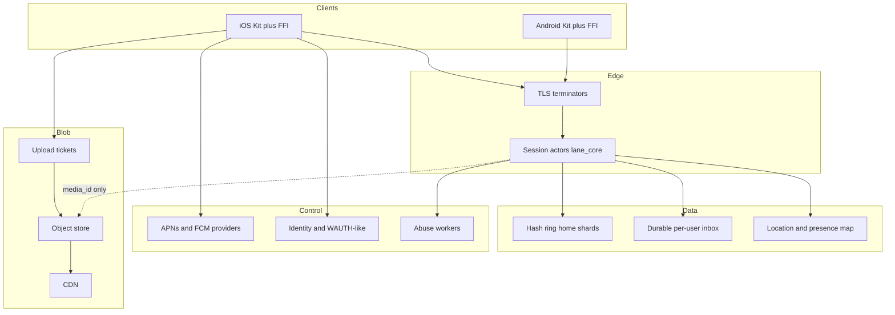

# Gap analysis: WhatsApp shape vs Lane Rust ecosystem

Honest fidelity score for “are we building WhatsApp?”:

| Lens | Score | Meaning |
|------|-------|---------|
| Boxes-and-arrows topology | **~60–70%** | Client ↔ long-lived transport ↔ session gateway ↔ offline queue ↔ E2EE — yes |
| Runtime / storage substrate | **~30–40%** | Erlang/OTP + Mnesia-class presence lookup ≠ Tokio services + WAL |
| Client architecture | **~50%** | Native UI + local DB + push — yes; **shared Rust core via FFI** is Signal-like, not WA |
| Product completeness | **~40%** | Missing CDN media tier, geo, spam/abuse, full WAUTH/SASL detail, multi-DC |

**Do not claim ~95%.** That oversells. Lane captures WhatsApp’s *conceptual silhouette* well; several core implementation choices diverge in ways that matter architecturally, not just cosmetically.

Related docs: [`docs/ECOSYSTEM_GUIDE.md`](docs/ECOSYSTEM_GUIDE.md), [`docs/messenger/`](docs/messenger/README.md), [`todo.md`](todo.md), [`todo_ios.md`](todo_ios.md), [`funxmpp_todo.md`](funxmpp_todo.md) (Antunes Cap. 4 → Lane backlog).

---

## 1. What matches genuinely well

### 1.1 Client shape (iOS)

| WhatsApp-like | Lane today |
|---------------|------------|
| Local encrypted / private message store | SQLite in `LaneMessengerKit` |
| Secrets off the filesystem | Keychain: token, `device_id`, E2EE pickle |
| Alert push only for chat presentation | APNs alert path; **no VoIP** for chat ([`09_push.md`](docs/client-ios/09_push.md)) |
| Foreground reconnect + catch-up | `resume_after_seq` + `SyncComplete` (I2) |
| E2EE as client-side session material | Olm/Megolm via Rust (`vodozemac`) + FFI |

This is basically how a real iOS messenger client is *shaped*.

### 1.2 Wire-level framing

| WhatsApp (modern, simplified) | Lane FunXMPP |
|-------------------------------|--------------|
| Long-lived TCP | Same |
| Binary framing (historically FunXMPP / binary XML “nodes”) | `u8 ver \| u8 type \| u32 len \| protobuf` |
| Protobuf (or similar) payloads inside nodes | Prost / `proto/messenger.proto` |

Lane’s frame is a **reasonable simplification**, not a fabrication. Real WA uses a binary XML node tree with protobuf-ish payloads inside; we collapsed that to typed packet IDs + protobuf. Directionally right; not byte-compatible.

### 1.3 Server-side silhouette

```text
accept → auth → session → router → presence / groups / media
                              ↓
                     offline inbox (per recipient)
                              ↓
                     deliver on reconnect / live push
```

WhatsApp’s Erlang backend queues undelivered messages per-user and dispatches on reconnect. Lane’s inbox + `ServerAck`-after-durable + ack ladder (`0x21` → `0x22` → `0x23`) mirrors that **external behavior**.

### 1.4 E2EE as a distinct plane

Signal-protocol-class crypto on the client, opaque bodies on the wire, key directory as a separate concern — aligned with how WA integrated Signal. Lane: `src/messenger/e2ee.rs` + FFI `E2eeDevice`.

---

## 2. Where it diverges architecturally (not cosmetically)

### 2.1 Language / runtime — the philosophical fork

| | Real WhatsApp backend | Lane gateway |
|--|----------------------|--------------|
| Runtime | **Erlang/OTP** | **Rust + Tokio** |
| Session model | Cheap **process-per-connection**; mailbox; let-it-crash | Session task + **shared** router / presence / inbox services |
| Failure model | Supervisor trees restart isolated processes | Shared state behind locks/channels; task abort ≠ OTP restart semantics |
| Concurrency philosophy | No shared mutable heap across processes | Shared services + message passing |

Erlang’s per-connection lightweight process model **is** the architecture. Lane’s router/service split can converge on similar *external* behavior (acks, offline, presence) while remaining a **different concurrency philosophy**.

`lane_core` already provides OTP-*style* actors (mailboxes, supervision). The messenger gateway today does **not** fully exploit “one supervised actor per session + Mnesia-like location table” as the primary design — it is closer to a classic async gateway.

### 2.2 Storage / presence lookup

| | WhatsApp-class | Lane today |
|--|----------------|------------|
| “Where is user X connected *right now*?” | **Mnesia**-class distributed in-memory tables across the cluster | In-process maps + cluster `PeerPresence` location map ([`04_presence.md`](docs/messenger/04_presence.md), [`05_cluster.md`](docs/messenger/05_cluster.md)) |
| Offline durability | Per-user queues + Erlang persistence story | Inbox + **WAL/journal** aimed at durability/crash recovery |
| Cross-node routing lookups | Native distributed DB semantics | Hash-ring home shard + peer forward (`0x50`–`0x52`) |

WAL-backed storage optimizes **durability/consistency**. Mnesia-class tables optimize **fast distributed presence/routing lookups**. Different primary problem.

### 2.3 Client architecture — Signal pattern, not WA pattern

| | WhatsApp | Lane / Signal-like |
|--|----------|---------------------|
| Mobile clients | **Native per platform**, largely independent implementations | **Shared Rust core** (`lane_messenger_ffi`) + thin Swift/Kotlin bindings |
| Wire + crypto ownership | Per-platform (with shared crypto libs historically evolving) | Single Rust implementation for wire + E2EE |
| Philosophy | Product teams own native stacks | `lane_core` / libsignal-style: one engine, many hosts |

A shared Rust core over FFI is a **deliberate** Lane choice (and a good one for correctness). It is **not** how WhatsApp structures clients. Do not market it as “WA client architecture.”

### 2.4 Missing or thin subsystems

| Subsystem | WhatsApp | Lane gap |
|-----------|----------|----------|
| **Media / CDN tier** | Upload to blob store + CDN; chat carries pointers; gateway not the byte pipe at scale | Chunked media **through the session gateway** ([`02_bulk_data.md`](docs/messenger/02_bulk_data.md)) — fine for MVP, wrong for WA scale |
| **Multi-DC / geo-routing** | Users pinned / routed across DCs | Single-region cluster mesh; no geo DNS / DC affinity story |
| **Spam / abuse pipeline** | Separate scoring, rate, report, ban planes | Basic rate limits; no abuse ML / report graph |
| **Auth handshake** | SASL / WAUTH-style multi-step, cert pinning culture | Pluggable `Authenticator`; demo HMAC; prod = HTTPS identity mint — **not** full WA handshake detail |
| **Multi-device** | Linked devices, companion sync, history sync product | Same-device kick (`REPLACED_BY_NEW_SESSION`); multi-device presence exists but not full companion product |
| **Calls / VoIP** | Separate media plane (not chat APNs) | Explicitly out of scope for chat push; no call stack |
| **Status / channels / communities** | Product surfaces beyond 1:1 + groups | Groups only (MVP) |
| **Backup** | Encrypted cloud backup product | Local pickle / SQLite only |

---

## 3. Side-by-side: closer-to-literal WA analog vs Lane Rust

```text
┌──────────────────────────── WhatsApp-shaped (literal) ────────────────────────────┐
│  Native iOS / Android (independent)                                               │
│       │                                                                           │
│       │  FunXMPP-like binary nodes + Noise/TLS                                    │
│       ▼                                                                           │
│  Edge gateway (Erlang)                                                            │
│       │  one lightweight process per TCP session                                  │
│       ▼                                                                           │
│  Router processes  ←→  Mnesia: sessions, location, routing hints                  │
│       │                                                                           │
│       ├── Offline message queue (per user)                                        │
│       ├── Media: separate upload service → object store → CDN                     │
│       ├── Auth: WAUTH / challenge plane                                           │
│       └── Abuse / spam workers                                                    │
│       │                                                                           │
│  Multi-DC federation / geo                                                        │
└───────────────────────────────────────────────────────────────────────────────────┘

┌──────────────────────────── Lane Rust (current) ──────────────────────────────────┐
│  SwiftUI + LaneMessengerKit  ──FFI──►  lane_messenger_ffi (shared Rust client)    │
│       │                                                                           │
│       │  TCP+TLS  ver|type|len|protobuf                                           │
│       ▼                                                                           │
│  MessengerServer (Tokio)                                                          │
│       │  accept loop → session task → shared State (sessions, presence, inbox)    │
│       ▼                                                                           │
│  Router + HashRing home shards + PeerHello mesh                                   │
│       │                                                                           │
│       ├── Inbox + WAL (durable before ServerAck)                                  │
│       ├── Media chunks on same socket (in-gateway store)                          │
│       ├── Auth: HMAC demo / pluggable / HTTPS token mint                          │
│       └── lane_core actors available but not the session substrate end-to-end     │
└───────────────────────────────────────────────────────────────────────────────────┘
```

**Fork summary**

| Decision | Literal WA | Lane choice | Keep? |
|----------|------------|-------------|-------|
| Backend language | Erlang | Rust | **Keep Rust** — goal is WA *product shape* in Rust ecosystem |
| Session isolation | Process-per-conn | Task + shared state | **Close gap** via `lane_core` actor-per-session (below) |
| Location DB | Mnesia | Maps + peer presence | **Close gap** via distributed location service |
| Client engine | Per-platform native | Shared FFI core | **Keep FFI** — Signal-grade correctness > WA client layout |
| Media path | CDN | In-gateway chunks | **Close gap** for production scale |
| Auth | WAUTH/SASL-class | Token mint + Login | **Close gap** with stronger handshake |

---

## 4. Implementation backlog — WhatsApp *in the Rust ecosystem*

Goal: raise boxes-and-arrows + ops fidelity **without** rewriting the backend in Erlang. Use `lane_core` where OTP semantics matter; keep FunXMPP + FFI.

Legend: `[ ]` todo · `[~]` partial · `[x]` done (already in tree)

### G0 — Honesty & docs (this file)

- [x] Document fidelity score and divergences (`gap.md`)
- [x] Link from [`docs/ECOSYSTEM_GUIDE.md`](docs/ECOSYSTEM_GUIDE.md) + root README
- [ ] One-pager “WA silhouette vs Lane” in `docs/messenger/12_whatsapp_gap.md` (optional symlink/copy)

### G1 — Actor-per-session (Erlang philosophy on Rust)

Close the concurrency gap using **existing** `lane_core`:

- [ ] One supervised actor (or isolated task with OTP-style restart) **per TCP session**
- [ ] Session actor owns: codec I/O, login SM, ping, backpressure mailbox
- [ ] Router / presence are **separate actors** (no fat shared `RwLock` god-state)
- [ ] Let-it-crash: session failure must not poison global router; intensity limits
- [ ] Docs: map OTP “process” → `lane_core` actor for messenger

**Exit:** kill one session under load; others + router stay healthy; tests in `tests/messenger.rs`.

### G2 — Mnesia-equivalent location & presence

- [ ] Fast `user_id → {node, device_ids}` lookup API (in-memory, cluster-replicated)
- [ ] Replicate location updates with bounded staleness (PeerPresence today is `[~]`)
- [ ] Separate **routing table** from **durable inbox** (don’t force WAL for “is online?”)
- [ ] Optional: CRDT or versioned map; measure lookup p99 under churn

**Exit:** cluster test — Alice on node-0 finds Bob on node-2 in &lt; X ms without inbox scan.

### G3 — Media / CDN tier (stop piping blobs through chat gateway)

- [ ] `MediaStart` returns **upload URL** (presigned) or ticket to object store
- [ ] Client uploads bytes to S3/GCS/MinIO (or local stub)
- [ ] Chat/group message carries `media_id` + CDN URL / hash only
- [ ] Gateway validates ticket + size + MIME; optional virus scan hook
- [ ] Keep chunk protocol as **fallback** for demos / airgapped

**Exit:** 50 MiB image never traverses FunXMPP as `MediaChunk` in production config.

### G4 — Auth closer to WAUTH/SASL class

- [ ] Multi-step login: challenge → response → session keys (Noise or TLS+token)
- [ ] Short-lived access token + refresh via identity service (already sketched for iOS Release)
- [ ] Device attestation hook (optional)
- [ ] Ban / logout-all-devices control plane
- [ ] Never ship HMAC `demo-secret` in mobile Release ([`todo_ios.md`](todo_ios.md))

**Exit:** Login packet alone insufficient without prior identity challenge; e2e test.

### G5 — Offline queue & multi-device product

- [x] Per-user inbox + seq + `resume_after_seq` ([`06_offline_store.md`](docs/messenger/06_offline_store.md))
- [ ] Explicit multi-device fan-out policy (which devices get which msgs)
- [ ] Companion device linking + history sync product surface
- [ ] Tombstone / delete-for-everyone server fan-out
- [ ] Sealed sender / metadata minimization (stretch)

### G6 — Multi-DC / geo

- [x] Single-region hash-ring cluster ([`05_cluster.md`](docs/messenger/05_cluster.md))
- [ ] DC-aware ring / affinity (user home DC)
- [ ] Cross-DC forward with latency budgets
- [ ] Edge PoP termination (TLS) separate from home shard

### G7 — Abuse, spam, safety

- [ ] Report message / user API
- [ ] Server-side rate + reputation beyond connect limits
- [ ] Spam signals on first-contact / group invite
- [ ] Admin quarantine without breaking E2EE bodies (metadata-only)

### G8 — Push & notifications (product parity)

- [x] Alert APNs contract + badge + deep link (I9)
- [ ] Real APNs provider + token registry service
- [ ] Android FCM path via same payload contract
- [ ] Push content rules when E2EE on (no plaintext in `aps.alert`)
- [ ] Still **forbid** VoIP-as-chat

### G9 — Client ecosystem (keep Signal-like core)

- [x] Shared Rust FFI + Swift kit
- [ ] Android kit parity with iOS I0–I9
- [ ] Desktop (optional) on same FFI
- [ ] Do **not** fork wire codec per platform

### G10 — Calls / status / extras (explicitly later)

- [ ] Voice/video = separate media SFU (not FunXMPP chat socket)
- [ ] Status / stories
- [ ] Channels / communities
- [ ] Encrypted cloud backup

---

## 5. Priority order (practical)

```text
Now (raise fidelity without boiling ocean)
  G0 docs
  G3 media CDN split          ← biggest scale lie today
  G4 stronger auth            ← production blocker
  G1 actor-per-session        ← philosophical + reliability
  G2 location service         ← cluster correctness at churn

Next
  G5 multi-device product
  G8 real push providers
  G7 abuse basics
  G9 Android parity

Later
  G6 multi-DC
  G10 calls / status / backup
```

---

## 6. What we will *not* do (on purpose)

| Non-goal | Why |
|----------|-----|
| Rewrite gateway in Erlang | Project is a **Rust** ecosystem (`lane_switchboards` + FFI) |
| Byte-compatible FunXMPP with WA servers | Legal/protocol opacity; we want WA *shape*, not impersonation |
| Per-platform reimplementation of codec/E2EE | Prefer Signal/`libsignal`-style shared core |
| VoIP push for chat keepalive | App Store risk; WA itself uses a careful push split |
| Claim “95% WhatsApp” in marketing | False; use 60–70% topology language |

---

## 7. Suggested architecture target (Rust, WA-shaped)



---

## 8. One-line takeaway

Lane is a **WhatsApp-shaped messaging system implemented with Rust/Tokio + shared FFI clients** — closer to “Signal’s engineering taste + WA’s product silhouette” than to a literal Erlang/Mnesia/WhatsApp clone. Close **G1–G4** and **G3** especially to raise architectural honesty and production readiness; keep the FFI shared core as a feature, not a bug.
