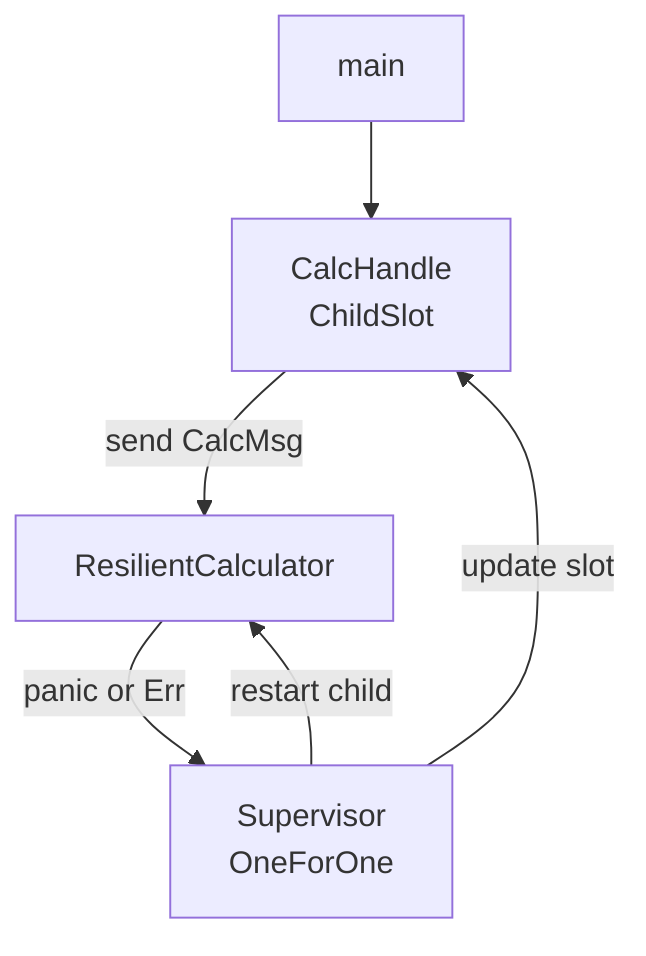

# Resilient calculator — supervised panic recovery + optional metrics

A **supervised calculator** that keeps working after panics, with optional [`ActorMonitor`](../src/monitor/mod.rs) and Prometheus export via Cargo feature flags.

Source: [`resilient_calculator.rs`](./resilient_calculator.rs)

---

## Run

| Mode | Command |
|------|---------|
| Fast (no monitor overhead) | `cargo run --example resilient_calculator -p lane_core` |
| In-process stats | `cargo run --example resilient_calculator -p lane_core --features monitor` |
| Prometheus on `:9090` | `cargo run --example resilient_calculator -p lane_core --features metrics` |

`metrics` enables `monitor` automatically — you do not need both features.

With `--features metrics`, the example:

1. Calls `init_metrics(MetricsConfig { node: Some("resilient_calculator"), .. })` at startup.
2. Tags the calculator via `ActorConfig::monitor_meta` (`calculator` / `ResilientCalculator`).
3. Spawns `serve_metrics_http("127.0.0.1:9090")` in the background.
4. Runs the panic-recovery demo, then waits for Ctrl-C so you can scrape `/metrics`.

---

## Feature flags (template pattern)

Use `#[cfg(feature = "metrics")]` to gate Prometheus setup without breaking the default build:

```rust
#[cfg(feature = "metrics")]
use lane_core::metrics::{init_metrics, serve_metrics_http, MetricsConfig};
#[cfg(feature = "metrics")]
use lane_core::monitor::ActorMeta;

#[cfg(feature = "metrics")]
let actor_config = ActorConfig {
    monitor_meta: ActorMeta::default()
        .with_name("calculator")
        .with_actor_type("ResilientCalculator"),
    ..Default::default()
};

#[cfg(feature = "metrics")]
let sup_handle = Supervisor::with_actor_config(actor_config, config, vec![spec])
    .start()
    .await?;

#[cfg(not(feature = "metrics"))]
let sup_handle = Supervisor::new(config, vec![spec]).start().await?;
```

In `Cargo.toml`:

```toml
[dependencies]
lane_core = { path = ".", features = ["metrics"] }  # or ["monitor"] for stats only
```

See [`monitor.md`](../monitor.md) for Grafana wiring and per-actor opt-out (`monitor_enabled: false`).

---

## Environment variables

| Variable | Default | Effect |
|----------|---------|--------|
| `METRICS_ADDR` | `127.0.0.1:9090` | Host and port for the example’s `serve_metrics_http` listener |
| `LANE_METRICS_PREFIX` | `lane` | Prometheus metric name prefix (`{prefix}_actor_*`, `{prefix}_supervisor_*`, …) |
| `LANE_NODE` | `unknown` | `node` label when `MetricsConfig.node` is unset |

### Change the scrape listen address

The example reads `METRICS_ADDR` at startup (not built into `lane_core` itself):

```bash
METRICS_ADDR=0.0.0.0:9092 cargo run --example resilient_calculator -p lane_core --features metrics
curl -s http://127.0.0.1:9092/metrics
```

In your own binary, use the same pattern:

```rust
let addr: std::net::SocketAddr = std::env::var("METRICS_ADDR")
    .unwrap_or_else(|_| "127.0.0.1:9090".into())
    .parse()
    .expect("METRICS_ADDR");
tokio::spawn(serve_metrics_http(addr));
```

### Change the `lane_` metric prefix

Set `LANE_METRICS_PREFIX` **before the process starts** (or pass `metric_prefix` in `init_metrics`). Series become `{prefix}_actor_messages_handled_total`, etc.

```bash
LANE_METRICS_PREFIX=mysvc cargo run --example resilient_calculator -p lane_core --features metrics
curl -s http://127.0.0.1:9090/metrics | grep mysvc_actor
```

Or in code (takes precedence over the env var):

```rust
init_metrics(MetricsConfig {
    metric_prefix: Some("mysvc".into()),
    ..Default::default()
});
```

Query the active prefix in PromQL via [`metric_prefix()`](../../src/metrics/common.rs):

```rust
use lane_core::metrics::metric_prefix;

let p = metric_prefix(); // "mysvc" or "lane"
// rate({p}_actor_panics_total[5m])
```

Both overrides together:

```bash
METRICS_ADDR=127.0.0.1:9092 LANE_METRICS_PREFIX=mysvc \
  cargo run --example resilient_calculator -p lane_core --features metrics
```

---

## Architecture



| Component | Role |
|-----------|------|
| `ResilientCalculator` | add/sub/mul/div; panics on divide-by-zero |
| `Supervisor` | Restarts failed child up to intensity limit |
| `CalcHandle` | Wraps `ChildSlot<CalcMsg>` — always points at the live `ActorRef` |
| `ChildSlot::child_spec` | Spawns calculator with supervisor channel, updates slot on every restart |

---

## Expected output

```
Supervised resilient calculator started

add: 10 and 4 = 14
sub: 10 and 4 = 6
mul: 10 and 4 = 40
div: 10 and 4 = 2.5

--- panic: divide by zero ---
div: 10 and 0 -> calculator crashed before reply (supervisor will restart it)
add: 5 and 5 = 10

--- panic: simulated bug ---
mul: 3 and 7 = 21

Calculator stopped cleanly.
```

With `--features metrics`, after the demo (default prefix `lane`):

```bash
curl -s http://127.0.0.1:9090/metrics | grep lane_actor
```

Useful PromQL (replace `lane` if you set `LANE_METRICS_PREFIX`):

```promql
rate(lane_actor_messages_handled_total{actor_name="calculator"}[1m])
rate(lane_actor_panics_total{actor_name="calculator"}[5m])
rate(lane_supervisor_restarts_total[5m])
```

---

## Related

- [`monitor.md`](../monitor.md) — full Prometheus / Grafana guide for `lane_core`
- [`../examples/resilient_calculator.rs`](../../examples/resilient_calculator.rs) — same demo in the full `lane_switchboards` crate
- [`../examples/resilient_monitor.rs`](../../examples/resilient_monitor.rs) — deeper `ActorMonitor` tour with metrics
